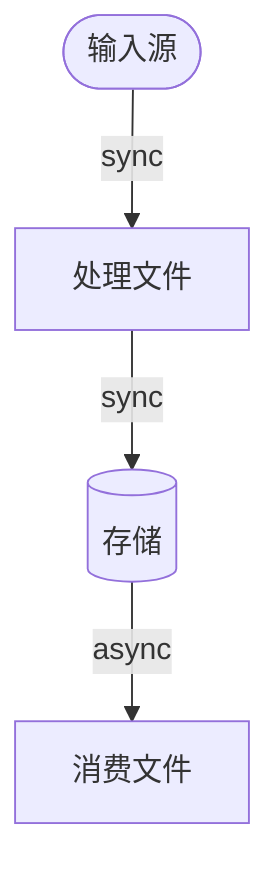

# 项目文档 — [项目名]

<!--
PROJECT_DOC_VERSION: v1
INIT_RULE:
- 本模板用于初始化项目根目录 PROJECT.md
- 初始化后可保留锚点注释；不要删除 <!-- PROJECT:SECTION:* --> 这类定位标记
- 其他说明性注释可按需删除
-->

<!--
写权限边界（铁律）：
- 决策层主节点（Gemini）→ 可写：一、五中的 ARCH-xxx
- 执行节点              → 可写：二、三、四、五中的 TD-xxx、六
- Node C               → 可写：五中的 SEC-xxx
- 人类                 → 全部可写

更新原则：
- 只允许增量修改相关条目，禁止整节重写
- 若无法定位锚点，停止自动写入并输出 [HALT: PROJECT_DOC_ANCHOR_MISSING]
- 不确定的信息宁可留空，不要编造
-->

<!-- PROJECT:SECTION:OVERVIEW -->
## 一、项目总览
<!-- [Owner: 决策层主节点（Gemini）] -->
<!-- 触发条件：项目目标、核心功能、技术栈、外部依赖发生根本变化时更新 -->

### 1. 项目目标

[一句话描述项目解决什么问题、服务谁、核心价值是什么]

### 2. 核心功能

- 功能 A：[描述]
- 功能 B：[描述]
- 功能 C：[描述]

### 3. 技术栈

| 层级 | 技术 | 用途 |
| :--- | :--- | :--- |
| 前端 | [技术] | [用途] |
| 后端 | [技术] | [用途] |
| 存储 | [技术] | [用途] |
| 部署/运行 | [技术] | [用途] |

### 4. 外部依赖

| 服务/组件 | 用途 | 接入方式 | 备注 |
| :--- | :--- | :--- | :--- |
| [服务名] | [用途] | SDK / REST / RPC / 直连 | [备注] |

---

<!-- PROJECT:SECTION:FILES -->
## 二、文件职责清单
<!-- [Owner: 执行节点] -->
<!-- 触发条件：新增、删除或文件职责变化时追加/删除/修改对应行 -->
<!-- 类型标签：service / util / model / api / ui / config / test / worker / script / doc -->

| 文件 | 类型 | 职责 | 上游输入 | 下游输出 |
| :--- | :--- | :--- | :--- | :--- |
| `[文件路径]` | [类型] | [只写"做什么"] | [来自谁] | [输出给谁] |

---

<!-- PROJECT:SECTION:DATAFLOW -->
## 三、数据生产、存储与流转
<!-- [Owner: 执行节点] -->
<!-- 触发条件：新增数据结构、字段变更、流转链路改变时更新涉及条目 -->

### 1. 数据流图

<!-- 使用 Mermaid flowchart；边上标注 sync / async / event -->



### 2. 核心数据结构

#### [数据结构名 / DTO / Schema / Model]

```json
{
  "fieldA": "string - 含义",
  "fieldB": "number - 含义"
}
```

- 所在文件：`[文件路径]`
- 生产者：`[文件路径/模块名]`
- 消费者：`[文件路径/模块名]`
- 存储位置：`[memory / redis / postgres / file / none]`
- 变更影响：`[一句话说明改这个会影响哪里]`

---

<!-- PROJECT:SECTION:DEPENDENCIES -->
## 四、关键依赖与影响范围
<!-- [Owner: 执行节点] -->
<!-- 触发条件：新增跨文件调用、引入新模块、新外部依赖时更新 -->
<!-- 只记录架构级关键依赖，不求全量 -->

### 1. 关键依赖图

```text
[核心文件A]
  依赖 → [文件B]（原因：提供[能力]）
  依赖 → [文件C]（原因：读写[数据/配置]）

[核心文件B]
  依赖 → [文件D]（原因：调用[接口/方法]）
```

### 2. 改动影响速查

| 改动文件 | 直接影响 | 潜在级联影响 | 审计关注点 |
| :--- | :--- | :--- | :--- |
| `[文件]` | [直接影响文件/功能] | [可能波及的下游] | [接口/状态/数据/安全] |

### 3. 对外接口清单（可选）

<!-- 有 API / CLI / Webhook / 消息队列时填写，无则保留空表 -->

| 接口标识 | 位置 | 输入 | 输出 | 兼容性风险 |
| :--- | :--- | :--- | :--- | :--- |
| `[文件::标识符]` | [路由/函数/模块] | [输入说明] | [输出说明] | 低/中/高 |

---

<!-- PROJECT:SECTION:ISSUES -->
## 五、已知问题、风险与技术债务
<!-- [Owner: 执行节点 + Node C + 决策层主节点（Gemini）] -->
<!--
编号规范：
- TD-xxx   技术债务（执行节点）
- SEC-xxx  安全/基建风险（Node C）
- ARCH-xxx 架构风险（决策层主节点 Gemini）
-->

### 5A. 技术债务与架构风险

| 编号 | 类型 | 来源 | 问题描述 | 影响文件 | 优先级 | 状态 | 建议方案 | 代码锚点 |
| :--- | :--- | :--- | :--- | :--- | :--- | :--- | :--- | :--- |
| TD-001 | 技术债务 | 执行节点 | [描述] | [文件] | 高/中/低 | 待处理/处理中/已解决 | — | `DEBT[TD-001]` |
| ARCH-001 | 架构风险 | 决策层主节点 | [描述] | [文件] | 高/中/低 | 待处理/处理中/已解决 | [建议方案] | — |

### 5B. 安全与合规发现

| 编号 | 类型 | 来源 | 问题描述 | 影响文件 | 严重度 | 状态 | 建议方案 |
| :--- | :--- | :--- | :--- | :--- | :--- | :--- | :--- |
| SEC-001 | 安全 | Node C | [描述] | [文件] | 高/中/低 | 待处理/处理中/已解决 | — |

<!--
技术债务代码锚点规范：
- 执行节点采取妥协实现时，必须在代码中留下 DEBT[TD-xxx] 标记
- 标记内容统一为 DEBT[TD-xxx]，后跟一句话说明原因
- 注释前缀必须使用目标语言的原生注释语法（不统一为某种符号）
- 允许使用全中文说明

示例（仅说明原则，不固定注释符号）：
  Python：  # DEBT[TD-001]: 临时兼容旧接口，待 v2 迁移后删除
  TypeScript：  // DEBT[TD-002]: 绕过类型检查，原因是上游返回类型不稳定
  PowerShell：  # DEBT[TD-003]: 此处硬编码路径，需改为配置读取
-->

---

<!-- PROJECT:SECTION:CHANGELOG -->
## 六、变更记录
<!-- [Owner: 执行节点] -->
<!-- 触发条件：每次 execution_status 置 done 后追加一行 -->
<!-- 轮换规则：总条数 > 10 时，将最旧记录移入 PROJECT_history.md -->
<!-- 禁止修改已有历史行；只能追加 -->

| 日期 | workflow_id | 执行端 | 变更原因 | 变更摘要 | 影响文件 | 审计结果 | 备注 |
| :--- | :--- | :--- | :--- | :--- | :--- | :--- | :--- |
| [YYYY-MM-DD] | [wf-xxx-YYYYMMDD] | [cc/cx] | 功能新增/bug修复/重构/安全修复/性能优化 | [一句话摘要] | [文件列表] | pending/passed/failed/rollback | [可选] |

---

<!-- PROJECT:SECTION:MAINTENANCE -->
## 七、维护规则
<!-- [Owner: 人类] -->

### 自动维护约束

- **执行节点**：可初始化 PROJECT.md；可更新 二、三、四、五A（TD）、六
- **Node C**：仅可更新 五B（SEC）
- **决策层主节点（Gemini）**：仅可更新 一、五A（ARCH）
- **人类**：全部可写

### 回写失败处理

- 无法定位目标锚点 → `[HALT: PROJECT_DOC_ANCHOR_MISSING]`
- 文档不存在 → `[PROJECT.MD: MISSING]`
- 文档首次创建成功 → `[PROJECT.MD: INITIALIZED]`

### 配套文件

- `PROJECT.md`：当前项目主文档
- `PROJECT_history.md`：历史变更归档（六节轮换时自动追加）
