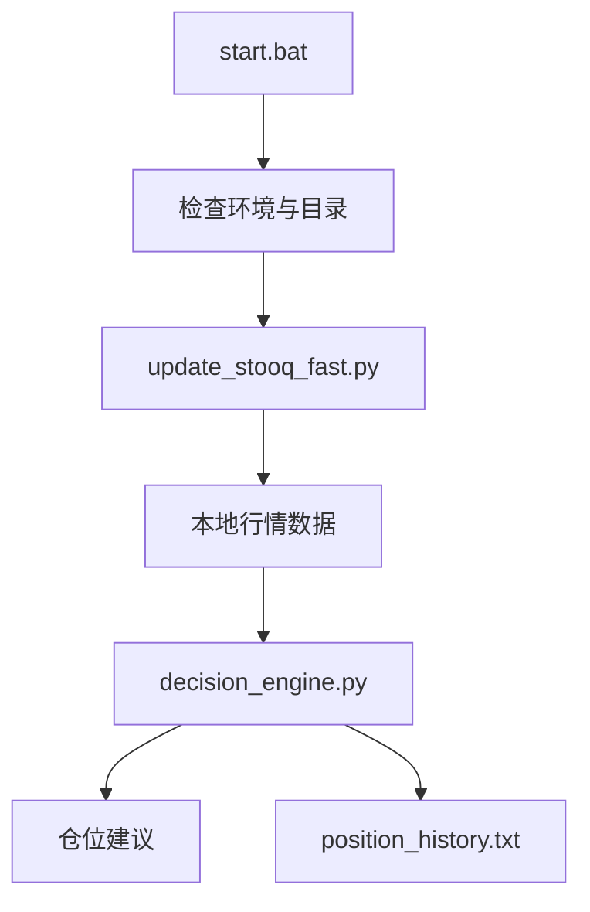

# QuantProject 项目文档

`QuantProject/` 是一个多资产量化仓位决策系统，核心作用是把行情更新、策略计算和仓位建议串成一条可重复执行的本地流程。

## 项目目标

- 自动更新核心资产行情数据。
- 对多资产分别应用固定策略模型。
- 生成可执行的仓位建议和资金分配结果。
- 把每次决策写入历史记录，便于回溯。

## 目录职责

| 路径 | 作用 |
| --- | --- |
| `QuantProject/start.bat` | 主入口脚本，负责环境检查和串联运行。 |
| `QuantProject/config.py` | 全局配置、路径解析、资产映射和权重配置。 |
| `QuantProject/update_stooq_fast.py` | 数据更新模块，优先走 `yfinance`，必要时降级到 `Stooq`。 |
| `QuantProject/decision_engine.py` | 仓位决策引擎，生成最终建议。 |
| `QuantProject/position_history.txt` | 决策历史追加记录。 |

## 运行流程



### 主链路

1. `start.bat` 作为统一入口，先做目录和环境检查。
2. `update_stooq_fast.py` 更新本地行情数据，优先使用 `yfinance`，失败时回退到 `Stooq`。
3. `decision_engine.py` 读取最新数据并计算各资产仓位。
4. 系统输出最终建议，同时把结果追加到 `position_history.txt`。

## 资金配置

当前标准配置如下：

| 资产 | 权重 |
| --- | --- |
| `SPY` | 21.25% |
| `QQQ` | 21.25% |
| `EWJ` | 21.25% |
| `XAU` | 21.25% |
| `BTC` | 15.00% |

## 策略模型

### SPY

- 使用 `MA12` 偏离度。
- 通过 `Sigmoid` 平滑输出仓位。
- 偏离度在极端区间时会触发强多或强空规则。

### QQQ 和 EWJ

- 使用多周期移动均线组合。
- 结合短期波动率调整动量权重。
- 带有风险过滤机制，避免在剧烈回撤中继续放大仓位。

### XAU

- 使用多级趋势判定。
- 跌破关键均线时逐步减仓。

### BTC

- 使用快速均线策略。
- 以短周期趋势作为核心信号。

## 输出与历史

系统在运行后会输出类似下面的信息：

- 资产名称
- 策略模型
- 资金占比
- 最新价
- 信号仓位
- 建议分配金额
- 核心指标状态

历史结果会追加写入 `position_history.txt`，便于按日期回看策略表现。

## 使用方式

```bat
start.bat
```

如果要直接调试模块，也可以单独运行：

```bash
python update_stooq_fast.py
python decision_engine.py
```

## 依赖与环境

- Python 3。
- `pandas`、`numpy`、`requests`、`yfinance` 等常用金融数据依赖。
- 需要能访问行情数据源，或至少能回退到 `Stooq`。

## 维护要点

- 改权重时要同时检查 `config.py` 和 `decision_engine.py`。
- 改数据源时要确认 `update_stooq_fast.py` 的回退逻辑仍然可用。
- `position_history.txt` 是历史记录，不要当成临时输出文件清理掉。
- 如果新增资产，必须同步更新策略、配置和历史输出格式。

## 最近变更

| 日期 | 变更 |
| --- | --- |
| 2026-02-28 | 记录全资产量化仓位输出格式与策略结果。 |
| 2026-03-22 | 继续沿用多资产权重配置与本地决策流程。 |
| 2026-03-25 | 按最新模板补齐项目文档。 |
