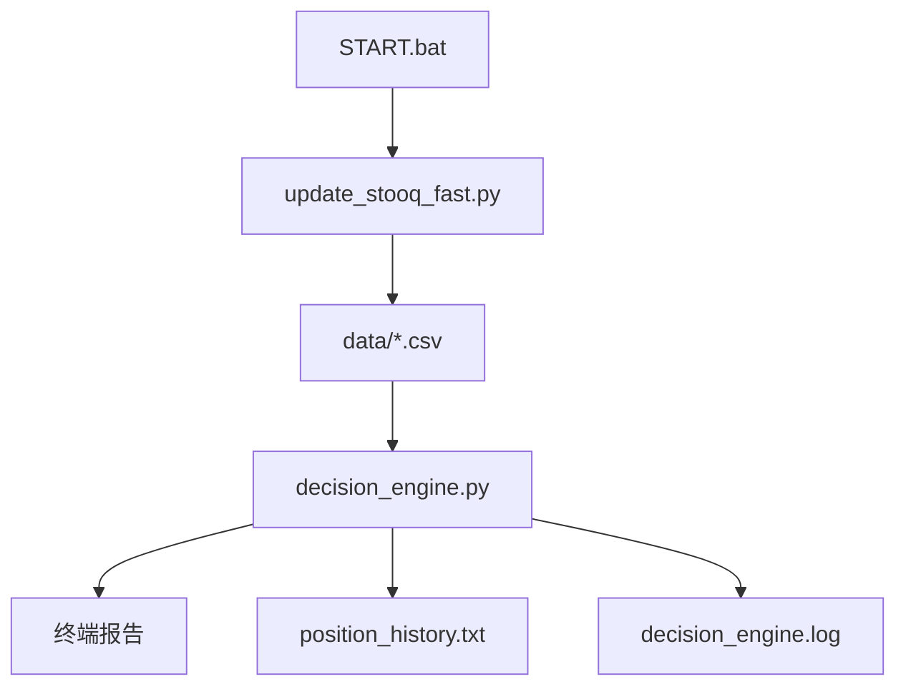

# 项目文档 — QuantProject

<!-- PROJECT:SECTION:OVERVIEW -->
## 一、项目总览

`QuantProject/` 是一个本地多资产量化仓位决策系统。它读取本地行情 CSV，按固定策略模型计算各资产建议仓位，并输出终端报告与历史归档。

---

<!-- PROJECT:SECTION:FILES -->
## 二、文件职责清单

| 文件 | 类型 | 职责 |
| :--- | :--- | :--- |
| `START.bat` | 启动脚本 | 一键创建目录、同步行情并运行决策引擎 |
| `config.py` | 配置模块 | 定义数据目录、文件映射、权重和同步参数 |
| `data_io.py` | 数据访问层 | 统一处理 CSV 归一化、校验和、列名识别与月度序列装载 |
| `strategies/*.py` | 策略层 | 按资产拆分策略实现，通过注册表统一装配 |
| `update_stooq_fast.py` | 数据同步模块 | 按需刷新行情数据，串行调用 yfinance；必要时再降级到带 apikey 的 Stooq |
| `decision_engine.py` | 调度层 | 装配策略、生成仓位建议并输出报告/归档 |
| `README.md` | 说明文档 | 用户侧运行说明与策略简介 |
| `data/*.csv` | 行情数据 | 各资产历史价格数据 |
| `position_history.txt` | 历史归档 | 追加保存仓位决策结果 |
| `decision_engine.log` | 日志 | 运行与调试日志 |

---

<!-- PROJECT:SECTION:DATAFLOW -->
## 三、数据生产、存储与流转

关键约束：

- 先同步数据，再做仓位决策
- 仅使用本地 CSV 作为决策输入
- `decision_engine.py` 允许用户输入总资金，也允许纯百分比模式

---

<!-- PROJECT:SECTION:DEPENDENCIES -->
## 四、关键依赖与影响范围

| 改动文件 | 直接影响 | 潜在级联影响 | 审计关注点 |
| :--- | :--- | :--- | :--- |
| `config.py` | 资产映射、文件命名、权重与同步参数 | 数据同步和决策引擎 | 权重与文件名是否一致 |
| `data_io.py` | CSV 标准化、校验和、月度序列读取 | 数据同步和决策引擎 | 列名兼容性与完整性校验是否一致 |
| `strategies/*.py` | 各资产策略计算逻辑 | 决策输出与回测结果 | 阈值是否保持既有语义 |
| `update_stooq_fast.py` | 行情同步、增量刷新逻辑 | `data/*.csv` 可靠性 | yfinance / Stooq 回退是否稳定 |
| `decision_engine.py` | 策略调度和终端报告 | `position_history.txt`、决策解释 | 调度流程是否保持行为不变 |
| `START.bat` | 本地启动顺序 | 用户实际执行体验 | 目录创建与错误提示是否清晰 |

---

<!-- PROJECT:SECTION:ISSUES -->
## 五、已知问题、风险与技术债务

| 编号 | 类型 | 问题描述 | 影响文件 | 优先级 | 状态 | 建议方案 |
| :--- | :--- | :--- | :--- | :--- | :--- | :--- |
| QP-001 | 数据源依赖 | yfinance / Stooq 都依赖外部网络，且 Stooq 现已默认要求 apikey，短时波动或未配置密钥都会影响同步 | `update_stooq_fast.py` | 中 | 已知 | 优先保证 yfinance 主链路稳定，Stooq 仅作为显式配置 apikey 后的备用源 |
| QP-002 | 配置硬编码 | 资产权重与映射目前写在 `config.py` 中 | `config.py` | 中 | 已知 | 后续可拆成独立配置文件或表驱动格式 |
| QP-003 | 日志增长 | `decision_engine.log` 和 `position_history.txt` 会持续增长 | 日志与历史文件 | 中 | 部分缓解 | 已增加日志轮转，历史文本归档仍待进一步轮转 |
| QP-004 | 同步契约薄弱 | 数据同步与决策读取之间原本缺少显式校验与状态文件 | `update_stooq_fast.py`, `decision_engine.py`, `data_io.py` | 中 | 部分缓解 | 已补 `sync_status.json` 与 CSV SHA256 校验，后续可继续加 schema 版本 |
| QP-005 | 注册表仍需手工维护 | 新增资产时仍需同步更新 `config.py` 和 `strategies/registry.py` | `config.py`, `strategies/registry.py` | 低 | 已知 | 后续可继续演进为表驱动注册 |

---

<!-- PROJECT:SECTION:CHANGELOG -->
## 六、变更记录

| 日期 | task_id | 执行端 | 最终改动 | 最终有效范围 | 范围变动/新增需求 | 遗留债务 | 审计结果 | 备注 |
| :--- | :--- | :--- | :--- | :--- | :--- | :--- | :--- | :--- |
| 2026-04-13 | cx-task-fix-quantproject-sync-20260413 | cx | 修复 `update_stooq_fast.py` 在多线程下调用 yfinance 的并发不稳定问题，补 Stooq apikey 检测与重试/全量回退，恢复 `SPY/QQQ/XAU` 数据同步 | `QuantProject/config.py`, `QuantProject/update_stooq_fast.py`, `QuantProject/PROJECT.md` | 无 | QP-001, QP-002 | passed | 本轮以恢复真实抓取链路为主，未改策略计算逻辑 |
| 2026-04-13 | cx-fix-run-security-audit-20260413-arch | cx | 拆分 `data_io.py` 与 `strategies/`，将 `decision_engine.py` 重构为调度层，`update_stooq_fast.py` 改为复用共享数据层 | `QuantProject/data_io.py`, `QuantProject/strategies/*.py`, `QuantProject/decision_engine.py`, `QuantProject/update_stooq_fast.py`, `QuantProject/README.md`, `QuantProject/PROJECT.md` | 无 | QP-005 | passed | 本轮以最小行为变化完成架构收敛 |
| 2026-04-13 | cx-fix-run-security-audit-20260413 | cx | 修复 QQQ/EWJ 趋势判断覆盖 bug，补输入边界、日志脱敏/轮转、CSV 校验和、同步状态文件、结构化决策归档与启动依赖检查 | `QuantProject/config.py`, `QuantProject/update_stooq_fast.py`, `QuantProject/decision_engine.py`, `QuantProject/START.bat`, `QuantProject/PROJECT.md` | 无 | QP-002, QP-004 | passed | 依据 `quantproject_audit_report.md` 落地高优先级修复 |
| 2026-04-12 | cx-task-quantproject-project-doc-init-20260412 | cx | 新建 `QuantProject/PROJECT.md`，补齐项目总览、数据流与风险说明 | `QuantProject/PROJECT.md` | 无 | QP-001, QP-002, QP-003 | pending | 本轮只写文档，不修改量化脚本 |

---

<!-- PROJECT:SECTION:MAINTENANCE -->
## 七、维护规则

- 修改资产映射或权重时，优先更新 `config.py` 与本文件
- 修改同步行为时，先检查 `update_stooq_fast.py` 的数据回退与增量策略
- 修改决策阈值或报告格式时，优先更新 `decision_engine.py`
- `START.bat` 保持为最小薄壳，只负责顺序调用和错误提示
