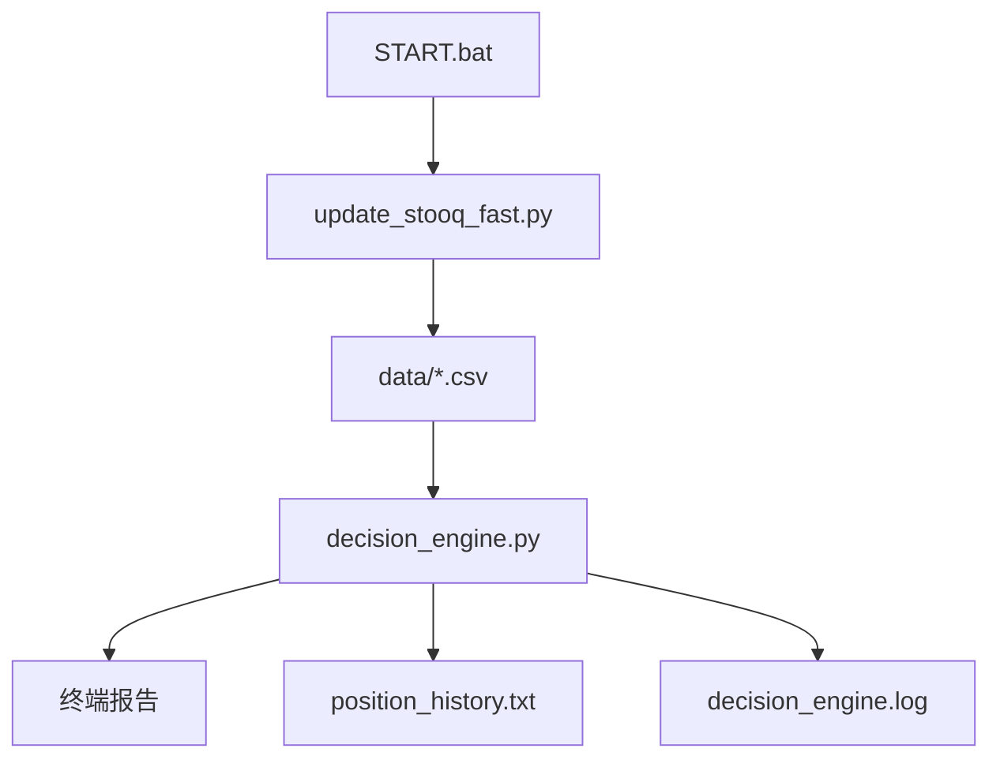

# 项目文档 — QuantProject

<!-- PROJECT:SECTION:OVERVIEW -->
## 一、项目总览

`QuantProject/` 是一个本地多资产量化仓位决策系统。它读取本地行情 CSV，按固定策略模型计算各资产建议仓位，并输出终端报告与历史归档。

---

<!-- PROJECT:SECTION:FILES -->
## 二、文件职责清单

| 文件 | 类型 | 职责 |
| :--- | :--- | :--- |
| `START.bat` | 启动脚本 | 一键创建目录、同步行情并运行决策引擎 |
| `config.py` | 配置模块 | 定义数据目录、文件映射、权重和同步参数 |
| `update_stooq_fast.py` | 数据同步模块 | 按需刷新行情数据，优先 yfinance，失败后降级 Stooq |
| `decision_engine.py` | 决策引擎 | 读取本地数据并计算各资产仓位建议 |
| `README.md` | 说明文档 | 用户侧运行说明与策略简介 |
| `data/*.csv` | 行情数据 | 各资产历史价格数据 |
| `position_history.txt` | 历史归档 | 追加保存仓位决策结果 |
| `decision_engine.log` | 日志 | 运行与调试日志 |

---

<!-- PROJECT:SECTION:DATAFLOW -->
## 三、数据生产、存储与流转

关键约束：

- 先同步数据，再做仓位决策
- 仅使用本地 CSV 作为决策输入
- `decision_engine.py` 允许用户输入总资金，也允许纯百分比模式

---

<!-- PROJECT:SECTION:DEPENDENCIES -->
## 四、关键依赖与影响范围

| 改动文件 | 直接影响 | 潜在级联影响 | 审计关注点 |
| :--- | :--- | :--- | :--- |
| `config.py` | 资产映射、文件命名、权重与同步参数 | 数据同步和决策引擎 | 权重与文件名是否一致 |
| `update_stooq_fast.py` | 行情同步、增量刷新逻辑 | `data/*.csv` 可靠性 | yfinance / Stooq 回退是否稳定 |
| `decision_engine.py` | 仓位信号和终端报告 | `position_history.txt`、决策解释 | 策略阈值是否被误改 |
| `START.bat` | 本地启动顺序 | 用户实际执行体验 | 目录创建与错误提示是否清晰 |

---

<!-- PROJECT:SECTION:ISSUES -->
## 五、已知问题、风险与技术债务

| 编号 | 类型 | 问题描述 | 影响文件 | 优先级 | 状态 | 建议方案 |
| :--- | :--- | :--- | :--- | :--- | :--- | :--- |
| QP-001 | 数据源依赖 | yfinance / Stooq 都依赖外部网络，短时波动会影响同步 | `update_stooq_fast.py` | 中 | 已知 | 保留双源回退和超时参数 |
| QP-002 | 配置硬编码 | 资产权重与映射目前写在 `config.py` 中 | `config.py` | 中 | 已知 | 后续可拆成独立配置文件或表驱动格式 |
| QP-003 | 日志增长 | `decision_engine.log` 和 `position_history.txt` 会持续增长 | 日志与历史文件 | 低 | 已知 | 以后可考虑轮转或归档策略 |

---

<!-- PROJECT:SECTION:CHANGELOG -->
## 六、变更记录

| 日期 | task_id | 执行端 | 最终改动 | 最终有效范围 | 范围变动/新增需求 | 遗留债务 | 审计结果 | 备注 |
| :--- | :--- | :--- | :--- | :--- | :--- | :--- | :--- | :--- |
| 2026-04-12 | cx-task-quantproject-project-doc-init-20260412 | cx | 新建 `QuantProject/PROJECT.md`，补齐项目总览、数据流与风险说明 | `QuantProject/PROJECT.md` | 无 | QP-001, QP-002, QP-003 | pending | 本轮只写文档，不修改量化脚本 |

---

<!-- PROJECT:SECTION:MAINTENANCE -->
## 七、维护规则

- 修改资产映射或权重时，优先更新 `config.py` 与本文件
- 修改同步行为时，先检查 `update_stooq_fast.py` 的数据回退与增量策略
- 修改决策阈值或报告格式时，优先更新 `decision_engine.py`
- `START.bat` 保持为最小薄壳，只负责顺序调用和错误提示
