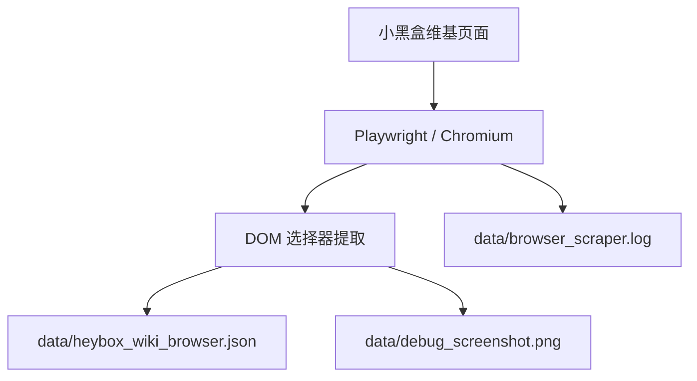

# 项目文档 — heybox

<!-- PROJECT:SECTION:OVERVIEW -->
## 一、项目总览

`heybox/` 是一个本地 Playwright 抓取脚本目录，目标是从小黑盒维基页面抓取模块标题和条目数据，保存为本地 JSON，并在抓取失败时保留诊断截图。

---

<!-- PROJECT:SECTION:FILES -->
## 二、文件职责清单

| 文件 | 类型 | 职责 |
| :--- | :--- | :--- |
| `heybox_browser.py` | 抓取脚本 | 启动 Chromium，抓取页面 DOM，导出 JSON / 截图 |
| `PROJECT.md` | 项目文档 | 项目总览、职责、风险与变更记录 |
| `data/` | 输出目录 | 保存抓取日志、JSON 与调试截图 |

---

<!-- PROJECT:SECTION:DATAFLOW -->
## 三、数据生产、存储与流转

关键约束：

- 抓取目标目前写死为 `https://www.xiaoheihe.cn/wiki/203`
- 依赖页面选择器 `.wiki-module-title` 和 `.wiki-item-name`
- 抓取失败时优先保留截图，便于后续排查

---

<!-- PROJECT:SECTION:DEPENDENCIES -->
## 四、关键依赖与影响范围

| 改动文件 | 直接影响 | 潜在级联影响 | 审计关注点 |
| :--- | :--- | :--- | :--- |
| `heybox_browser.py` | 抓取逻辑与输出结构 | JSON 内容、截图策略、日志输出 | 页面选择器是否失效 |
| `data/` | 本地结果持久化 | 后续分析、手工复核 | 是否误删历史输出 |

---

<!-- PROJECT:SECTION:ISSUES -->
## 五、已知问题、风险与技术债务

| 编号 | 类型 | 问题描述 | 影响文件 | 优先级 | 状态 | 建议方案 |
| :--- | :--- | :--- | :--- | :--- | :--- | :--- |
| HX-001 | 选择器脆弱 | 依赖页面 CSS 类名，页面结构变动后容易失效 | `heybox_browser.py` | 中 | 已知 | 后续可补备用选择器或更稳健的解析逻辑 |
| HX-002 | 目标写死 | 当前抓取目标 URL 固定，复用性有限 | `heybox_browser.py` | 低 | 已知 | 若扩展多个页面，可改为参数化入口 |
| HX-003 | 输出目录管理 | `data/` 同时保存结果、日志和截图，文件较杂 | `data/` | 低 | 已知 | 以后按类型拆分子目录或补清理脚本 |

---

<!-- PROJECT:SECTION:CHANGELOG -->
## 六、变更记录

| 日期 | task_id | 执行端 | 最终改动 | 最终有效范围 | 范围变动/新增需求 | 遗留债务 | 审计结果 | 备注 |
| :--- | :--- | :--- | :--- | :--- | :--- | :--- | :--- | :--- |
| 2026-04-12 | cx-task-heybox-project-doc-init-20260412 | cx | 新建 `heybox/PROJECT.md`，补齐项目总览、文件职责、数据流与风险说明 | `heybox/PROJECT.md` | 无 | HX-001, HX-002, HX-003 | pending | 本轮只写文档，不修改抓取脚本 |

---

<!-- PROJECT:SECTION:MAINTENANCE -->
## 七、维护规则

- 修改抓取目标时，优先更新 `heybox_browser.py` 顶部常量与项目文档
- 保留失败诊断截图，便于页面结构变化时回溯
- 结果文件与日志文件都应保持在 `data/` 下，避免散落到仓库根目录
