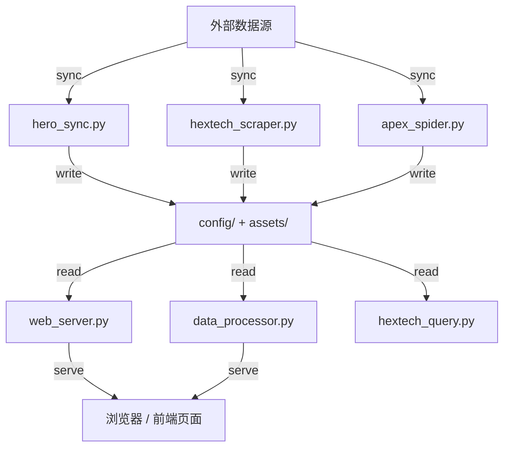

# Hextech 伴生系统项目文档

<!-- PROJECT:SECTION:OVERVIEW -->
## 一、项目总览

Hextech 伴生系统是一个本地运行的《英雄联盟》数据分析工具，目标是把英雄资料、海克斯符文数据和协同信息同步到本地，再通过桌面界面和 Web 页面提供快速查询。

### 1. 项目目标

为本地玩家提供一个离线可用、启动即用的伴生查询入口，减少在多个网页和外部站点之间切换的成本。

### 2. 核心功能

- 自动同步英雄基础数据、海克斯数据、协同数据和图标目录。
- 启动时自动补齐海克斯统一目录与图标缓存，日志默认只保留任务级成功/失败摘要。
- 详情页海克斯图像优先使用后端 `icon` 字段，失败时只保留真实失败状态，不再绘制 canvas 或 data-uri 占位图。
- 详情页海克斯悬浮窗采用单例 DOM + 纯文本安全渲染，展示统一目录中的 `tooltip_plain`。
- 提供桌面伴生界面，跟随游戏窗口状态显示或隐藏。
- 提供本地 Web 服务，用于列表页、详情页和 API 查询。
- 提供后端数据整理入口和打包脚本，方便本地使用与分发。

### 3. 技术栈

| 层级 | 技术 | 用途 |
| :--- | :--- | :--- |
| 后端 | Python 3.11 | 数据同步、Web 服务、桌面编排 |
| Web | FastAPI / Uvicorn | 本地 HTTP API 与静态页服务 |
| 数据处理 | Pandas / NumPy | 表格计算、筛选、汇总 |
| 网络 | Requests | 拉取 Riot、CommunityDragon、Apexlol 数据 |
| 桌面 | Tkinter / psutil | 桌面界面与窗口/进程协同 |
| 打包 | PyInstaller | 生成可分发可执行文件 |

### 4. 外部依赖

| 服务/组件 | 用途 | 接入方式 | 备注 |
| :--- | :--- | :--- | :--- |
| Riot / LCU | 英雄客户端状态、英雄资料 | 本地 API / HTTP | 失败时回退缓存 |
| CommunityDragon | 英雄头像、增强符文图标回退 | HTTP | 作为 CDN 回退源 |
| Apexlol | 增强符文图标映射 | HTTP + 本地缓存 | 首选图标索引来源 |

---

<!-- PROJECT:SECTION:FILES -->
## 二、文件职责清单

| 文件 | 类型 | 职责 | 上游输入 | 下游输出 |
| :--- | :--- | :--- | :--- | :--- |
| `hextech_ui.py` | ui | 桌面伴生界面、窗口状态、跳转控制 | LCU 状态、本地缓存 | `web_server.py`、浏览器 |
| `web_server.py` | api / service | 本地 Web 服务、静态资源、API 聚合 | `hero_sync.py`、`data_processor.py`、`hextech_query.py` | 浏览器、前端页面 |
| `hero_sync.py` | service / util | 英雄核心数据同步、版本检查、头像与图标映射生成 | Riot / LCU、CommunityDragon、Apexlol | `config/`、`assets/` |
| `data_processor.py` | util | 处理英雄和海克斯数据，拼装前端所需结构 | CSV / JSON 缓存 | `web_server.py` |
| `hextech_query.py` | script / util | 后端数据整理、CSV 定位、主名归一 | `config/`、`hero_sync.py` | 结构化数据、`web_server.py` |
| `champion_aliases.py` | util | 首页搜索专用别名索引读取、名称归一、模糊搜索辅助 | `config/Champion_Alias_Index.json` | `web_server.py`、首页搜索联想 |
| `alias_utils.py` | util | 英雄别名归一化、去重 | 传入别名集合 | `hero_sync.py`、`hextech_query.py`、`web_server.py` |
| `icon_resolver.py` | util | 增强符文图标映射、缓存与回退 URL | `config/`、远程图标源 | `hero_sync.py`、`data_processor.py`、`web_server.py` |
| `backend_refresh.py` | worker | 后台刷新调度 | 本地缓存、数据处理器 | UI / Web 刷新 |
| `hextech_scraper.py` | worker | 海克斯数据抓取 | 远程数据源 | `config/` |
| `apex_spider.py` | worker | 协同数据抓取 | 远程数据源 | `config/` |
| `build.py` | script | 打包与签名流程 | 源码与依赖 | `dist/` |
| `cleanup.py` | script | 清理本地缓存与临时文件 | 本地运行产物 | `config/`、`assets/` |

---

<!-- PROJECT:SECTION:DATAFLOW -->
## 三、数据生产、存储与流转

### 1. 数据流图



### 2. 核心数据结构

#### Champion_Core_Data.json

```json
{
  "name": "中文名",
  "title": "称号",
  "en_name": "EnglishId",
  "aliases": ["别名1", "别名2"]
}
```

- 所在文件：`config/Champion_Core_Data.json`
- 生产者：`hero_sync.py`
- 消费者：`hextech_query.py`、`web_server.py`
- 存储位置：`file`
- 变更影响：英雄展示、别名搜索、跳转逻辑都会受影响

#### Champion_Alias_Index.json

- 所在文件：`config/Champion_Alias_Index.json`
- 生产者：人工维护
- 消费者：`champion_aliases.py`、`web_server.py`
- 存储位置：`file`
- 典型字段：`heroName`、`title`、`enName`、`heroId`、`aliases`
- 变更影响：首页搜索联想和别名快捷检索会直接受影响
- 维护补充：该文件是首页搜索专用索引，只提供读取和归一化，不作为通用运行时数据源，也不由程序自动写回

#### Augment_Icon_Manifest.json

- 所在文件：`config/Augment_Icon_Manifest.json`
- 生产者：`augment_icon_refresh.py`
- 消费者：`data_processor.py`、`web_server.py`、`backend_refresh.py`
- 存储位置：`file`
- 典型字段：`name`、`tier`、`filename`、`icon_url`、`description`、`tooltip`、`tooltip_plain`、`spell_values`、`status`、`updated_at`
- 变更影响：海克斯详情页、图标缓存、API 输出路径都会变化
- 维护补充：`config/Augment_Full_Map.json` 与 `config/Augment_Icon_Map.json` 仍可作为冷启动输入，但运行时主链路只读取该统一目录

#### Hextech CSV

- 所在位置：`config/Hextech_Data_*.csv`
- 生产者：`hextech_scraper.py`
- 消费者：`data_processor.py`、`web_server.py`
- 存储位置：`file`
- 典型字段：`英雄 ID`、`英雄名称`、`英雄评级`、`英雄胜率`、`英雄出场率`、`海克斯阶级`、`海克斯名称`、`海克斯胜率`、`海克斯出场率`、`胜率差`、`综合得分`
- 变更影响：榜单、推荐、详情页数据都会跟着变化

---

<!-- PROJECT:SECTION:DEPENDENCIES -->
## 四、关键依赖与影响范围

### 1. 关键依赖图

```text
hero_sync.py
  依赖 → alias_utils.py（原因：别名去重）
  依赖 → icon_resolver.py（原因：图标映射）

web_server.py
  依赖 → hero_sync.py（原因：基础路径与核心数据）
  依赖 → data_processor.py（原因：展示数据）
 依赖 → hextech_query.py（原因：CSV 定位与主名归一）
 依赖 → champion_aliases.py（原因：首页搜索专用别名索引读取）

data_processor.py
  依赖 → hero_sync.py（原因：核心数据）
  依赖 → icon_resolver.py（原因：本地图标 URL）
```

### 2. 改动影响速查

| 改动文件 | 直接影响 | 潜在级联影响 | 审计关注点 |
| :--- | :--- | :--- | :--- |
| `hero_sync.py` | 数据同步、缓存生成 | `web_server.py`、`hextech_query.py`、`data_processor.py` | 文件存在性、版本短路、网络失败回退 |
| `web_server.py` | API 与静态页展示 | 浏览器前端、桌面 UI | 路由兼容、资源路径、缓存刷新 |
| `data_processor.py` | 前端展示数据结构 | Web 列表页、详情页 | 字段名、排序、图标 URL |
| `hextech_query.py` | 后端数据整理与别名索引 | UI 搜索、查询一致性 | 别名归一化、模糊匹配 |

### 3. 对外接口清单（可选）

| 接口标识 | 位置 | 输入 | 输出 | 兼容性风险 |
| :--- | :--- | :--- | :--- | :--- |
| `web_server.py::/api/champions` | HTTP API | 无 | 英雄列表 | 低 |
| `web_server.py::/api/champion/{name}/hextechs` | HTTP API | 英雄名 | 海克斯推荐数据 | 中 |
| `web_server.py::/api/champion_aliases` | HTTP API | 无 | 首页搜索专用英雄别名索引 | 低 |
| `web_server.py::/api/augment_icon_map` | HTTP API | 无 | 从统一目录投影出的兼容海克斯图标映射 | 中 |
| `champion_aliases.py::load_champion_alias_index` | Python API | 无 | 首页搜索专用别名索引 | 低 |

---

<!-- PROJECT:SECTION:ISSUES -->
## 五、已知问题、风险与技术债务

### 5A. 技术债务与架构风险

| 编号 | 类型 | 来源 | 问题描述 | 影响文件 | 优先级 | 状态 | 建议方案 | 代码锚点 |
| :--- | :--- | :--- | :--- | :--- | :--- | :--- | :--- | :--- |
| TD-001 | 技术债务 | 执行节点 | 桌面 UI 与 Web 服务仍然共享同一套本地缓存文件，后续如果改缓存结构，需要同步更新多个入口。 | `hextech_ui.py`、`web_server.py`、`hero_sync.py` | 中 | 已知 | 统一缓存 schema 并补回归测试 | `DEBT[TD-001]` |
| ARCH-001 | 架构风险 | 决策层主节点 | 本地运行时状态依赖 `config/` 下多个文件，文件缺失时会触发重同步，启动路径比较脆弱。 | `hero_sync.py`、`web_server.py`、`hextech_query.py` | 中 | 待关注 | 保持版本短路与缺文件补全逻辑一致 | — |

### 5B. 安全与合规发现

| 编号 | 类型 | 来源 | 问题描述 | 影响文件 | 严重度 | 状态 | 建议方案 |
| :--- | :--- | :--- | :--- | :--- | :--- | :--- | :--- |
| SEC-001 | 安全 | Node C | 运行期依赖外部 HTTP 资源，网络失败会导致回退逻辑生效，需确保失败摘要日志可观测。 | `hero_sync.py`、`icon_resolver.py` | 低 | 已知 | 保留缓存和失败摘要，避免静默降级 |

---

<!-- PROJECT:SECTION:CHANGELOG -->
## 六、变更记录

| 日期 | workflow_id | 执行端 | 变更原因 | 变更摘要 | 影响文件 | 审计结果 | 备注 |
| :--- | :--- | :--- | :--- | :--- | :--- | :--- | :--- |
| 2026-04-03 | cx-fix-ui-web-startup | cx | 启动修复 / 文档同步 | 清理 `web_server.py` 中残留的合并冲突标记，恢复桌面 UI 与 Web 服务的导入和启动链路，并补充运行文档 | `web_server.py`、`PROJECT.md`、`README.md` | done | 当前分支待推送 |
| 2026-04-03 | cx-scratch | cx | 海克斯图像修复 / 文档同步 | 修复详情页海克斯图像合并冲突，补齐图标回退脚本，并修正联动文章区的图标解析，增加多英雄端到端验证说明 | `static/detail.html`、`icon_resolver.py`、`web_server.py`、`PROJECT.md`、`README.md` | done | 已验证左侧海克斯与右侧联动文章图标链路 |
| 2026-04-03 | cx-refactor-shared-modules | cx | 重构 / 文档补齐 | 抽取别名与图标解析共享模块，修正同步链路，并补齐项目文档 | `alias_utils.py`、`icon_resolver.py`、`hero_sync.py`、`web_server.py`、`data_processor.py`、`hextech_query.py` | done | 当前分支未提交 |
| 2026-04-03 | cx-refactor-shared-modules | cx | 海克斯图标维护 | 新增海克斯图标自检与自动抓取，运行时逐步收敛到统一目录链路 | `web_server.py`、`static/detail.html`、`.gitignore` | done | 后续由统一目录与摘要日志承接运行态 |
| 2026-04-06 | frontend-task-hextech-tooltip-20260406 | cx | 前端集成 / 文档同步 | 详情页海克斯悬浮窗改为单例 DOM + 纯文本安全渲染，消费 `tooltip_plain`，不再依赖图片占位脚本 | `static/detail.html`、`PROJECT.md`、`README.md` | done | 已验证 hover 显示与 XSS 防护 |
| 2026-04-07 | cx-runtime-log-and-augment-unify | cx | 运行时收敛 / 文档同步 | 统一 `Augment_Icon_Manifest.json` 为海克斯运行时目录，精简 `Hextech_Data_*.csv` 字段，日志改为任务级成功/失败摘要，并清空历史运行日志 | `augment_icon_refresh.py`、`hextech_scraper.py`、`data_processor.py`、`web_server.py`、`backend_refresh.py`、`hero_sync.py`、`apex_spider.py`、`log_utils.py`、`README.md`、`PROJECT.md` | done | 当前运行日志已清空，后续仅保留摘要与失败信息 |
| 2026-04-07 | cx-alias-index-boundary | cx | 别名索引边界收口 / 文档同步 | 将 `Champion_Alias_Index.json` 定义为首页搜索专用静态索引，`champion_aliases.py` 收敛为只读读取与归一化模块，移除写回与自动生成职责 | `champion_aliases.py`、`web_server.py`、`README.md`、`PROJECT.md` | done | 后续由人工维护 `Champion_Alias_Index.json` |
| 2026-04-06 | packaging-runtime-fixes | cx | 打包链修复 / 冷启动修复 | 打包改为最小运行壳，不再预打包 `config/`、`assets/`；修复打包后 `apex_spider.py` 路径、首页榜单快照降级和死锁文件清理，并同步 `.spec`、依赖与文档 | `build.py`、`Hextech伴生终端.spec`、`backend_refresh.py`、`apex_spider.py`、`web_server.py`、`requirements.txt`、`README.md`、`PROJECT.md` | done | 冷启动下已验证首页榜单和联动文章都能恢复 |

---

<!-- PROJECT:SECTION:MAINTENANCE -->
## 七、维护规则

- 变更缓存 schema、别名规则或图标映射时，优先同步更新 `hero_sync.py`、`web_server.py`、`hextech_query.py`、`champion_aliases.py`、`augment_icon_refresh.py` 和本文件。
- `config/Champion_Alias_Index.json` 是首页搜索专用索引，只允许人工维护或离线导入，不允许运行时自动写回。
- 变更海克斯图标来源、缓存或统一目录逻辑时，优先同步更新 `augment_icon_refresh.py`、`web_server.py` 与 `config/Augment_Icon_Manifest.json` 的字段说明。
- 变更桌面 UI 或 Web 启动链路时，优先同步检查 `hextech_ui.py` 的子进程拉起逻辑、`web_server.py` 的导入路径与 `config/web_server_port.txt` 的端口落盘行为。
- 变更打包链路时，必须同步更新 `build.py`、`Hextech伴生终端.spec`、`requirements.txt` 和 `README.md` 的运行说明，确保仓库内配置与实际产物一致。
- 新增入口脚本或工具文件时，及时补充“文件职责清单”和“关键依赖与影响范围”。
- 若未来出现新的临时测试文件或预览页，先确认是否有代码引用，再决定删除。
