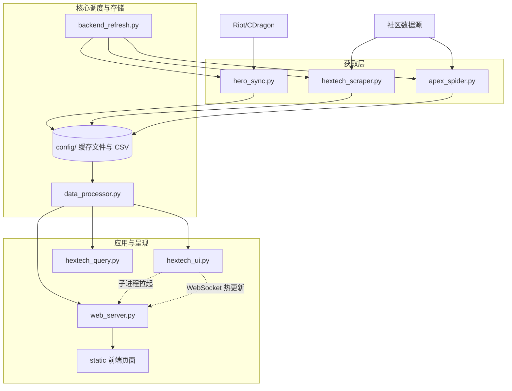

# 🔮 Hextech Nexus

> 面向《英雄联盟》ARAM / 海克斯系统的本地数据抓取、分析与可视化伴生套件。

## 1. 核心概览

Hextech Nexus 的核心目标是整合社区海克斯梯队数据、官方 API 及本地客户端状态，提供从**静默后台抓取**到**动态桌面悬浮**的全链路分析体验。

**核心能力：**
- 🔄 **数据同步**：英雄与海克斯数据的多源清洗融合
- 🖥️ **本地 Web 控制台**：基于 FastAPI 的高性能数据面板
- 🖱️ **伴生悬浮窗**：自动识别 LCU（游戏客户端）状态的透明悬浮层

---

## 2. 架构与数据流

本系统分为四层：**数据获取层** -> **存储处理层** -> **服务调度层** -> **视图表现层**。



### 关键运转机制
1. **自动化调度**：`hextech_ui.py` 会定期触发 `backend_refresh.py`。
2. **非阻塞更新**：刷新脚本更新 CSV。`web_server.py` 的 FileWatcher 捕获变更后，触发 WebSocket 广播，使前端（如果已打开）无缝热更新。
3. **伴生联动**：悬浮窗拦截用户操作，指令 `web_server.py` 控制浏览器进行对应英雄信息的热跳转。

---

## 3. 模块组件说明

| 组件分类 | 脚本文件 | 核心职责说明 |
| :--- | :--- | :--- |
| **表现层** | `hextech_ui.py` | 基于 Tkinter 的透明桌面悬浮窗，负责追踪 LCU 端口与拦截前端焦点。自带生命周期管理，启动时会自动在后台拉起 `web_server.py` 子进程。 |
| **表现层** | `hextech_query.py` | CLI 命令行模式交互式查询入口，供终端极客使用。 |
| **服务层** | `web_server.py` | FastAPI 本地服务端。提供 API 接口、静态页面分发、网络图片代理以及长连接 WebSocket 推送服务。 |
| **调度层** | `backend_refresh.py` | 中央编排器。统一管理并触发底层所有的抓取任务序列。 |
| **抓取层** | `hextech_scraper.py` | 抓取外部站点海克斯胜率等数据，清洗落盘至 CSV。 |
| **抓取层** | `hero_sync.py` | 负责从 DDragon 抓取英雄头像资产及同步 `Champion_Core_Data.json`。 |
| **抓取层** | `apex_spider.py` | 独立英雄协同数据分析模块。 |
| **处理层** | `data_processor.py` | 读取 `config` 资产目录，拼接资源链，输出标准 JSON 供 Web 层消费。 |

---

## 4. 快速运行指引

建议统一在项目根目录（运行环境应位于外层，即 `python run/xxx.py`）执行操作。

### 推荐模式：伴生唤起
```powershell
python run/hextech_ui.py
```
> **说明**：此命令为玩家日常主要入口。挂载后，工具将自动隐藏并在检测到进入选人界面时浮出；同时它会在**后台自动拉起 Web 服务器**。点击悬浮窗英雄会直接调用浏览器查阅分析报表。

### 独立 Web 服务
```powershell
python run/web_server.py
```
> **说明**：独立后台启动，默认自动寻找可用端口（优先 8000）并在浏览器中弹出控制台主页。

### 纯数据命令面板
```powershell
python run/hextech_query.py
```

---

## 5. 存储资产与配置 (config & assets)

系统在 `run/config/` 下维护着自己的运行时账本：

- **`Champion_Core_Data.json`**：ID 映射的核心字典。
- **`Augment_Icon_Map.json`**：海克斯中英文对译及本地图标哈希映射表（UI的图源基石）。
- **`Hextech_Data_*.csv`**：抓取器定期沉积的持久化面板数据。
- **`scraper_status.json` / `hero_version.txt`**：爬虫断点及当前同步的 DDragon 版本锚点。

在 `run/assets/` 下：
- **头像缓存区**：系统首次匹配未命中时静默下载的所有 `.png` 图标。

---

## 6. 环境依赖与约束限制

**核心依赖配置**：
请通过 `pip install -r run/requirements.txt` 完成安装。其中包括：`fastapi`, `uvicorn`, `pandas`, `requests`, `psutil`, `Pillow`, `pywin32`。

**已知限制**：
- ✅ **操作系统特异性**：悬浮窗依托于 `pywin32` 获取 LeagueClient 等窗口句柄与焦点跟踪，**强依赖 Windows 环境**。
- ✅ **冷启动延迟**：如果在极其纯净的环境下首次运行，同步 DDragon 并落盘可能导致 UI 与浏览器显示数秒的空白期。
- ✅ **LFI 防御机制**：Web 层有严苛的路径审查，禁止将任意文件移入 `assets` 并期望通过路由越权访问。

---

## 7. 变更记录

| 日期 | 执行节点 | 变更原因 | 摘要 | 影响文件 |
| :--- | :--- | :--- | :--- | :--- |
| 2026-03-22 | ai-task-fix-web | bug修复 / 重构 | 修复 hextech_ui.py 无法独立挂载/唤起 Web 界面服务的问题；重构重组项目文档架构与模块层级说明 | `hextech_ui.py`<br>`web_server.py`<br>`PROJECT.md` |
