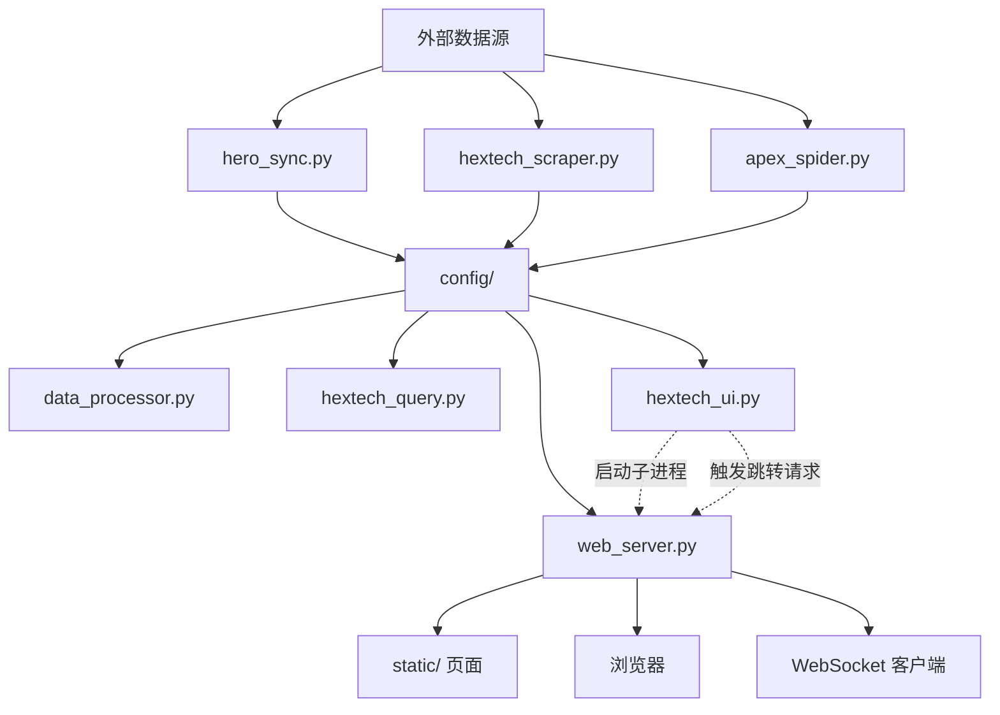

# Hextech Nexus 项目文档

`run/` 目录承载 Hextech Nexus 的主要运行时代码。它将本地数据刷新、桌面伴生界面、浏览器页面、API 服务和静态资源组织成一套面向 Windows 的本地工具链，核心目标是让玩家能够在桌面端和浏览器端快速查看英雄与海克斯相关信息。

## 1. 项目目标

- 同步并缓存英雄基础资料、海克斯数据、协同数据与图标资源。
- 提供一个常驻桌面侧边伴生界面，便于在客户端内外快速交互。
- 提供本地 Web 服务，负责页面展示、API 数据输出和实时通知。
- 在默认端口被占用时自动切换可用端口，并让 UI 与浏览器始终使用实际端口。

## 2. 目录定位

`run/` 是项目的运行主目录，包含以下几类内容：

- Python 入口程序：桌面 UI、Web 服务、数据刷新、抓取与查询脚本。
- `config/`：运行期间生成或消费的缓存、端口、状态与数据文件。
- `assets/`：本地图片缓存与静态资源。
- `static/`：浏览器页面模板、脚本和样式资源。

## 3. 当前架构



### 3.1 主链路说明

1. `hero_sync.py` 负责同步英雄核心资料，并维护部分共享目录与版本数据。
2. `hextech_scraper.py` 负责刷新海克斯相关原始数据。
3. `apex_spider.py` 负责补充协同类数据，例如 `Champion_Synergy.json`。
4. `backend_refresh.py` 串联上述刷新过程，并通过锁文件避免重复并发刷新。
5. `data_processor.py` 将缓存文件整理为 Web 页面可直接消费的结构。
6. `web_server.py` 对外提供本地页面、API、资源映射和 WebSocket 广播。
7. `hextech_ui.py` 作为桌面伴生界面入口，启动 `web_server.py` 子进程，并将英雄点击行为转交给 Web 层处理。

### 3.2 分层视角

| 层级 | 模块 | 作用 |
| --- | --- | --- |
| 数据采集层 | `hero_sync.py`、`hextech_scraper.py`、`apex_spider.py` | 从外部来源抓取并更新本地缓存。 |
| 数据编排层 | `backend_refresh.py`、`data_processor.py` | 控制刷新顺序、锁定并发、整理页面所需数据。 |
| 交互入口层 | `hextech_ui.py`、`hextech_query.py` | 提供桌面 UI 与终端查询两种入口。 |
| 服务与展示层 | `web_server.py`、`static/` | 提供 HTML 页面、API、静态资源和实时事件。 |

## 4. 核心模块说明

| 模块 | 说明 |
| --- | --- |
| `hextech_ui.py` | Tkinter 桌面伴生界面。负责窗口创建、后台刷新触发、英雄点击处理、子进程拉起 `web_server.py`，以及关闭时清理本地 Web 进程。 |
| `web_server.py` | FastAPI 本地服务。负责端口选择、浏览器唤起、静态资源挂载、页面路由、API 输出、WebSocket 广播、图标与图片兜底。 |
| `backend_refresh.py` | 后台刷新总控。用线程锁和文件锁控制刷新互斥，协调英雄数据、协同数据和海克斯数据的更新。 |
| `data_processor.py` | 将本地缓存转换为前端页面和接口可直接读取的数据结构。 |
| `hextech_query.py` | 终端查询入口，负责读取最新 CSV、输出英雄信息，并与 UI 共用部分查询逻辑。 |
| `hero_sync.py` | 管理英雄基础资料同步、共享目录常量和部分公共会话能力。 |
| `hextech_scraper.py` | 刷新本地海克斯 CSV 数据。 |
| `apex_spider.py` | 抓取并生成协同相关数据文件。 |
| `capture.py` | 轻量辅助脚本，提供额外的采集或实验性能力。 |

## 5. 启动模式

### 5.1 桌面伴生模式

```powershell
python run/hextech_ui.py
```

这是推荐主入口。启动流程如下：

1. 初始化 Tkinter 窗口与后台线程。
2. 调用 `_start_web_server()` 通过子进程启动 `web_server.py`。
3. 等待 `config/web_server_port.txt` 写入实际端口。
4. 用户点击英雄时，优先请求 Web 服务的 `/api/redirect` 完成浏览器跳转。
5. 如果 Web 服务不可用，则回退为本地 URL 直开。

### 5.2 独立 Web 服务模式

```powershell
python run/web_server.py
```

适合只调试页面、接口或浏览器交互时使用。主要行为包括：

- 默认使用 `8000` 端口，可被 `HEXTECH_PORT` 覆盖。
- 若目标端口被占用，会自动寻找可用端口。
- 将最终端口写入 `config/web_server_port.txt`。
- 按实际端口唤起浏览器，避免固定写死旧端口。

### 5.3 终端查询模式

```powershell
python run/hextech_query.py
```

用于纯命令行查询与调试，不依赖桌面窗口。

## 6. Web 服务能力

`web_server.py` 当前承担四类职责：

- 页面路由：如 `/`、`/index.html`、`/detail.html`。
- 资源输出：如 `/assets/{filename}`、`/canvas_fallback.js`、`/favicon.ico`。
- 数据接口：如 `/api/champions`、`/api/champion/{name}/hextechs`、`/api/synergies/{champ_id}`、`/api/augment_icon_map`。
- 浏览器联动：`/api/redirect` 负责跳转，`/ws` 负责实时通知。

这意味着它不只是一个静态页面服务器，而是桌面伴生系统与浏览器前端之间的协调中心。

## 7. 端口协同机制

近期启动问题修复后，`hextech_ui.py` 与 `web_server.py` 的协作依赖统一端口文件：

- `web_server.py` 启动后会解析可用端口，并写入 `config/web_server_port.txt`。
- `hextech_ui.py` 通过 `_resolve_web_base()` 读取该文件，获取实际服务地址。
- UI 在发送 `/api/redirect` 请求和构造本地兜底 URL 时，都会优先使用这个实际端口。

该机制解决了两个典型问题：

1. `hextech_ui.py` 以前无法独立拉起 Web 服务，桌面入口不完整。
2. `web_server.py` 动态切端口后，浏览器和 UI 仍可能沿用旧端口。

## 8. 运行数据与资源

### 8.1 `config/`

`config/` 是运行态数据中心，常见文件包括：

- `Champion_Core_Data.json`：英雄基础资料缓存。
- `Champion_Synergy.json`：协同数据缓存。
- `Augment_Full_Map.json`、`Augment_Icon_Map.json`：海克斯名称与图标映射。
- `Augment_Apexlol_Map.json`：从 apexlol 补充生成的海克斯图标映射。
- `Hextech_Data_*.csv`：抓取生成的海克斯数据。
- `hero_version.txt`：当前英雄数据版本标记。
- `web_server_port.txt`：实际运行端口。
- `scraper_status.json`：抓取状态记录。
- `backend_refresh.lock`：后台刷新互斥锁文件。

### 8.2 `assets/`

- 本地图标缓存。
- 浏览器兜底图片资源。

### 8.3 `static/`

- 浏览器页面模板。
- 页面脚本与样式。
- 详情页与预览页相关前端资源。

## 9. 维护要点

- 项目目前以 Windows 为主要运行平台，部分能力依赖 `pywin32` 和本地客户端窗口环境。
- 新增浏览器跳转、页面链接或 API 转发逻辑时，必须同时检查 `web_server.py` 与 `hextech_ui.py` 两侧是否都使用实际端口。
- `backend_refresh.py` 已经做了并发保护，新增刷新入口时不要绕过锁文件机制。
- Tkinter 相关后台线程只能在 `root` 和关键控件初始化完成后再回写 UI，避免启动阶段出现静默失败。
- 刷新、跳转和图片加载这类关键路径异常不应直接吞掉，至少需要保留日志，便于后续排查。
- 页面数据结构如有调整，需要同步检查 `data_processor.py`、`web_server.py` 和 `static/` 下页面脚本。
- `run/PROJECT.md` 应持续反映当前实现，不应只记录设计意图。

## 10. 最近变更

| 日期 | 领域 | 变更说明 |
| --- | --- | --- |
| 2026-03-22 | 启动链路 | 修复 `hextech_ui.py` 无法独立拉起 `web_server.py` 的问题，并补齐桌面入口到 Web 服务的启动链路。 |
| 2026-03-22 | 端口协同 | 修复 Web 服务动态切换端口后，浏览器仍可能打开旧端口的问题。 |
| 2026-03-23 | 项目文档 | 将 `run/PROJECT.md` 重构为中文版本，重新梳理目录职责、启动模式、端口机制与运行结构。 |
| 2026-03-23 | 调试清理 | 修正 `hextech_ui.py` 的启动时序与异常吞噬问题，清理 `backend_refresh.py` 的刷新控制流与日志可读性债务。 |
