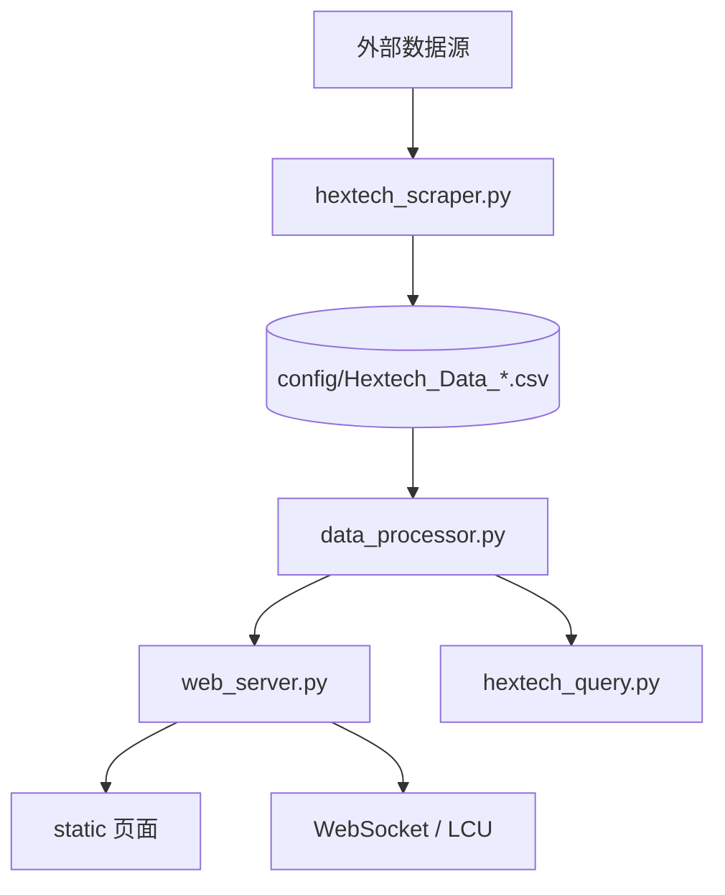

# Hextech Nexus 项目文档

## 1. 项目概览

Hextech Nexus 是一个面向《英雄联盟》ARAM/海克斯数据分析的本地工具集，核心目标是把社区数据、官方数据和本地缓存整合起来，提供可查询、可视化、可同步的分析体验。

它主要覆盖四类能力：

- 英雄数据同步
- 海克斯数据抓取与分析
- 本地 Web 控制台
- 桌面悬浮查询界面

## 2. 目录结构

| 路径 | 作用 |
| --- | --- |
| `web_server.py` | 本地 FastAPI 服务，负责网页端接口、静态资源、WebSocket 推送和 LCU 联动 |
| `hextech_scraper.py` | 海克斯数据抓取器，负责抓取外部数据源、落盘 CSV、更新状态文件 |
| `data_processor.py` | 数据处理核心，负责英雄与海克斯榜单计算、缓存和图标 URL 生成 |
| `hero_sync.py` | 英雄核心数据同步模块，负责 DDragon 版本追踪、头像下载和配置文件刷新 |
| `backend_refresh.py` | 后端数据统一刷新入口，编排 hero_sync、apex_spider、hextech_scraper 的执行顺序 |
| `apex_spider.py` | 英雄协同数据爬虫，抛出 Champion_Synergy.json |
| `hextech_query.py` | 交互式查询入口，负责命令行检索、别名解析和结果展示 |
| `hextech_ui.py` | 桌面悬浮窗界面 |
| `capture.py` | 自动化截图脚本，便于前端验收和回归记录 |
| `config/` | JSON、CSV、日志和运行状态文件 |
| `assets/` | 本地英雄头像与海克斯图标资源 |
| `static/` | Web 前端页面与静态脚本样式 |

## 3. 运行方式

### Web 控制台

```bash
python run/web_server.py
```

启动后会自动打开浏览器，并在默认端口 `8000` 提供服务。

### 桌面悬浮窗

```bash
python run/hextech_ui.py
```

### 数据查询

```bash
python run/hextech_query.py
```

### 数据抓取

```bash
python run/hextech_scraper.py
```

## 4. 数据流



### 关键链路

- `hextech_scraper.py` 定时抓取或更新海克斯数据，生成 CSV。
- `web_server.py` 读取最新 CSV 和配置文件，渲染网页端内容。
- `data_processor.py` 根据最新数据计算榜单，并为海克斯拼接图标 URL。
- `hero_sync.py` 负责英雄基础数据和头像资源同步。

## 5. 配置文件

| 文件 | 说明 |
| --- | --- |
| `config/Champion_Core_Data.json` | 英雄 ID、中文名和英文名映射 |
| `config/Champion_Synergy.json` | 英雄协同数据 |
| `config/Augment_Full_Map.json` | 海克斯中文名与标准名映射 |
| `config/Augment_Icon_Map.json` | 海克斯中文名与图标文件名映射 |
| `config/hero_aliases.json` | 英雄别名表 |
| `config/hero_version.txt` | 当前 DDragon 版本号 |
| `config/scraper_status.json` | 抓取状态记录 |
| `config/user_settings.json` | 本地用户设置 |

## 6. 依赖说明

建议安装以下依赖：

```bash
pip install -r run/requirements.txt
```

当前项目核心依赖包括：

- `pandas`
- `numpy`
- `requests`
- `Pillow`
- `psutil`
- `pywin32`
- `selenium`
- `fastapi[standard]`

## 7. 已知约束

- 图标 URL 依赖 `config/Augment_Icon_Map.json` 的准确映射。
- Web 端默认会尝试访问 CommunityDragon 资源，需要网络可用。
- `capture.py` 依赖 Selenium 和本地浏览器驱动。
- 该项目基于 Windows 环境特性较多，`pywin32` 与部分 LCU 相关逻辑在其他平台上可能不可用。

## 8. 维护建议

- 新增或修改海克斯图标时，优先同步更新 `config/Augment_Icon_Map.json`。
- 修改数据处理逻辑时，尽量保持 `data_processor.py` 的缓存键策略不变。
- 新增页面或接口时，补充 `web_server.py` 中对应的静态资源和返回路径说明。
- 如果抓取源结构变化，优先调整 `hextech_scraper.py`，再回看 `PROJECT.md` 和 `README.md`。

## 9. 变更记录

| 日期 | 变更原因 | 摘要 |
| --- | --- | --- |
| 2026-03-22 | 调试修复 + 文档重构 | 删除 `backend_refresh.py` 重复函数；修复 `Augment_Icon_Map.json` 5 条损坏映射；补全目录说明 |
