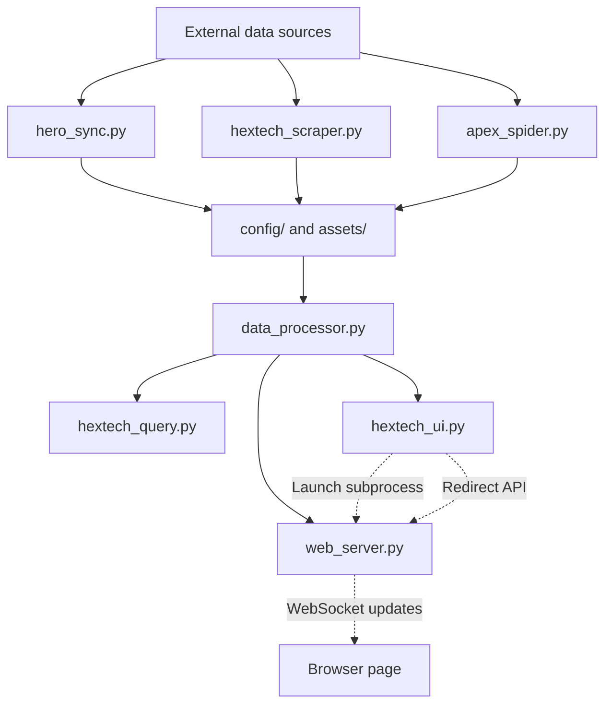

# Hextech Nexus Project Overview

Hextech Nexus is a Windows-first local toolchain for League of Legends data scraping, processing, analysis, and web visualization. The project combines background data refresh, a Tkinter companion UI, and a FastAPI web service into one flow.

## 1. Goals

- Keep champion and Hextech data synchronized from external sources.
- Provide a lightweight desktop companion for in-game interaction.
- Serve local HTML views, API endpoints, and WebSocket updates for the browser UI.
- Keep startup reliable when the default web port is already occupied.

## 2. System Architecture



### Flow summary

1. `hero_sync.py` downloads and normalizes the core champion dataset and supporting assets.
2. `hextech_scraper.py` and `apex_spider.py` collect local gameplay and synergy data.
3. `backend_refresh.py` coordinates refresh jobs and keeps cached artifacts current.
4. `data_processor.py` converts refreshed CSV and JSON inputs into browser-ready payloads.
5. `web_server.py` serves the browser app, API routes, static assets, and live updates.
6. `hextech_ui.py` provides the desktop companion, launches the web server as a child process, and forwards hero clicks to the browser flow.

## 3. Module Responsibilities

| Module | Responsibility |
| --- | --- |
| `hextech_ui.py` | Tkinter companion UI. Starts `web_server.py` in a subprocess, tracks the local client, and forwards hero interactions to the browser experience. |
| `web_server.py` | FastAPI service. Hosts HTML pages, APIs, static assets, WebSocket broadcasts, image fallback logic, and local browser redirection. |
| `hextech_query.py` | CLI entry for text-based hero lookup and console output. |
| `backend_refresh.py` | Orchestrates refresh tasks and keeps the runtime cache in sync. |
| `hero_sync.py` | Downloads DDragon data, builds champion metadata, and manages shared configuration paths. |
| `hextech_scraper.py` | Scrapes and stores local game / synergy data into `config/`. |
| `apex_spider.py` | Additional standalone data analysis and collection helper. |
| `data_processor.py` | Normalizes cached data into the payloads consumed by the web layer. |

## 4. Startup Modes

### Desktop companion

```powershell
python run/hextech_ui.py
```

This is the main user entry point. It starts the desktop overlay, launches `web_server.py` in the background, and then routes hero clicks through the browser flow.

### Standalone web server

```powershell
python run/web_server.py
```

This starts the local FastAPI server directly. If the default port is already in use, the server selects the next available port, writes that port to `config/web_server_port.txt`, and opens the browser on the resolved address.

### Console query mode

```powershell
python run/hextech_query.py
```

This is the text-only lookup mode for local data inspection.

## 5. Port Coordination

The UI and web server now share the actual runtime port through `config/web_server_port.txt`.

- `web_server.py` resolves the first available port at startup.
- `web_server.py` writes the resolved port to the config file before opening the browser.
- `hextech_ui.py` reads the same file before sending `/api/redirect` and before building fallback detail URLs.
- This prevents the browser from reopening on an outdated port after a port switch.

## 6. Runtime Data and Assets

The project keeps runtime files under `run/config/` and `run/assets/`.

### `config/`

- `Champion_Core_Data.json`: champion metadata cache.
- `Champion_Synergy.json`: synergy payload used by the web UI.
- `Augment_Full_Map.json` and `Augment_Icon_Map.json`: augment lookup data.
- `Hextech_Data_*.csv`: scraped and refreshed gameplay data.
- `hero_version.txt`: pinned DDragon version marker.
- `web_server_port.txt`: resolved browser server port.
- `scraper_status.json`: scraper progress state.

### `assets/`

- Cached hero and augment images.
- Fallback files used by the browser UI when a remote image is unavailable.

## 7. Operational Notes

- The project is designed for Windows because the companion UI depends on `pywin32`.
- The UI and browser pages are intentionally decoupled so the companion can keep running even if the browser is closed.
- The web layer should always use the resolved port value rather than assuming `8000`.
- When modifying browser-facing URLs, update both the server-side redirect path and the UI fallback path.

## 8. Recent Change Log

| Date | Area | Summary | Files |
| --- | --- | --- | --- |
| 2026-03-22 | web startup | Fixed the web server bootstrap path, dynamic port handoff, and companion UI browser routing. | `hextech_ui.py`, `web_server.py`, `PROJECT.md` |
| 2026-03-23 | web encoding | Served HTML with an explicit UTF-8 content type and percent-encoded redirect URLs to prevent garbled browser text. | `web_server.py` |
| 2026-03-23 | readability cleanup | Replaced the most visible mojibake comments and startup/status strings with readable Chinese annotations in the UI and web service. | `hextech_ui.py`, `web_server.py` |
| 2026-03-23 | prismatic polish | Restyled prismatic augment shells and tier bars to read as richer metallic rainbow panels instead of flat cyan neon. | `static/detail.html`, `static/detail_preview.html` |
| 2026-03-23 | apexlol icons | Repointed hextech icon URLs to apexlol's `/images/hextech/{slug}.webp` source and stopped rewriting remote icons back to local assets. | `web_server.py`, `static/detail.html`, `static/detail_preview.html` |
