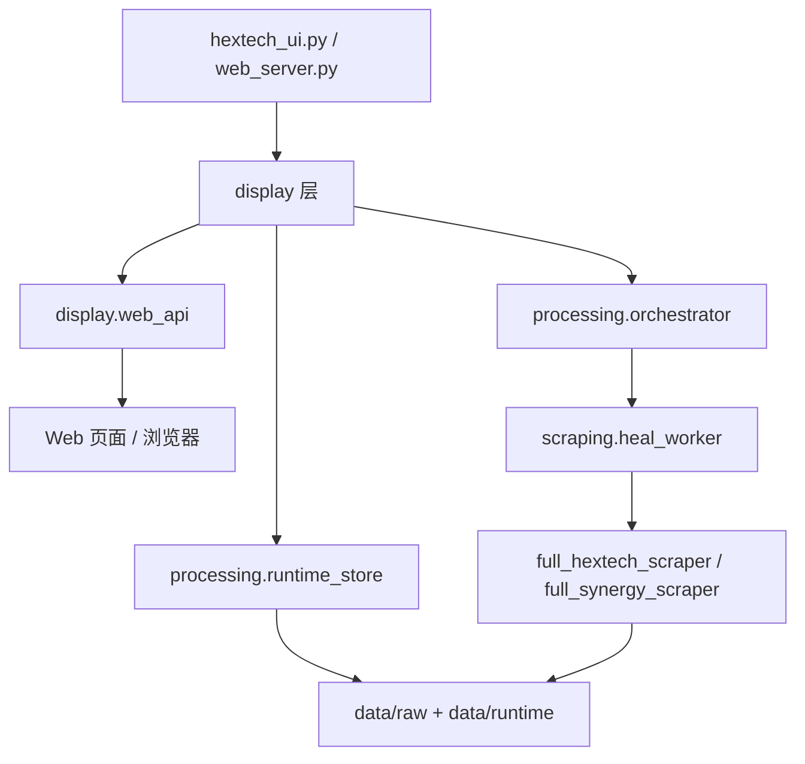

# 项目文档 — run

<!-- PROJECT:SECTION:OVERVIEW -->
## 一、项目总览

`run/` 是 Hextech 伴生系统的实际运行工作区。它不是仓库根治理层，也不是临时实验目录；它承载桌面伴生界面、本地 Web/API、数据处理、远端抓取、自愈修复和 PyInstaller 便携包发布链路。

当前维护目标：

1. 源码态能通过 `python hextech_ui.py` 或 `python web_server.py` 启动。
2. 打包态只使用 `python build.py` 这一条构建入口。
3. 打包产物在非仓库、空运行态目录中首次启动后 60 秒内可用。
4. 高频抓取、缓存、状态、日志和计算产物不随包分发。
5. 首次空仓启动必定触发高频抓取；后续启动按 4 小时新鲜度触发。

---

<!-- PROJECT:SECTION:ARCHITECTURE -->
## 二、架构分层

| 层级 | 目录/入口 | 职责 | 不负责 |
| :--- | :--- | :--- | :--- |
| 入口薄壳 | `build.py`、`hextech_ui.py`、`web_server.py` | 保持历史命令兼容，把控制权转交给真实模块 | 不堆积业务逻辑 |
| 展示与运行 | `display/` | 桌面窗口、本地 Web/API、浏览器/LCU 协同、前端静态资源 | 不做远端抓取实现 |
| 数据处理 | `processing/` | 运行态路径、CSV/DataFrame、视图适配、缓存重建、刷新编排 | 不直接承载 UI 控件 |
| 抓取与自愈 | `scraping/` | 海克斯/协同抓取、稳定资源同步、缺失产物修复 | 不阻塞首屏可用 |
| 工具链 | `tools/` | 打包、白名单、运行态播种、清理、日志、自检、烟测 | 不替代主业务入口 |
| 运行态数据 | `data/` | 本机生成的抓取结果、缓存、锁、日志、profile | 不作为发布源数据 |

---

<!-- PROJECT:SECTION:FILES -->
## 三、文件职责清单

| 文件 | 类型 | 职责 |
| :--- | :--- | :--- |
| `build.py` | thin entry | 打包入口薄壳，委托 `tools.build_bundle` |
| `hextech_ui.py` | thin entry | 桌面启动薄壳，委托 `display.hextech_ui` |
| `web_server.py` | thin entry | Web 启动薄壳，委托 `display.web_server` |
| `display/hextech_ui.py` | ui | 桌面 UI 主类、控件结构与交互入口 |
| `display/ui_runtime.py` | ui runtime | 桌面后台线程、Web 子进程、LCU 轮询、窗口同步、头像加载 |
| `display/web_server.py` | web launcher | FastAPI 应用创建与 Uvicorn 启动 |
| `display/web_api.py` | web api | HTTP/WS 路由、请求模型与接口编排 |
| `display/web_runtime.py` | web runtime | Web 生命周期、LCU、缓存、浏览器与后台刷新触发 |
| `processing/runtime_store.py` | runtime | CSV 与运行时文件定位、DataFrame 缓存与归一 |
| `processing/view_adapter.py` | adapter | 首页榜单与海克斯详情数据适配 |
| `processing/precomputed_cache.py` | cache | 预计算 API 缓存读写 |
| `processing/query_terminal.py` | terminal | 终端查询输出 |
| `processing/alias_search.py` | alias | 首页别名索引读取 |
| `processing/alias_utils.py` | alias | 别名归一与去重 |
| `processing/orchestrator.py` | orchestrator | 后台刷新、自愈与缓存重建编排；包含 4 小时高频新鲜度判断 |
| `scraping/version_sync.py` | sync | 稳定资源同步、源码/冻结态运行根定位、首启目录引导 |
| `scraping/full_hextech_scraper.py` | scraper | 海克斯高频数据抓取，目标总等待约 30 秒 |
| `scraping/full_synergy_scraper.py` | scraper | 协同高频数据抓取，目标总等待约 28-30 秒 |
| `scraping/augment_catalog.py` | catalog | 海克斯统一目录维护与预缓存 |
| `scraping/icon_resolver.py` | icon | 海克斯图标查找、缓存与远端兜底 |
| `scraping/heal_worker.py` | heal | 缺失关键产物自愈修复与启动状态写回 |
| `scraping/augment_common.py` | helper | 海克斯目录公共辅助 |
| `tools/build_bundle.py` | build tool | 打包主流程、版本文件、PyInstaller 参数和产物整理 |
| `tools/bundle_manifest.py` | build tool | 稳定资源白名单与 manifest 生成 |
| `tools/runtime_bundle.py` | runtime tool | 打包后稳定资源播种 |
| `tools/cleanup_runtime.py` | cleanup tool | 构建和运行态残留清理 |
| `tools/log_utils.py` | support tool | 日志过滤、source 标识、UTF-8 输出和冻结态日志目录 |
| `tools/dev_checks.py` | dev tool | 本地结构与构建契约自检 |
| `tools/smoke_packaged_startup.py` | acceptance tool | 打包产物空仓首启 60 秒验收 |

---

<!-- PROJECT:SECTION:DATA_BOUNDARY -->
## 四、数据边界

### 4.1 随包稳定资源

这些资源可以进入便携包，因为它们随游戏/数据版本变化，而不是随用户运行即时变化：

- `display/static/`
- `data/static/` 中的版本级稳定数据文件
- `data/indexes/` 中的版本级稳定索引文件
- `assets/` 中的稳定图片/图标资源
- `Champion_Core_Data.json`
- `Champion_Alias_Index.json`
- `Augment_Icon_Manifest.json`
- 兼容图标映射文件

### 4.2 禁止当作发布源的数据

这些内容属于运行态，不能作为打包源数据：

- `data/raw/hextech/Hextech_Data_*.csv`
- `data/raw/synergy/Champion_Synergy.json`
- `data/runtime/state/*.json`
- `data/runtime/state/web_server_port.txt`
- `data/runtime/cache/`
- `data/runtime/locks/`
- `data/runtime/profile/`
- `data/runtime/persisted/`
- `data/runtime/logs/`
- 任何启动后生成、抓取、缓存、锁、日志或计算产物

### 4.3 首启运行态骨架

源码态和冻结态启动时都应能创建：

- `data/raw/hextech/`
- `data/raw/synergy/`
- `data/runtime/state/`
- `data/runtime/cache/`
- `data/runtime/locks/`
- `data/runtime/profile/`
- `data/runtime/persisted/`
- `data/runtime/logs/`

冻结态运行根必须是 exe 所在便携目录；运行态不得落到 `_internal/data/runtime`。

---

<!-- PROJECT:SECTION:DATAFLOW -->
## 五、启动与数据流



关键约束：

- UI/Web 首屏可用路径不能等待完整网络抓取、图片下载或图标预取。
- 首次空仓启动必须尽早写出 `startup_status.json` 和 `web_server_port.txt`。
- 高频抓取在首次空仓启动必触发；之后只在文件缺失或超过 4 小时时触发。
- 抓取失败应体现在状态和日志里，不应让本地 Web/API 长时间不可用。
- 纯数据转换统一下沉到 `processing/`。
- 远端依赖、稳定资源同步和自愈统一放在 `scraping/`。

---

<!-- PROJECT:SECTION:PACKAGING -->
## 六、打包链路

唯一推荐打包入口：

```powershell
python build.py
```

该入口委托 `tools/build_bundle.py`，负责：

1. 准备稳定资源白名单。
2. 调用 PyInstaller `--onedir`。
3. 补齐 PyInstaller 动态依赖和子模块收集。
4. 整理 `dist/Hextech_伴生系统_YYYYMMDD/`。
5. 写入 `启动 Hextech.bat` 和 `README_首次使用.txt`。
6. 生成 `Hextech_伴生系统_YYYYMMDD_portable.zip`。

不要新增第二条平行打包流程；如果打包行为要变，优先改 `tools/build_bundle.py`、`tools/bundle_manifest.py`、`tools/runtime_bundle.py`。

---

<!-- PROJECT:SECTION:ACCEPTANCE -->
## 七、验收标准

### 7.1 发布前最小验收

```powershell
python tools/smoke_packaged_startup.py --timeout 60
```

验收脚本必须证明：

- 使用最新 `dist/Hextech_*` 目录或显式 `--package-dir`。
- 复制到临时目录后删除 `data/raw` 和 `data/runtime`，构造严格空仓。
- 启动 exe 后 60 秒内可获得端口文件。
- `startup_status.json` 是本轮启动后新写入。
- 运行态目录全部位于便携目录根下。
- `_internal/data/runtime` 不存在。
- `/`、`/api/startup_status`、`/api/champions`、`/detail.html?champion=1`、`/api/synergies/1` 返回可操作响应。

最近一次严格空仓烟测结果：约 3.83 秒可用。

### 7.2 仍需人工确认的 UI 路径

自动烟测覆盖本地 Web/API 和详情页直达能力，但不能完全替代人工确认：

- Tk 悬浮窗是否可见。
- 从悬浮窗点击是否能直达英雄界面。
- 空数据刷新中状态是否符合用户预期。

---

<!-- PROJECT:SECTION:RISKS -->
## 八、已知风险与技术债务

| 编号 | 类型 | 问题描述 | 影响范围 | 状态 | 建议方案 |
| :--- | :--- | :--- | :--- | :--- | :--- |
| TD-001 | 文档漂移 | 历史文档曾残留旧结构描述，与当前真实代码不一致 | `README.md`、`PROJECT.md` | 持续关注 | 目录职责变更时同步更新两份入口文档 |
| TD-002 | 兼容薄壳保留 | 根级入口保留兼容壳职责 | `build.py`、`hextech_ui.py`、`web_server.py` | 已知 | 保持薄壳，仅做委托 |
| ARCH-001 | 模块级瘦身受限 | UI/Web 当前仍会静态触达部分抓取模块，硬排除可能破坏自愈 | 打包体积、PyInstaller 依赖 | 待二阶段 | 先做懒加载/子进程化，再考虑排除模块 |
| OPS-001 | 未签名分发 | 便携包未做 Windows 代码签名，可能触发 SmartScreen | 分发体验 | 已知 | 测试/熟人分发可接受；正式分发需签名 |
| UX-001 | 空仓数据为空 | 首屏可用时 `/api/champions` 可能为空列表 | 空仓首次体验 | 待产品判断 | 如需更明确体验，增加刷新中状态断言和前端提示 |

---

<!-- PROJECT:SECTION:MAINTENANCE -->
## 九、维护规则

- 新增 Web 路由优先落在 `display/web_api.py`。
- 新增 Web 生命周期、LCU、缓存、端口或浏览器逻辑优先落在 `display/web_runtime.py`。
- 新增桌面线程、轮询、跳转和资源加载逻辑优先落在 `display/ui_runtime.py`。
- `display/hextech_ui.py` 只保留 UI 结构、状态和交互入口，不继续堆积后台流程。
- 纯数据转换、DataFrame 清洗、终端展示适配优先落在 `processing/`。
- 远端抓取、图标目录维护、稳定资源同步和自愈逻辑优先落在 `scraping/`。
- 变更打包链路时，必须同步检查 `tools/build_bundle.py`、`tools/bundle_manifest.py`、`tools/runtime_bundle.py`、`README.md` 和本文件。
- 变更目录结构、数据边界或首启验收标准时，必须同步更新 [README.md](README.md) 和本文件。

---

<!-- PROJECT:SECTION:CHANGELOG -->
## 十、变更记录

| 日期 | task_id | 最终改动 | 有效范围 | 遗留债务 |
| :--- | :--- | :--- | :--- | :--- |
| 2026-04-28 | run-docs-clarify-project-state | 重构 `run/` 文档为现状面板 + 维护文档，补齐打包、空仓首启、数据边界和验收标准 | `README.md`、`PROJECT.md` | UI 悬浮窗点击路径仍需人工或 GUI 自动化验收 |
| 2026-04-12 | cx-task-run-project-doc-refresh-20260412 | 按新模板收口 `run/` 项目文档，补齐文件职责、数据流、风险与变更记录 | `PROJECT.md` | TD-001, TD-002, ARCH-001 |
| 2026-04-11 | cx-run-web-ui-performance-refactor | Web / UI 结构收口、注释统一、文档同步 | `display/*`, `tools/dev_checks.py`, `README.md`, `PROJECT.md` | TD-001, TD-002, ARCH-001 |
