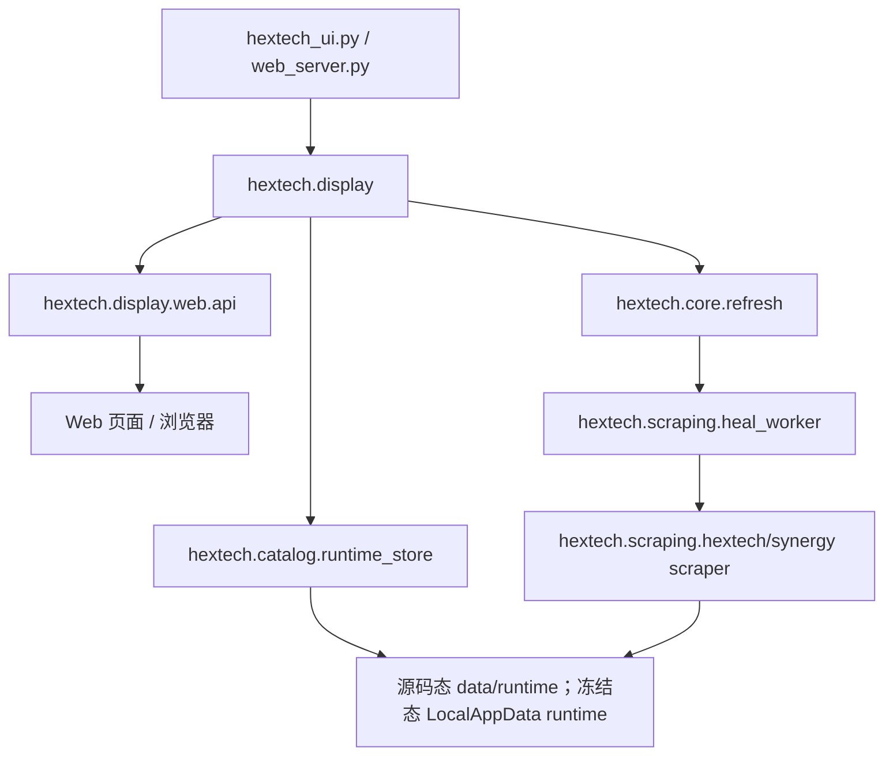

# 项目文档 — run

<!-- PROJECT:SECTION:OVERVIEW -->
## 一、项目总览

`run/` 是 Hextech 伴生系统的实际运行工作区。它不是仓库根治理层，也不是临时实验目录；它承载桌面伴生界面、本地 Web/API、数据处理、远端抓取、自愈修复和 PyInstaller 便携包发布链路。

当前维护目标：

1. 源码态固定使用 `run/.venv` 内 Python 3.11；首次入口误用系统 Python 且 `.venv` 缺失时，允许用 `py -3.11` 自动创建并安装依赖，最终运行只切回 `.venv`；`py -3.11 tools/setup_venv.py` 保留为显式修复工具。
2. 打包态只使用 `.\.venv\Scripts\python.exe build.py` 这一条构建入口，禁止裸系统 Python 打包。
3. 打包产物在非仓库、空运行态目录中首次启动后 60 秒内可用。
4. 高频抓取、缓存、状态、日志和计算产物不随包分发。
5. 首次空仓启动必定触发高频抓取；后续启动按 4 小时新鲜度触发。

---

<!-- PROJECT:SECTION:ARCHITECTURE -->
## 二、架构分层

| 层级 | 目录/入口 | 职责 | 不负责 |
| :--- | :--- | :--- | :--- |
| 入口薄壳 | `build.py`、`hextech_ui.py`、`web_server.py` | 保持历史命令兼容，把控制权转交给真实模块 | 不堆积业务逻辑 |
| 主应用包 | `hextech/` | 承载稳定 import 根；所有可 import 业务代码收口到这里 | 不复制运行态状态 |
| 前端源码 | `frontend/` | Tailwind 源码、Node 构建配置；输出仍写入 Web 静态目录 | 不承载运行时 API 或 Python 逻辑 |
| 展示与运行 | `hextech/display/` | 桌面窗口、本地 Web/API、浏览器/LCU 协同、前端静态资源 | 不做远端抓取实现 |
| 数据处理 | `hextech/catalog/` | 运行态路径、CSV/DataFrame、视图适配、缓存重建、别名索引 | 不直接承载 UI 控件 |
| 核心编排 | `hextech/core/` | 后台刷新编排、运行态偏好和轻量核心合同 | 不承载 UI 控件 |
| 抓取与自愈 | `hextech/scraping/` | 海克斯/协同业务抓取、稳定资源同步、图标目录维护、缺失产物修复和底层 transport | 不阻塞首屏可用 |
| 抓取 transport | `hextech/scraping/transport/` | Scrapling / CloakBrowser 底层抓取客户端 | 不承载业务解析 |
| 工具链 | `tools/` | 打包、白名单、运行态播种、自检、手动验收、烟测 | 不替代主业务入口 |
| 数据根 | `data/` | 源码态唯一数据根；承载稳定版本数据、图片资源、首启 seed、来源证据、诊断 fixture 和运行态数据 | 不保留 `resources/` 镜像；runtime/cache/log/profile 不进包 |

---

<!-- PROJECT:SECTION:FILES -->
## 三、文件职责清单

| 文件 | 类型 | 职责 |
| :--- | :--- | :--- |
| `build.py` | thin entry | 打包入口薄壳，委托 `tools.build_package` |
| `hextech_ui.py` | thin entry | 桌面启动薄壳，委托 `hextech.display.desktop.app` |
| `web_server.py` | thin entry | Web 启动薄壳，委托 `hextech.display.web.app` |
| `hextech/` | application package | 稳定 import 根；承载 desktop、Web、catalog、overlay、scraping 与 core 主实现 |
| `frontend/` | frontend source | Tailwind 源码与 Node 构建配置，编译产物写入 `hextech/display/web/static/` |
| `hextech/display/desktop/app.py` | ui | 桌面 UI 主类、控件结构与交互入口 |
| `hextech/display/desktop/runtime.py` | ui runtime | 桌面后台线程、Web 子进程、LCU 轮询、窗口同步、头像加载 |
| `hextech/display/desktop/service_manager.py` | lifecycle | Web 前端生命周期、低频监听，以及向独立 GameOverlayController 委托启停 |
| `hextech/overlay/lifecycle.py` | overlay lifecycle | host + Vision sidecar 原子启停、失败回滚和统一状态快照 |
| `hextech/overlay/host.py` | overlay host | 透明置顶窗口、前台门控、Alt+H、最小事件轮询；不解释 Web 状态 |
| `hextech/overlay/data_source.py` | overlay adapter | 通过统一协议读取共享 event/hint/context，为后续专属数据源保留替换点 |
| `hextech/overlay/renderer.py` | overlay renderer | 固定三统计窗、0–3 当前英雄联动和 LoL 原生风格 Canvas 绘制 |
| `hextech/display/web/app.py` | web launcher | FastAPI 应用创建与 Uvicorn 启动 |
| `hextech/display/web/api.py` | web api | HTTP/WS 路由、请求模型与接口编排 |
| `hextech/display/web/runtime.py` | web runtime | Web 生命周期、LCU、缓存、浏览器与后台刷新触发 |
| `hextech/core/settings.py` | runtime | Web 前端、游戏内显示、私用统计和低频监听偏好持久化 |
| `hextech/overlay/hints.py` | cache | overlay 本地轻量提示缓存生成、写入和按 augment_id 查询 |
| `hextech/overlay/vision/sidecar.py` | vision sidecar | Pillow/pywin32 本地窗口截图、蓝色按钮场景门控、固定 ROI、模板指纹匹配和事件写入 |
| `hextech/overlay/providers/official.py` | provider | 官方接口优先的三槽候选探测与归一化；只访问 Riot / LoL 本地接口，不直接渲染 overlay |
| `hextech/catalog/runtime_store.py` | runtime | CSV 与运行时文件定位、DataFrame 缓存与归一 |
| `hextech/catalog/view_adapter.py` | adapter | 首页榜单与海克斯详情数据适配 |
| `hextech/catalog/precomputed_cache.py` | cache | 预计算 API 缓存读写 |
| `hextech/catalog/query_terminal.py` | terminal | 终端查询输出 |
| `hextech/catalog/aliases.py` | alias | 首页别名索引读取 |
| `hextech/catalog/alias_utils.py` | alias | 别名归一与去重 |
| `hextech/core/refresh.py` | orchestrator | 后台刷新、自愈与缓存重建编排；包含 4 小时高频新鲜度判断 |
| `hextech/scraping/version_sync.py` | sync | 稳定资源同步、源码/冻结态运行根定位、首启目录引导 |
| `hextech/scraping/hextech/scraper.py` | scraper | 海克斯高频数据抓取，目标总等待约 30 秒 |
| `hextech/scraping/synergy/scraper.py` | scraper | 协同高频数据抓取，目标总等待约 28-30 秒 |
| `hextech/scraping/synergy/mayhem_combo_scraper.py` | scraper | ARAMMayhem Combos 普通 GET 抓取；写入固定 Mayhem raw 清洗输入，不直接供前端读取 |
| `hextech/scraping/transport/scrapling_client.py` | transport | Scrapling 同步抓取客户端 |
| `hextech/scraping/transport/cloakbrowser_client.py` | transport | CloakBrowser 同步抓取客户端 |
| `hextech/scraping/transport/smoke_scrapling.py` | smoke | Scrapling 在线冒烟脚本 |
| `hextech/support/python_runtime.py` | support | 源码态 run/.venv 守卫、依赖预检和自动重启命令构造 |
| `hextech/support/log_utils.py` | support | 统一安装摘要/错误日志、开发态 JSONL 诊断日志、脱敏 filter 和结构化事件写入 |
| `hextech/support/user_diagnostics.py` | support | 打包内用户轻量诊断导出，只采集白名单 state 与日志/事件 tail |
| `tools/setup_venv.py` | setup tool | 显式创建/修复 run/.venv，安装依赖并输出关键包与 Scrapling smoke 摘要 |
| `hextech/scraping/augment_catalog.py` | catalog | 海克斯统一目录维护与预缓存 |
| `hextech/scraping/icon_resolver.py` | icon | 海克斯图标查找、缓存与远端兜底 |
| `hextech/scraping/heal_worker.py` | heal | 缺失关键产物自愈修复与启动状态写回 |
| `tools/build_package.py` | build tool | 打包主流程、临时目录、PyInstaller 参数和最终产物整理 |
| `tools/package_rules.py` | build tool | 稳定资源白名单与 PyInstaller data 规则 |
| `tools/bundle_manifest.py` | build tool | 稳定资源 manifest 生成；不复制资源 |
| `tools/runtime_bundle.py` | runtime tool | 打包后稳定资源播种 |
| `tools/cleanup_runtime.py` | cleanup tool | 构建和运行态残留清理 |
| `tools/clean_mayhem_combos.py` | data tool | 把 Mayhem raw 按英雄 + augment 组合增量合并到前端 cleaned 协同数据 |
| `tools/dev_checks.py` | dev tool | 统一离线自检、bundle manifest 明细校验、Web/UI 手动验收辅助入口；检查执行顺序由 `tools/checks/registry.py` 维护 |
| `tools/checks/` | dev tool | 分域自检清单；当前阶段只拆编排清单，不搬 5000 行检查函数体 |
| `tools/acceptance/` | acceptance tool | 验收工具入口 |
| `tools/acceptance/overlay_performance_probe.py` | acceptance tool | 阶段 5 游戏内显示四状态资源与延迟样本摘要 |
| `tools/acceptance/probe_official_overlay_provider.py` | acceptance tool | 真实 LoL 中只读探测官方本地接口是否提供三槽候选；显式 `--write-event` 才写 overlay 事件 |
| `tools/acceptance/smoke_packaged_startup.py` | acceptance tool | 打包产物空仓首启 60 秒验收 |

---

<!-- PROJECT:SECTION:DATA_BOUNDARY -->
## 四、数据边界

### 4.0 单一数据根分类

`data/` 是源码态唯一数据根，`resources/` 不再作为真实路径存在。分类事实源是
`data/data_manifest.v1.json`，详细用途口径见 `data/DATA_USAGE.md`：

- `static/assets/` 承载图片和图标事实源；`/assets/...` 只是兼容 URL。
- `static/version/` 承载版本级稳定 JSON / TXT 数据；`/data/static/...` 与 `/data/indexes/...` 只是兼容路由。
- `seed/startup/` 承载构建期可读取的首启 seed。
- `fixtures/diagnostics/` 承载 overlay 视觉离线回归样例。
- `evidence/` 承载 `mayhem_combos.raw.json` 等外部来源输入。
- `runtime/` 承载本机运行态状态、缓存、锁、日志、profile 和 debug 输出。

后续如果继续调整路径或合并 JSON，必须同步更新加载器、打包白名单、bundle manifest、
runtime bundle 和验收脚本。不得把 `data/runtime/**` 登记为稳定资源，也不得把
运行期生成的 `data/runtime/raw/**` 或迁移前旧 `data/raw/**` 当作普通版本数据。

### 4.1 随包稳定资源

这些资源可以进入便携包，因为它们随游戏/数据版本变化，而不是随用户运行即时变化：

- `hextech/display/web/static/`
- `data/static/version/` 中的版本级稳定数据和索引文件
- `data/static/assets/` 中的稳定图片/图标资源
- `data/seed/startup/` 中的构建期首启 seed 输入
- 包内 `data/seed/startup/` 中的首启种子快照
- `英雄目录.v1.json`
- `海克斯资源目录.v1.json`
- `Champion_Synergy_Cleaned.json`
- `hero_version.txt`

旧 `/data/static/...` 与 `/data/indexes/...` 文件名由 API 投影兼容，不作为包内实体事实源。
`Champion_Synergy_Cleaned.json` 是协同展示的清洗后静态事实源；Web/API 与
overlay hint cache 默认通过统一运行路径读取它，只有缺失时才回退启动后的 raw latest
或旧固定名快照。

### 4.2 禁止当作发布源的数据

这些内容属于运行态，不能作为打包源数据：

- `data/runtime/raw/hextech/Hextech_Data_*.csv`
- 启动后新生成的 `data/runtime/raw/synergy/Champion_Synergy_*.json`
- 启动后新生成的 `data/runtime/raw/synergy/Champion_Synergy_latest.v1.json`
- 迁移前旧路径 `data/raw/**`
- `data/runtime/state/*.json`
- `data/runtime/state/overlay_anchor_calibration.v1.json`
- `data/runtime/state/web_server_port.txt`
- `data/runtime/cache/`
- `data/runtime/locks/`
- `data/runtime/profile/`
- `data/runtime/persisted/`
- `data/runtime/logs/`
- 任何启动后生成、抓取、缓存、锁、日志或计算产物

例外：`data/evidence/mayhem_combos.raw.json` 是显式入库的 Mayhem 清洗输入，用于复现
`Champion_Synergy_Cleaned.json` 的生成；它不加入 `tools/package_rules.py` 打包白名单，
也不被 Web/API 或前端直接读取。重抓后只有在准备更新 cleaned 数据时才一起提交。

协同数据的包内种子使用时间快照加 latest 指针：`Champion_Synergy_YYYYMMDD_HHMMSS.json`
和 `Champion_Synergy_latest.v1.json`，但包内路径必须是 `data/seed/startup/synergy/`。
Hextech 首启种子快照同理放入 `data/seed/startup/hextech/`。旧固定名
`Champion_Synergy.json` 只保留只读迁移兜底。

### 4.3 首启运行态骨架

源码态和冻结态启动时使用同一套运行态骨架：

- `raw/hextech/`
- `raw/synergy/`
- `state/`
- `cache/`
- `locks/`
- `profile/`
- `persisted/`
- `logs/`

源码态运行态统一位于 `run/data/runtime/`；冻结态运行态统一落到 `%LOCALAPPDATA%/HextechNexus/data/runtime/`（无
`LOCALAPPDATA` 时回退到 `%APPDATA%/HextechNexus/data/runtime/` 或
`~/.hextech_nexus/data/runtime/`），高频快照位于其中的 `raw/hextech/` 与
`raw/synergy/`。冻结态不得在便携包根或 `_internal` 下创建 `data/raw`、
`data/runtime`、`data/processed` 或运行期 cache/profile/log/logs/debug。
冻结态不再接受 `HEXTECH_BASE_DIR` 覆盖运行态根，避免脚本把便携包根当作可写数据目录。

### 4.4 日志与诊断边界

`hextech.support.log_utils` 是运行态日志统一入口。源码态默认 `dev` profile，可通过
`HEXTECH_LOG_PROFILE=packaged|dev|test` 覆盖；冻结态默认 `packaged`。`dev` profile
额外写 `data/runtime/logs/dev/hextech_full.jsonl`，按 10MB x 5 轮转；`packaged`
不写 full debug JSONL，只保留摘要、错误和轻量导出所需事件尾部。

用户侧诊断导出由 `hextech.support.user_diagnostics.export_user_diagnostics()` 提供，
桌面标题栏 `诊断` 按钮异步调用。导出包只包含白名单 state JSON、`runtime_events.v1.jsonl`
和 `supervisor_events.v1.jsonl` 尾部、摘要/错误日志尾部、`summary.json` 和说明文件。
导出逻辑不得读取或复制 `debug/`、旧 `reports/`、`raw/`、`cache/`、`profile/`，
不得把 `auth/token/cookie/secret/nonce/lcu/riot` 相关文件或内容写入 zip。

源码侧重型开发采集工具仍是 `tools/collect_runtime_diagnostics.py`，用于 watch、全量摘要和
debug JSON 复盘；该工具不进入 source manifest，不作为打包态能力。

---

<!-- PROJECT:SECTION:DATAFLOW -->
## 五、启动与数据流


```mermaid
flowchart TD
    A[hextech_ui.py / web_server.py] --> B[hextech.display]
    B --> C[hextech.catalog.runtime_store]
    C --> D[源码态 data/runtime；冻结态 LocalAppData runtime]
    B --> E[hextech.display.web.api]
    E --> F[Web 页面 / 浏览器]
    B --> G[hextech.core.refresh]
    G --> H[hextech.scraping.heal_worker]
    H --> I[hextech.scraping.hextech/synergy scraper]
    I --> D
```

关键约束：

- UI/Web 首屏可用路径不能等待完整网络抓取、图片下载或图标预取。
- 首次空仓启动必须尽早写出 `startup_status.json` 和 `web_server_port.txt`。
- 高频抓取在首次空仓启动必触发；之后只在文件缺失或超过 4 小时时触发。
- 抓取失败应体现在状态和日志里，不应让本地 Web/API 长时间不可用。
- 纯数据转换统一下沉到 `hextech/catalog/`。
- 业务抓取、底层 transport、稳定资源同步、图标目录维护和自愈都放在 `hextech/scraping/`。

---

<!-- PROJECT:SECTION:PACKAGING -->
## 六、打包链路

唯一推荐打包入口：

```powershell
.\.venv\Scripts\python.exe build.py
```

该入口委托 `tools/build_package.py`，负责：

1. 准备稳定资源白名单。
2. 生成临时 bundle manifest，不创建长期 `_bundle_runtime`。
3. 补齐 PyInstaller 动态依赖和子模块收集。
4. 调用 PyInstaller `--onedir`，并把 work/dist/spec 都写入系统临时目录。
5. 整理 `.artifacts/hextech/releases/HextechCompanion-YYYYMMDD/`。
6. 写入 `启动 Hextech.bat` 和 `README_首次使用.txt`。
7. 生成 `.artifacts/hextech/releases/HextechCompanion-YYYYMMDD.zip`。

不要新增第二条平行打包流程；如果打包行为要变，优先改 `tools/build_package.py`、`tools/package_rules.py`、`tools/bundle_manifest.py`、`tools/runtime_bundle.py`。

---

<!-- PROJECT:SECTION:ACCEPTANCE -->
## 七、验收标准

### 7.0 开发阶段统一自检

```powershell
.\.venv\Scripts\python.exe tools/dev_checks.py
```

该入口覆盖结构收口、别名索引、日志契约、bundle manifest、协同数据
freshness、快照定位、发布熔断和结构化协同 payload 回归检查。`run/tests/`
不再作为独立临时测试目录保留。

需要查看打包资源白名单明细时使用：

```powershell
.\.venv\Scripts\python.exe tools/dev_checks.py --bundle-manifest
```

日志与诊断变更的最小自动验收：

```powershell
.\.venv\Scripts\python.exe -m pytest tests/test_runtime_logging.py tests/test_user_diagnostics_export.py tests/test_desktop_diagnostics_button.py -q
.\.venv\Scripts\python.exe -m pytest tests/test_runtime_diagnostics_collector.py tests/test_runtime_supervisor.py tests/test_bundle_manifest.py -q
.\.venv\Scripts\python.exe tools/dev_checks.py --bundle-manifest
```

人工视觉验收必须确认标题栏右侧只有一个低干扰 `诊断` 按钮，英雄列表可见区域不减少，
三个功能开关位置不变，底部状态栏不遮挡，游戏内 overlay 无新增控件。

### 7.1 发布前最小验收

```powershell
.\.venv\Scripts\python.exe tools/acceptance/smoke_packaged_startup.py --timeout 60
```

验收脚本必须证明：

- 使用最新 `.artifacts/hextech/releases/HextechCompanion-*` 目录或显式 `--package-dir`。
- 复制到临时目录后不预删 forbidden 目录，直接检查包根与 `_internal` 不存在运行态副本。
- 使用隔离的 `LOCALAPPDATA` 启动 exe，确认冻结态运行态位于 `HextechNexus/data/runtime`。
- 启动 exe 后 60 秒内可获得端口文件。
- `startup_status.json` 是本轮启动后新写入。
- `data/raw`、`data/runtime`、`data/processed` 与 cache/profile/log/logs/debug 不会出现在包根或 `_internal`。
- 包内首启种子位于 `_internal/data/seed/startup/` 或便携根 `data/seed/startup/`。
- `/`、`/api/startup_status`、`/api/champions`、`/detail.html?champion=1`、`/api/synergies/1` 返回可操作响应。

最近一次严格空仓烟测结果：约 3.83 秒可用。

### 7.2 仍需人工确认的 UI 路径

自动烟测覆盖本地 Web/API 和详情页直达能力，但不能完全替代人工确认：

- Tk 悬浮窗是否可见。
- 从悬浮窗点击是否能直达英雄界面。
- 空数据刷新中状态是否符合用户预期。

Web/UI 详情页右侧联动对齐 ApexLoL 源页的检查保留为手动验收辅助，
因为它依赖浏览器、本地 Web 服务和外网：

```powershell
.\.venv\Scripts\python.exe tools/dev_checks.py --manual-web-synergy --base-url http://127.0.0.1:8000
```

### 7.3 游戏内显示阶段 0-5 验收

阶段 0-2 验证基础窗口能力；阶段 3 验证假识别事件通道；阶段 3R 验证 Pillow/pywin32 Vision MVP；阶段 4 验证 overlay host 与 Vision sidecar 生命周期；阶段 5 验证性能记录结构、打包边界和人工验收清单：

- `.\.venv\Scripts\python.exe tools/dev_checks.py` 必须通过，覆盖双开关配置、ServiceManager 生命周期、overlay hint cache、overlay event channel 和基础 overlay host 合同。
- `.\.venv\Scripts\python.exe hextech_ui.py --game-overlay` 用于人工确认透明置顶、点击穿透、`Alt+H` 显隐、选择结束隐藏和游戏窗口跟随；无 active 选择事件或游戏不在前台时窗口保持隐藏。
- overlay 默认不显示占位框；显示条件为“开关开 + active 海克斯选择事件 + 游戏窗口在前台”，`Alt+H` 只切换用户开关，不绕过事件和前台门控。
- `.\.venv\Scripts\python.exe -c "from hextech.overlay.events import write_sample_overlay_event; print(write_sample_overlay_event())"` 用于写入本地三槽位样例事件；仍需游戏窗口在前台才会显示。
- `.\.venv\Scripts\python.exe -c "from hextech.overlay.events import write_fake_detection_overlay_event; print(write_fake_detection_overlay_event())"` 用于写入假识别事件，验证“事件文件 -> overlay 三槽位渲染”的端到端通道。
- `.\.venv\Scripts\python.exe -m hextech.overlay.vision.sidecar --once --preset auto --write-event` 用于执行一次本地 Vision 探针；无 LoL 窗口时写入 inactive 诊断事件。
- `.\.venv\Scripts\python.exe -m hextech.overlay.vision.sidecar --loop --preset auto --write-event` 用于正式常驻链路；游戏窗口不存在或不在前台时低频待机，并只写一次 inactive 清理旧 active 事件；前台时按约 250ms 截图识别。
- 识别判据为蓝色选择按钮 ROI 场景门控 + 灰度归一化指纹（NCC）+ top1/top2 margin + crop 方差下限，平坦暗面板不参与匹配；模板按图标内容去重，近孪生图标在置信度极高时豁免 margin；active 掉 unstable 延迟约 3 帧再写隐藏事件。新环境首次定位按钮并写 `data/runtime/state/overlay_anchor_calibration.v1.json`，后续每轮仍检测固定按钮 ROI；按钮不存在或锻体碎片三选一时隐藏 overlay。
- `.\.venv\Scripts\python.exe tools/acceptance/probe_official_overlay_provider.py --duration-seconds 120 --interval-ms 500 --dump-runtime-json` 用于官方接口优先验证：只读探测 Live Client Data / LCU 是否提供三槽候选；只有显式 `--write-event` 且返回完整三槽时才写现有 overlay 事件协议。
- `.\.venv\Scripts\python.exe tools/acceptance/overlay_performance_probe.py --latency-ms 180 240 420 --source-tag manual-lol-borderless` 用于记录阶段 5 人工延迟样本摘要。
- `.\.venv\Scripts\python.exe -c "from hextech.overlay.events import write_inactive_overlay_event; print(write_inactive_overlay_event())"` 用于验证非选择态隐藏 overlay。
- LoL `Borderless` / 无边框全屏下人工确认 overlay 可见；当前 MVP 不承诺独占全屏覆盖，FSO 只作为机会性覆盖记录。
- ROI 预设覆盖 `1920x1080`、`2560x1440` 和重点 `2560x1600`；DPI 缩放、多显示器和分辨率切换只记录为人工限制项。
- 桌面控制台必须分别验证只开 Web、只开游戏内显示、两者同开、两者全关四种矩阵。
- 只开游戏内显示时不得依赖 FastAPI、浏览器或 Web 端口；hint cache 只读取本地预计算缓存，并区分缺失、损坏、过期错误路径。
- 本地事件通道只读取 `data/runtime/state/game_overlay_slots.v1.json`，缺失、损坏、过期必须可诊断；只有 `hextech` active 选择态且游戏前台时会显示三槽内容，`body_shard` 只作为诊断类型不显示，其余状态隐藏 overlay；不得触发远端抓取、截图识别或自动点击。
- Vision sidecar 不读游戏内存、不注入、不修改客户端、不自动点击；默认不引入 OpenCV、imagehash 或 WGC。
- 真实 LoL 人工验收需记录识别输出 P95 <= 300ms、overlay 文案更新 P95 <= 500ms。
- 私用统计在本机伴生悬浮窗默认开启；该能力仅作为本机实验，存在 Riot policy 风险，不作为可发布合规能力。

---

<!-- PROJECT:SECTION:RISKS -->
## 八、已知风险与技术债务

| 编号 | 类型 | 问题描述 | 影响范围 | 状态 | 建议方案 |
| :--- | :--- | :--- | :--- | :--- | :--- |
| TD-001 | 文档漂移 | 历史文档曾残留旧结构描述，与当前真实代码不一致 | `README.md`、`PROJECT.md` | 持续关注 | 目录职责变更时同步更新两份入口文档 |
| TD-002 | 兼容薄壳保留 | 根级入口保留兼容壳职责 | `build.py`、`hextech_ui.py`、`web_server.py` | 已知 | 保持薄壳，仅做委托 |
| ARCH-001 | 模块级瘦身受限 | UI/Web 当前仍会静态触达部分抓取模块，硬排除可能破坏自愈 | 打包体积、PyInstaller 依赖 | 待二阶段 | 先做懒加载/子进程化，再考虑排除模块 |
| OPS-001 | 未签名分发 | 便携包未做 Windows 代码签名，可能触发 SmartScreen | 分发体验 | 已知 | 测试/熟人分发可接受；正式分发需签名 |
| UX-001 | 空仓数据为空 | 首屏可用时 `/api/champions` 可能为空列表 | 空仓首次体验 | 待产品判断 | 如需更明确体验，增加刷新中状态断言和前端提示 |

---

<!-- PROJECT:SECTION:MAINTENANCE -->
## 九、维护规则

- 新增 Web 路由优先落在 `hextech/display/web/api.py`。
- 新增 Web 生命周期、LCU、缓存、端口或浏览器逻辑优先落在 `hextech/display/web/runtime.py`。
- 新增 Web 前端生命周期或产品开关委托优先落在 `hextech/display/desktop/service_manager.py`。
- 游戏内显示生命周期、窗口、数据适配和绘制分别落在 `hextech/overlay/lifecycle.py`、`host.py`、`data_source.py`、`renderer.py`。
- `hextech.overlay` 不得导入 FastAPI、Web API 或浏览器模块。
- 新增 overlay 本地三槽位事件协议优先落在 `hextech/overlay/events.py`。真实 Vision 输出只能作为该协议的上游。
- 新增 overlay Vision 探针优先落在 `hextech/overlay/vision/sidecar.py`。
- 新增官方接口三槽候选探针优先落在 `hextech/overlay/providers/official.py` 与 `tools/acceptance/probe_official_overlay_provider.py`；结果只能通过现有 overlay 事件协议输出。
- 新增 overlay 性能验收摘要优先落在 `tools/acceptance/overlay_performance_probe.py`。
- 新增桌面线程、轮询、跳转和资源加载逻辑优先落在 `hextech/display/desktop/runtime.py`。
- `hextech/display/desktop/app.py` 只保留 UI 结构、状态和交互入口，不继续堆积后台流程。
- 新增 overlay hint cache 生成、查询和 schema 优先落在 `hextech/overlay/hints.py`。
- 纯数据转换、DataFrame 清洗、终端展示适配优先落在 `hextech/catalog/`。
- 底层抓取 transport 优先落在 `hextech/scraping/transport/`。
- Scrapling 冒烟脚本优先落在 `hextech/scraping/transport/smoke_scrapling.py`。
- 业务抓取优先落在 `hextech/scraping/hextech/scraper.py` 或 `hextech/scraping/synergy/scraper.py`。
- 图标目录维护、稳定资源同步和自愈逻辑优先落在 `hextech/scraping/`。
- 变更打包链路或验证入口时，必须同步检查 `tools/build_package.py`、`tools/package_rules.py`、`tools/bundle_manifest.py`、`tools/runtime_bundle.py`、`tools/dev_checks.py`、`README.md` 和本文件。
- 变更目录结构、数据边界或首启验收标准时，必须同步更新 [README.md](README.md) 和本文件。

---

<!-- PROJECT:SECTION:CHANGELOG -->
## 十、变更记录

| 日期 | task_id | 最终改动 | 有效范围 | 遗留债务 |
| :--- | :--- | :--- | :--- | :--- |
| 2026-06-20 | independent-game-overlay-module | 将游戏内显示拆为独立 `game_overlay` 包，统一 Controller 管理 host/sidecar，shared-data adapter 隔离数据边界，按真机截图重建三统计窗与 0–3 联动列，快照改为 Pillow 直出 PNG | `game_overlay/`、`display/service_manager.py`、`display/hextech_ui.py`、`tools/`、文档 | 真实 LoL Borderless 下对齐、前后台隐藏和进程残留仍需真机验收 |
| 2026-06-10 | hextech-game-overlay-vision-recalibration | 识别改为灰度归一化 NCC + margin/方差门槛杀暗面板假阳性；修复中文名被 ASCII 归一化滤空导致模板索引仅剩 2 个的致命假阴性；模板按内容去重 + 孪生图标高置信度豁免；ROI 重标定为图标紧贴框；active 退出防抖；新增 `--once --debug-dump` 校准转储；stop 路径仅在有运行服务时写隐藏事件 | `processing/overlay_vision_sidecar.py`、`processing/overlay_hint_cache.py`、`display/service_manager.py`、`tools/dev_checks.py`、`README.md`、`PROJECT.md` | 真实 LoL 卡片界面置信度/margin 实测、16:9 ROI 校准仍需 debug-dump 数据 |
| 2026-06-10 | hextech-game-overlay-visibility-and-loop | 改为开关、active 事件、游戏前台三与门显隐；修复 Alt+H 全局热键；Vision sidecar 改为常驻自门控循环 | `display/`、`processing/`、`tools/dev_checks.py`、`README.md`、`PROJECT.md` | 真实 LoL Borderless 下识别置信度、ROI 对齐和 P95 延迟仍需人工验收 |
| 2026-06-09 | hextech-game-overlay-stage-3r-5 | 新增 Pillow/pywin32 Vision MVP、ServiceManager sidecar 生命周期、打包 source manifest 审计和阶段 5 性能摘要结构 | `display/`、`processing/`、`tools/`、`README.md`、`PROJECT.md` | 真实 LoL Borderless 下 ROI 对齐、点击穿透、Alt+H、窗口跟随和 P95 延迟仍需人工验收 |
| 2026-06-09 | hextech-game-overlay-stage-3-channel | 解耦 overlay 窗口可见性与本地选择事件，默认显示占位框；新增假识别事件写入入口并验证本地事件文件到三槽位渲染通道 | `hextech/overlay/host.py`、`hextech/overlay/events.py`、`tools/dev_checks.py`、`README.md`、`PROJECT.md` | 真实 Vision 识别、ROI、模板匹配、500ms 端到端和 LoL Borderless 人工验收仍在后续阶段 |
| 2026-06-09 | hextech-game-overlay-stage-0-2 | 新增 Web 前端 / 游戏内显示双开关、ServiceManager、基础 overlay host、overlay hint cache 和阶段 0-2 验收合同 | `display/`、`processing/`、`tools/dev_checks.py`、`README.md`、`PROJECT.md` | Vision 识别、三 slot 文案接入、500ms 端到端、打包验收仍在后续阶段 |
| 2026-05-20 | run-tools-verification-consolidation | 清理旧备份残留，收口临时测试和零散验收入口到 `tools/dev_checks.py` | `tools/`, `README.md`, `PROJECT.md` | Web/UI 联动验收仍需本地服务、浏览器和外网 |
| 2026-04-28 | run-docs-clarify-project-state | 重构 `run/` 文档为现状面板 + 维护文档，补齐打包、空仓首启、数据边界和验收标准 | `README.md`、`PROJECT.md` | UI 悬浮窗点击路径仍需人工或 GUI 自动化验收 |
| 2026-04-12 | cx-task-run-project-doc-refresh-20260412 | 按新模板收口 `run/` 项目文档，补齐文件职责、数据流、风险与变更记录 | `PROJECT.md` | TD-001, TD-002, ARCH-001 |
| 2026-04-11 | cx-run-web-ui-performance-refactor | Web / UI 结构收口、注释统一、文档同步 | `display/*`, `tools/dev_checks.py`, `README.md`, `PROJECT.md` | TD-001, TD-002, ARCH-001 |
