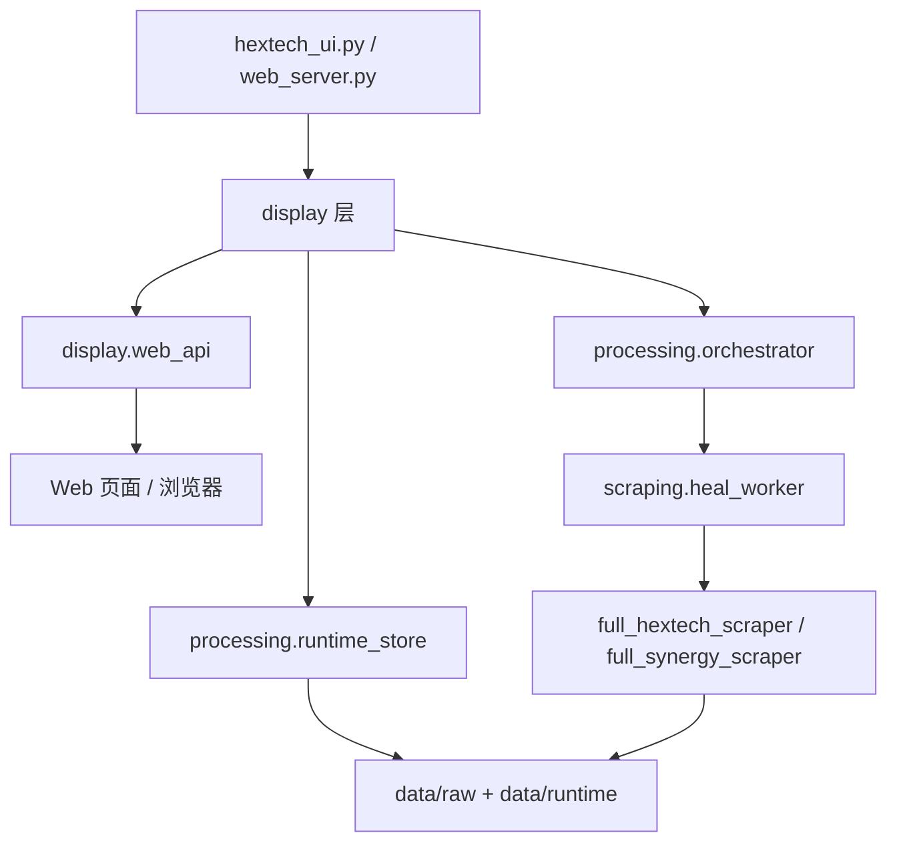

# 项目文档 — run

<!-- PROJECT:SECTION:OVERVIEW -->
## 一、项目总览

`run/` 是 Hextech 伴生系统的实际运行工作区。它不是仓库根治理层，也不是临时实验目录；它承载桌面伴生界面、本地 Web/API、数据处理、远端抓取、自愈修复和 PyInstaller 便携包发布链路。

当前维护目标：

1. 源码态能通过 `python hextech_ui.py` 或 `python web_server.py` 启动。
2. 打包态只使用 `python build.py` 这一条构建入口。
3. 打包产物在非仓库、空运行态目录中首次启动后 60 秒内可用。
4. 高频抓取、缓存、状态、日志和计算产物不随包分发。
5. 首次空仓启动必定触发高频抓取；后续启动按 4 小时新鲜度触发。

---

<!-- PROJECT:SECTION:ARCHITECTURE -->
## 二、架构分层

| 层级 | 目录/入口 | 职责 | 不负责 |
| :--- | :--- | :--- | :--- |
| 入口薄壳 | `build.py`、`hextech_ui.py`、`web_server.py` | 保持历史命令兼容，把控制权转交给真实模块 | 不堆积业务逻辑 |
| 展示与运行 | `display/` | 桌面窗口、本地 Web/API、浏览器/LCU 协同、前端静态资源 | 不做远端抓取实现 |
| 数据处理 | `processing/` | 运行态路径、CSV/DataFrame、视图适配、缓存重建、刷新编排 | 不直接承载 UI 控件 |
| 抓取与自愈 | `scraping/` | 海克斯/协同抓取、稳定资源同步、缺失产物修复 | 不阻塞首屏可用 |
| 工具链 | `tools/` | 打包、白名单、运行态播种、清理、日志、自检、手动验收、烟测 | 不替代主业务入口 |
| 运行态数据 | `data/` | 本机生成的抓取结果、缓存、锁、日志、profile | 不作为发布源数据 |

---

<!-- PROJECT:SECTION:FILES -->
## 三、文件职责清单

| 文件 | 类型 | 职责 |
| :--- | :--- | :--- |
| `build.py` | thin entry | 打包入口薄壳，委托 `tools.build_bundle` |
| `hextech_ui.py` | thin entry | 桌面启动薄壳，委托 `display.hextech_ui` |
| `web_server.py` | thin entry | Web 启动薄壳，委托 `display.web_server` |
| `display/hextech_ui.py` | ui | 桌面 UI 主类、控件结构与交互入口 |
| `display/ui_runtime.py` | ui runtime | 桌面后台线程、Web 子进程、LCU 轮询、窗口同步、头像加载 |
| `display/service_manager.py` | lifecycle | Web 前端、游戏内 overlay host、Vision sidecar 和低频监听的生命周期管理 |
| `display/game_overlay_host.py` | overlay | 阶段 0-5 游戏内透明置顶窗口、三与门显隐和本地事件渲染；不负责真实识别链路 |
| `display/web_server.py` | web launcher | FastAPI 应用创建与 Uvicorn 启动 |
| `display/web_api.py` | web api | HTTP/WS 路由、请求模型与接口编排 |
| `display/web_runtime.py` | web runtime | Web 生命周期、LCU、缓存、浏览器与后台刷新触发 |
| `processing/ui_feature_flags.py` | runtime | Web 前端、游戏内显示、私用统计和低频监听偏好持久化 |
| `processing/overlay_hint_cache.py` | cache | overlay 本地轻量提示缓存生成、写入和按 augment_id 查询 |
| `processing/overlay_vision_sidecar.py` | vision | Pillow/pywin32 本地窗口截图、固定 ROI、模板指纹匹配和事件写入 |
| `processing/runtime_store.py` | runtime | CSV 与运行时文件定位、DataFrame 缓存与归一 |
| `processing/view_adapter.py` | adapter | 首页榜单与海克斯详情数据适配 |
| `processing/precomputed_cache.py` | cache | 预计算 API 缓存读写 |
| `processing/query_terminal.py` | terminal | 终端查询输出 |
| `processing/alias_search.py` | alias | 首页别名索引读取 |
| `processing/alias_utils.py` | alias | 别名归一与去重 |
| `processing/orchestrator.py` | orchestrator | 后台刷新、自愈与缓存重建编排；包含 4 小时高频新鲜度判断 |
| `scraping/version_sync.py` | sync | 稳定资源同步、源码/冻结态运行根定位、首启目录引导 |
| `scraping/full_hextech_scraper.py` | scraper | 海克斯高频数据抓取，目标总等待约 30 秒 |
| `scraping/full_synergy_scraper.py` | scraper | 协同高频数据抓取，目标总等待约 28-30 秒 |
| `scraping/augment_catalog.py` | catalog | 海克斯统一目录维护与预缓存 |
| `scraping/icon_resolver.py` | icon | 海克斯图标查找、缓存与远端兜底 |
| `scraping/heal_worker.py` | heal | 缺失关键产物自愈修复与启动状态写回 |
| `scraping/augment_common.py` | helper | 海克斯目录公共辅助 |
| `tools/build_bundle.py` | build tool | 打包主流程、版本文件、PyInstaller 参数和产物整理 |
| `tools/bundle_manifest.py` | build tool | 稳定资源白名单与 manifest 生成 |
| `tools/runtime_bundle.py` | runtime tool | 打包后稳定资源播种 |
| `tools/cleanup_runtime.py` | cleanup tool | 构建和运行态残留清理 |
| `tools/log_utils.py` | support tool | 日志过滤、source 标识、UTF-8 输出和冻结态日志目录 |
| `tools/dev_checks.py` | dev tool | 统一离线自检、bundle manifest 明细校验、Web/UI 手动验收辅助入口 |
| `tools/overlay_performance_probe.py` | acceptance tool | 阶段 5 游戏内显示四状态资源与延迟样本摘要 |
| `tools/smoke_packaged_startup.py` | acceptance tool | 打包产物空仓首启 60 秒验收 |

---

<!-- PROJECT:SECTION:DATA_BOUNDARY -->
## 四、数据边界

### 4.1 随包稳定资源

这些资源可以进入便携包，因为它们随游戏/数据版本变化，而不是随用户运行即时变化：

- `display/static/`
- `data/static/` 中的版本级稳定数据文件
- `data/indexes/` 中的版本级稳定索引文件
- `assets/` 中的稳定图片/图标资源
- `Champion_Core_Data.json`
- `Champion_Alias_Index.json`
- `Augment_Icon_Manifest.json`
- 兼容图标映射文件

### 4.2 禁止当作发布源的数据

这些内容属于运行态，不能作为打包源数据：

- `data/raw/hextech/Hextech_Data_*.csv`
- 启动后新生成的 `data/raw/synergy/Champion_Synergy_*.json`
- 启动后新生成的 `data/raw/synergy/Champion_Synergy_latest.v1.json`
- `data/runtime/state/*.json`
- `data/runtime/state/web_server_port.txt`
- `data/runtime/cache/`
- `data/runtime/locks/`
- `data/runtime/profile/`
- `data/runtime/persisted/`
- `data/runtime/logs/`
- 任何启动后生成、抓取、缓存、锁、日志或计算产物

协同数据的包内种子使用时间快照加 latest 指针：`Champion_Synergy_YYYYMMDD_HHMMSS.json`
和 `Champion_Synergy_latest.v1.json`。旧固定名 `Champion_Synergy.json` 只保留只读迁移兜底。

### 4.3 首启运行态骨架

源码态和冻结态启动时都应能创建：

- `data/raw/hextech/`
- `data/raw/synergy/`
- `data/runtime/state/`
- `data/runtime/cache/`
- `data/runtime/locks/`
- `data/runtime/profile/`
- `data/runtime/persisted/`
- `data/runtime/logs/`

冻结态运行根必须是 exe 所在便携目录；运行态不得落到 `_internal/data/runtime`。

---

<!-- PROJECT:SECTION:DATAFLOW -->
## 五、启动与数据流


```mermaid
flowchart TD
    A[hextech_ui.py / web_server.py] --> B[display 层]
    B --> C[processing.runtime_store]
    C --> D[data/raw + data/runtime]
    B --> E[display.web_api]
    E --> F[Web 页面 / 浏览器]
    B --> G[processing.orchestrator]
    G --> H[scraping.heal_worker]
    H --> I[full_hextech_scraper / full_synergy_scraper]
    I --> D
```

关键约束：

- UI/Web 首屏可用路径不能等待完整网络抓取、图片下载或图标预取。
- 首次空仓启动必须尽早写出 `startup_status.json` 和 `web_server_port.txt`。
- 高频抓取在首次空仓启动必触发；之后只在文件缺失或超过 4 小时时触发。
- 抓取失败应体现在状态和日志里，不应让本地 Web/API 长时间不可用。
- 纯数据转换统一下沉到 `processing/`。
- 远端依赖、稳定资源同步和自愈统一放在 `scraping/`。

---

<!-- PROJECT:SECTION:PACKAGING -->
## 六、打包链路

唯一推荐打包入口：

```powershell
python build.py
```

该入口委托 `tools/build_bundle.py`，负责：

1. 准备稳定资源白名单。
2. 调用 PyInstaller `--onedir`。
3. 补齐 PyInstaller 动态依赖和子模块收集。
4. 整理 `dist/Hextech_伴生系统_YYYYMMDD/`。
5. 写入 `启动 Hextech.bat` 和 `README_首次使用.txt`。
6. 生成 `Hextech_伴生系统_YYYYMMDD_portable.zip`。

不要新增第二条平行打包流程；如果打包行为要变，优先改 `tools/build_bundle.py`、`tools/bundle_manifest.py`、`tools/runtime_bundle.py`。

---

<!-- PROJECT:SECTION:ACCEPTANCE -->
## 七、验收标准

### 7.0 开发阶段统一自检

```powershell
python tools/dev_checks.py
```

该入口覆盖结构收口、别名索引、日志契约、bundle manifest、协同数据
freshness、快照定位、发布熔断和结构化协同 payload 回归检查。`run/tests/`
不再作为独立临时测试目录保留。

需要查看打包资源白名单明细时使用：

```powershell
python tools/dev_checks.py --bundle-manifest
```

### 7.1 发布前最小验收

```powershell
python tools/smoke_packaged_startup.py --timeout 60
```

验收脚本必须证明：

- 使用最新 `dist/Hextech_*` 目录或显式 `--package-dir`。
- 复制到临时目录后删除 `data/raw` 和 `data/runtime`，构造严格空仓。
- 启动 exe 后 60 秒内可获得端口文件。
- `startup_status.json` 是本轮启动后新写入。
- 运行态目录全部位于便携目录根下。
- `_internal/data/runtime` 不存在。
- `/`、`/api/startup_status`、`/api/champions`、`/detail.html?champion=1`、`/api/synergies/1` 返回可操作响应。

最近一次严格空仓烟测结果：约 3.83 秒可用。

### 7.2 仍需人工确认的 UI 路径

自动烟测覆盖本地 Web/API 和详情页直达能力，但不能完全替代人工确认：

- Tk 悬浮窗是否可见。
- 从悬浮窗点击是否能直达英雄界面。
- 空数据刷新中状态是否符合用户预期。

Web/UI 详情页右侧联动对齐 ApexLoL 源页的检查保留为手动验收辅助，
因为它依赖浏览器、本地 Web 服务和外网：

```powershell
python tools/dev_checks.py --manual-web-synergy --base-url http://127.0.0.1:8000
```

### 7.3 游戏内显示阶段 0-5 验收

阶段 0-2 验证基础窗口能力；阶段 3 验证假识别事件通道；阶段 3R 验证 Pillow/pywin32 Vision MVP；阶段 4 验证 overlay host 与 Vision sidecar 生命周期；阶段 5 验证性能记录结构、打包边界和人工验收清单：

- `python tools/dev_checks.py` 必须通过，覆盖双开关配置、ServiceManager 生命周期、overlay hint cache、overlay event channel 和基础 overlay host 合同。
- `python hextech_ui.py --game-overlay` 用于人工确认透明置顶、点击穿透、`Alt+H` 显隐、选择结束隐藏和游戏窗口跟随；无 active 选择事件或游戏不在前台时窗口保持隐藏。
- overlay 默认不显示占位框；显示条件为“开关开 + active 选择事件 + 游戏窗口在前台”，`Alt+H` 只切换用户开关，不绕过事件和前台门控。
- `python -c "from processing.overlay_event_channel import write_sample_overlay_event; print(write_sample_overlay_event())"` 用于写入本地三槽位样例事件；仍需游戏窗口在前台才会显示。
- `python -c "from processing.overlay_event_channel import write_fake_detection_overlay_event; print(write_fake_detection_overlay_event())"` 用于写入假识别事件，验证“事件文件 -> overlay 三槽位渲染”的端到端通道。
- `python -m processing.overlay_vision_sidecar --once --preset auto --write-event` 用于执行一次本地 Vision 探针；无 LoL 窗口时写入 inactive 诊断事件。
- `python -m processing.overlay_vision_sidecar --loop --preset auto --write-event` 用于正式常驻链路；游戏窗口不存在或不在前台时低频待机，并只写一次 inactive 清理旧 active 事件；前台时按约 250ms 截图识别。
- 识别判据为灰度归一化指纹（NCC）+ top1/top2 margin + crop 方差下限，平坦暗面板不参与匹配；模板按图标内容去重，近孪生图标在置信度极高时豁免 margin；active 掉 unstable 延迟约 3 帧再写隐藏事件。ROI 框图标区，`2560x1600` 为实测标定，16:9 为推算值；`--once --debug-dump <目录>` 转储单帧、ROI crop 和 top3 候选分数供校准。
- `python tools/overlay_performance_probe.py --latency-ms 180 240 420 --source-tag manual-lol-borderless` 用于记录阶段 5 人工延迟样本摘要。
- `python -c "from processing.overlay_event_channel import write_inactive_overlay_event; print(write_inactive_overlay_event())"` 用于验证非选择态隐藏 overlay。
- LoL `Borderless` / 无边框全屏下人工确认 overlay 可见；当前 MVP 不承诺独占全屏覆盖，FSO 只作为机会性覆盖记录。
- ROI 预设覆盖 `1920x1080`、`2560x1440` 和重点 `2560x1600`；DPI 缩放、多显示器和分辨率切换只记录为人工限制项。
- 桌面控制台必须分别验证只开 Web、只开游戏内显示、两者同开、两者全关四种矩阵。
- 只开游戏内显示时不得依赖 FastAPI、浏览器或 Web 端口；hint cache 只读取本地预计算缓存，并区分缺失、损坏、过期错误路径。
- 本地事件通道只读取 `data/runtime/state/game_overlay_slots.v1.json`，缺失、损坏、过期必须可诊断；只有 `hextech` 或 `body_shard` 选择态且游戏前台时会显示 active 三槽内容，其余状态隐藏 overlay；不得触发远端抓取、截图识别或自动点击。
- Vision sidecar 不读游戏内存、不注入、不修改客户端、不自动点击；默认不引入 OpenCV、imagehash 或 WGC。
- 真实 LoL 人工验收需记录识别输出 P95 <= 300ms、overlay 文案更新 P95 <= 500ms。
- 私用统计开关默认关闭；启用后仅作为本机实验，存在 Riot policy 风险，不作为可发布合规能力。

---

<!-- PROJECT:SECTION:RISKS -->
## 八、已知风险与技术债务

| 编号 | 类型 | 问题描述 | 影响范围 | 状态 | 建议方案 |
| :--- | :--- | :--- | :--- | :--- | :--- |
| TD-001 | 文档漂移 | 历史文档曾残留旧结构描述，与当前真实代码不一致 | `README.md`、`PROJECT.md` | 持续关注 | 目录职责变更时同步更新两份入口文档 |
| TD-002 | 兼容薄壳保留 | 根级入口保留兼容壳职责 | `build.py`、`hextech_ui.py`、`web_server.py` | 已知 | 保持薄壳，仅做委托 |
| ARCH-001 | 模块级瘦身受限 | UI/Web 当前仍会静态触达部分抓取模块，硬排除可能破坏自愈 | 打包体积、PyInstaller 依赖 | 待二阶段 | 先做懒加载/子进程化，再考虑排除模块 |
| OPS-001 | 未签名分发 | 便携包未做 Windows 代码签名，可能触发 SmartScreen | 分发体验 | 已知 | 测试/熟人分发可接受；正式分发需签名 |
| UX-001 | 空仓数据为空 | 首屏可用时 `/api/champions` 可能为空列表 | 空仓首次体验 | 待产品判断 | 如需更明确体验，增加刷新中状态断言和前端提示 |

---

<!-- PROJECT:SECTION:MAINTENANCE -->
## 九、维护规则

- 新增 Web 路由优先落在 `display/web_api.py`。
- 新增 Web 生命周期、LCU、缓存、端口或浏览器逻辑优先落在 `display/web_runtime.py`。
- 新增 Web 前端 / 游戏内显示进程生命周期优先落在 `display/service_manager.py`。
- 新增基础 overlay host 能力优先落在 `display/game_overlay_host.py`；真实识别链路需另起阶段。
- 新增 overlay 本地三槽位事件协议优先落在 `processing/overlay_event_channel.py`；真实 Vision 输出只能作为该协议的上游。
- 新增 overlay Vision 探针优先落在 `processing/overlay_vision_sidecar.py`；默认只使用 Pillow/pywin32 本地能力。
- 新增 overlay 性能验收摘要优先落在 `tools/overlay_performance_probe.py`。
- 新增桌面线程、轮询、跳转和资源加载逻辑优先落在 `display/ui_runtime.py`。
- `display/hextech_ui.py` 只保留 UI 结构、状态和交互入口，不继续堆积后台流程。
- 新增 overlay hint cache 生成、查询和 schema 优先落在 `processing/overlay_hint_cache.py`。
- 纯数据转换、DataFrame 清洗、终端展示适配优先落在 `processing/`。
- 远端抓取、图标目录维护、稳定资源同步和自愈逻辑优先落在 `scraping/`。
- 变更打包链路或验证入口时，必须同步检查 `tools/build_bundle.py`、`tools/bundle_manifest.py`、`tools/runtime_bundle.py`、`tools/dev_checks.py`、`README.md` 和本文件。
- 变更目录结构、数据边界或首启验收标准时，必须同步更新 [README.md](README.md) 和本文件。

---

<!-- PROJECT:SECTION:CHANGELOG -->
## 十、变更记录

| 日期 | task_id | 最终改动 | 有效范围 | 遗留债务 |
| :--- | :--- | :--- | :--- | :--- |
| 2026-06-10 | hextech-game-overlay-vision-recalibration | 识别改为灰度归一化 NCC + margin/方差门槛杀暗面板假阳性；修复中文名被 ASCII 归一化滤空导致模板索引仅剩 2 个的致命假阴性；模板按内容去重 + 孪生图标高置信度豁免；ROI 重标定为图标紧贴框；active 退出防抖；新增 `--once --debug-dump` 校准转储；stop 路径仅在有运行服务时写隐藏事件 | `processing/overlay_vision_sidecar.py`、`processing/overlay_hint_cache.py`、`display/service_manager.py`、`tools/dev_checks.py`、`README.md`、`PROJECT.md` | 真实 LoL 卡片界面置信度/margin 实测、16:9 ROI 校准仍需 debug-dump 数据 |
| 2026-06-10 | hextech-game-overlay-visibility-and-loop | 改为开关、active 事件、游戏前台三与门显隐；修复 Alt+H 全局热键；Vision sidecar 改为常驻自门控循环 | `display/`、`processing/`、`tools/dev_checks.py`、`README.md`、`PROJECT.md` | 真实 LoL Borderless 下识别置信度、ROI 对齐和 P95 延迟仍需人工验收 |
| 2026-06-09 | hextech-game-overlay-stage-3r-5 | 新增 Pillow/pywin32 Vision MVP、ServiceManager sidecar 生命周期、打包 source manifest 审计和阶段 5 性能摘要结构 | `display/`、`processing/`、`tools/`、`README.md`、`PROJECT.md` | 真实 LoL Borderless 下 ROI 对齐、点击穿透、Alt+H、窗口跟随和 P95 延迟仍需人工验收 |
| 2026-06-09 | hextech-game-overlay-stage-3-channel | 解耦 overlay 窗口可见性与本地选择事件，默认显示占位框；新增假识别事件写入入口并验证本地事件文件到三槽位渲染通道 | `display/game_overlay_host.py`、`processing/overlay_event_channel.py`、`tools/dev_checks.py`、`README.md`、`PROJECT.md` | 真实 Vision 识别、ROI、模板匹配、500ms 端到端和 LoL Borderless 人工验收仍在后续阶段 |
| 2026-06-09 | hextech-game-overlay-stage-0-2 | 新增 Web 前端 / 游戏内显示双开关、ServiceManager、基础 overlay host、overlay hint cache 和阶段 0-2 验收合同 | `display/`、`processing/`、`tools/dev_checks.py`、`README.md`、`PROJECT.md` | Vision 识别、三 slot 文案接入、500ms 端到端、打包验收仍在后续阶段 |
| 2026-05-20 | run-tools-verification-consolidation | 清理旧备份残留，收口临时测试和零散验收入口到 `tools/dev_checks.py` | `tools/`, `README.md`, `PROJECT.md` | Web/UI 联动验收仍需本地服务、浏览器和外网 |
| 2026-04-28 | run-docs-clarify-project-state | 重构 `run/` 文档为现状面板 + 维护文档，补齐打包、空仓首启、数据边界和验收标准 | `README.md`、`PROJECT.md` | UI 悬浮窗点击路径仍需人工或 GUI 自动化验收 |
| 2026-04-12 | cx-task-run-project-doc-refresh-20260412 | 按新模板收口 `run/` 项目文档，补齐文件职责、数据流、风险与变更记录 | `PROJECT.md` | TD-001, TD-002, ARCH-001 |
| 2026-04-11 | cx-run-web-ui-performance-refactor | Web / UI 结构收口、注释统一、文档同步 | `display/*`, `tools/dev_checks.py`, `README.md`, `PROJECT.md` | TD-001, TD-002, ARCH-001 |
