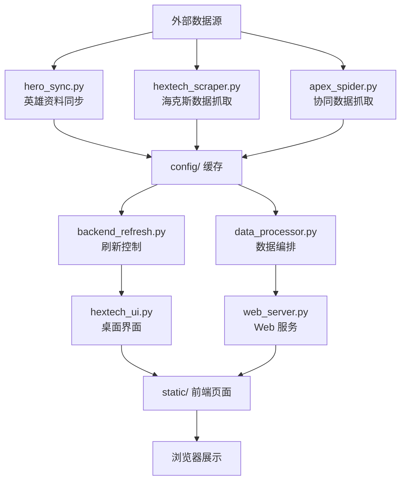

# Hextech 伴生系统文档

## 项目概述

**Hextech 伴生系统**是一个面向《英雄联盟》玩家的本地数据分析工具，提供英雄海克斯装备数据的实时查询、可视化展示和桌面伴生功能。

### 核心功能
- 📊 **数据采集**：自动同步英雄资料、海克斯数据、协同数据
- 🖥️ **桌面伴生**：常驻侧边栏界面，实时监控选人阶段
- 🌐 **Web 展示**：本地浏览器页面展示详细数据
- 🔔 **实时联动**：点击英雄自动跳转详情页
- 🔄 **自动刷新**：每 4 小时后台自动同步最新数据

---

## 快速开始

### 1. 环境要求
- Python 3.11+
- Windows 系统（推荐 Windows 10/11）
- 网络连接（用于数据同步）

### 2. 安装依赖
```powershell
pip install -r requirements.txt
```

### 3. 首次运行
```powershell
# 启动桌面伴生系统（推荐）
python hextech_ui.py

# 或仅启动 Web 服务
python web_server.py

# 或终端查询模式
python hextech_query.py
```

### 4. 打包成可执行文件
```powershell
# 运行打包脚本
python build.py

# 输出目录：dist/Hextech_伴生系统_YYYYMMDD/
```

### 5. 清理临时文件
```powershell
# 清理工作痕迹
python cleanup.py
```

---

## 目录结构

```
run/
├── hextech_ui.py              # 桌面伴生界面（主入口）
├── web_server.py              # Web 服务（FastAPI）
├── hextech_query.py           # 终端查询入口
├── backend_refresh.py         # 后台刷新总控
├── data_processor.py          # 数据编排处理
├── hero_sync.py               # 英雄数据同步
├── hextech_scraper.py         # 海克斯数据抓取
├── apex_spider.py             # 协同数据抓取
├── build.py                   # 打包脚本
├── cleanup.py                 # 清理脚本
├── requirements.txt           # Python 依赖
├── PROJECT.md                 # 项目架构文档
│
├── assets/                    # 图标缓存
│   └── {hero_id}.png
│
├── config/                    # 运行时数据
│   ├── Champion_Core_Data.json
│   ├── Champion_Synergy.json
│   ├── Augment_Full_Map.json
│   ├── Augment_Icon_Map.json
│   ├── Hextech_Data_*.csv
│   └── web_server_port.txt
│
├── static/                    # Web 前端资源
│   ├── index.html             # 英雄列表页
│   ├── detail.html            # 英雄详情页
│   ├── canvas_fallback.js     # Canvas 渲染引擎
│   └── test_canvas.html       # Canvas 测试页
│
└── dist/                      # 打包输出目录（运行后生成）
    └── Hextech_伴生系统_YYYYMMDD/
        ├── Hextech伴生终端.exe
        └── 使用说明.txt
```

---

## 使用指南

### 桌面伴生模式

1. **启动程序**：运行 `python hextech_ui.py`
2. **界面显示**：半透明侧边栏出现在屏幕右侧
3. **选人监控**：自动检测游戏选人阶段，显示备战席英雄
4. **点击英雄**：
   - 终端输出该英雄的海克斯数据
   - 浏览器自动打开英雄详情页
5. **窗口行为**：
   - 游戏全屏时会自动隐藏
   - 客户端窗口激活时显示
   - 支持拖拽调整位置

### Web 服务模式

1. **启动服务**：运行 `python web_server.py`
2. **自动打开浏览器**：访问 `http://127.0.0.1:{port}/`
3. **查看数据**：
   - `/` 或 `/index.html`：英雄列表页
   - `/detail.html?hero=英雄名`：英雄详情页
   - `/api/champions`：英雄数据 API
   - `/api/champion/{name}/hextechs`：海克斯数据 API

### 终端查询模式

1. **启动查询**：运行 `python hextech_query.py`
2. **输入英雄名**：输入英雄名称查看海克斯装备推荐
3. **退出**：按 Ctrl+C 退出

---

## 数据流架构



### 核心模块说明

| 模块 | 职责 | 入口点 |
|------|------|--------|
| `hextech_ui.py` | Tkinter 桌面界面 | 主程序 |
| `web_server.py` | FastAPI Web 服务 | 子进程 |
| `backend_refresh.py` | 后台刷新总控 | 线程 |
| `data_processor.py` | 数据编排处理 | 工具模块 |
| `hero_sync.py` | 英雄资料同步 | 工具模块 |
| `hextech_scraper.py` | 海克斯数据抓取 | 工具模块 |
| `apex_spider.py` | 协同数据抓取 | 工具模块 |
| `hextech_query.py` | 终端查询入口 | 独立脚本 |

---

## 首次运行配置

### 1. 数据初始化

首次运行时，系统会自动：
1. 创建 `config/`、`assets/` 目录
2. 下载英雄核心数据（约 1-2 分钟）
3. 抓取海克斯装备数据
4. 生成协同数据映射

**等待提示**：终端显示"数据同步完成"后即可使用。

### 2. 端口配置

- 默认端口：8000
- 端口被占用时自动切换
- 实际端口写入 `config/web_server_port.txt`
- UI 自动读取该文件获取正确端口

### 3. 图标缓存

- 英雄头像：自动下载到 `assets/{id}.png`
- 海克斯图标：优先使用 CDN，失败时使用 Canvas 渲染
- 缓存机制：已下载图标不再重复请求

---

## 常见问题

### 1. 程序启动失败

**问题**：提示"缺少核心依赖模块"

**解决**：
```powershell
pip install -r requirements.txt
```

### 2. 数据同步失败

**问题**：终端显示"数据同步失败"

**解决**：
1. 检查网络连接
2. 等待 1-2 分钟重试
3. 检查 `config/` 目录权限

### 3. 端口被占用

**问题**：提示"端口 8000 已被占用"

**解决**：
- 系统已自动切换端口，查看 `config/web_server_port.txt`
- 或关闭占用端口的程序

### 4. 图标无法加载

**问题**：页面显示空白图标

**解决**：
- 检查网络连接（需访问 CommunityDragon CDN）
- 查看浏览器控制台错误
- 清除缓存重试

### 5. 打包后被系统拦截

**问题**：Windows Defender 拦截 exe

**解决**：
- **临时方案**：右键 → 属性 → 勾选"解除锁定"
- **推荐方案**：购买代码签名证书进行数字签名

---

## 技术栈

### 后端
- **Python 3.11+**：主开发语言
- **FastAPI**：Web 服务框架
- **Requests**：HTTP 请求
- **Pandas**：数据处理
- **psutil**：进程监控

### 前端
- **HTML5 + JavaScript**：页面展示
- **Canvas API**：图标渲染（无依赖）
- **原生 DOM API**：交互操作

### 桌面
- **Tkinter**：GUI 界面
- **pywin32**：Windows API 调用

### 打包
- **PyInstaller**：Python 打包工具
- **signtool**：数字签名（可选）

---

## 安全说明

### 1. 数据安全
- 所有数据存储在本地 `config/` 目录
- 不上传用户数据到任何服务器
- 不收集个人隐私信息

### 2. 网络安全
- 仅访问官方数据源（Riot Games、CommunityDragon）
- HTTPS 安全连接
- 请求频率控制，避免被封禁

### 3. 文件安全
- 不修改系统文件
- 不注入游戏进程
- 纯读取游戏客户端信息（通过官方 LCU API）

### 4. 反病毒说明
- 打包后的 exe 可能被误报
- 原因：PyInstaller 打包特征 + 网络请求行为
- 解决：添加白名单或数字签名

---

## 开发指南

### 新增功能流程

1. **需求分析**：明确功能需求和用户场景
2. **架构设计**：选择合适模块进行扩展
3. **代码实现**：
   - 遵循现有代码风格
   - 添加必要的日志和错误处理
4. **测试验证**：
   - 单元测试
   - 集成测试
   - 手动测试
5. **文档更新**：更新本项目文档

### 代码规范

- 使用 UTF-8 编码
- 函数注释使用中文
- 异常处理必须记录日志
- 避免全局变量
- 线程安全：使用锁保护共享资源

### 调试技巧

1. **查看日志**：
   ```powershell
   # Windows
   Get-Content config/hextech_system.log -Wait
   ```

2. **调试模式**：
   ```python
   # 在代码中添加
   import logging
   logging.basicConfig(level=logging.DEBUG)
   ```

3. **浏览器调试**：
   - F12 打开开发者工具
   - 查看 Console 和 Network 标签

---

## 打包发布

### 标准流程

```powershell
# 1. 清理临时文件
python cleanup.py

# 2. 执行打包
python build.py

# 3. 检查输出
ls dist/Hextech_伴生系统_*
```

### 签名流程（推荐）

```powershell
# 安装 Windows SDK 获取 signtool
# 准备代码签名证书（.pfx 文件）

# 执行签名
signtool sign /f certificate.pfx /p 密码 `
  /tr http://timestamp.digicert.com `
  /td SHA256 /fd SHA256 `
  dist/Hextech_伴生系统_*/Hextech伴生终端.exe

# 验证签名
signtool verify /v /pa Hextech伴生终端.exe
```

### 分发清单

发布时应包含：
- ✅ `Hextech伴生终端.exe`（主程序）
- ✅ `使用说明.txt`（用户指南）
- ✅ `_internal/` 目录（依赖文件）
- ❌ 不包含源代码（保护知识产权）

---

## 维护记录

### 2026-03-24
- ✅ 重构打包脚本，支持数字签名
- ✅ 添加清理工具，自动删除临时文件
- ✅ 完善项目文档

### 2026-03-23
- ✅ 修复端口协同机制
- ✅ 优化启动链路
- ✅ 重构项目架构文档

### 2026-03-22
- ✅ 实现桌面伴生界面到 Web 服务的完整链路
- ✅ 修复端口切换问题

---

## 技术支持

### 问题反馈

如遇到问题，请提供：
1. 操作系统版本
2. Python 版本
3. 错误日志（`config/hextech_system.log`）
4. 复现步骤

### 贡献指南

欢迎提交 Issue 和 Pull Request：
- Bug 报告
- 功能建议
- 代码优化
- 文档改进

---

## 许可证

本项目仅供学习和研究使用，不得用于商业用途。

**免责声明**：使用本工具需自行承担风险，开发者不对任何损失负责。

---

## 附录

### A. 依赖列表

```
pandas>=1.5.0
numpy>=1.24.0
requests>=2.31.0
Pillow>=10.0.0
psutil>=5.9.0
pywin32>=306
selenium>=4.11.0
fastapi[standard]>=0.104.0
```

### B. API 接口文档

#### 数据接口
- `GET /api/champions`：获取所有英雄列表
- `GET /api/champion/{name}/hextechs`：获取英雄海克斯装备
- `GET /api/synergies/{champ_id}`：获取英雄协同数据
- `GET /api/augment_icon_map`：获取海克斯图标映射

#### 控制接口
- `POST /api/redirect`：浏览器跳转控制

#### WebSocket
- `GET /ws`：实时事件推送

### C. 环境变量

| 变量名 | 说明 | 默认值 |
|--------|------|--------|
| `HEXTECH_PORT` | Web 服务端口 | 8000 |
| `HEXTECH_BASE_DIR` | 项目根目录 | 自动检测 |

---

**最后更新**: 2026-03-24
**版本**: 1.0.0
