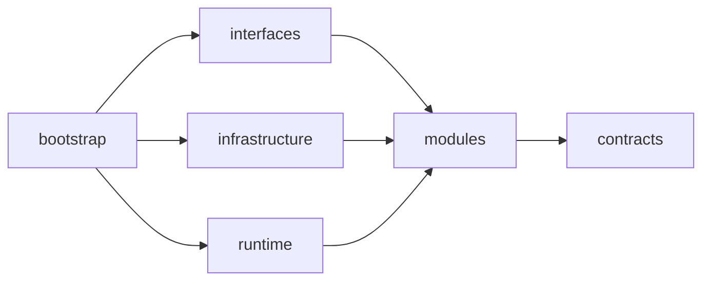

# Hextech 伴生系统设计

## 模块边界

源码根为 `src/hextech`。`contracts` 定义跨边界 ID、DTO 和失败分类；`modules` 持有业务用例；`interfaces` 与 `infrastructure` 实现入站和出站适配；`runtime` 管理进程；`bootstrap` 是唯一 composition root。

反向导入由 architecture tests 阻断。模块不得依赖根脚本、旧路径 alias 或转发入口。

## 抓取与 generation 链路

```mermaid
flowchart LR
    Remote["CDN / Apex / Mayhem"] --> Fetch["Transport + Source"]
    Catalog["Catalog candidate"] --> Parse["Parser + Normalizer"]
    Fetch --> Parse
    Parse --> Run["var/sources/*/runs/run_id"]
    Run --> Gate["来源完整性门禁"]
    Gate --> Candidate["source candidate pointers"]
    Candidate --> Cohort["CohortPromotionStore + journal"]
    Cohort --> SourceCurrent["catalog/source current.v2.json"]
    SourceCurrent --> DataService["DataService generation builder"]
    Seed["resources/seeds"] --> DataService
    DataService --> GenerationGate["Schema / 数量 / SHA-256"]
    GenerationGate --> Generation["var/snapshots/generations/id"]
    Generation --> Current["snapshot current.v2.json（最后提交）"]
    Current --> View["固定 DataSnapshotView"]
    View --> UI["Desktop / Web / Overlay"]
```

只有 DataService 可以提升来源 current 并发布 generation。来源 publisher 只写 immutable run
和 candidate pointer，显式请求 direct promotion 也会失败；Web、Desktop 和 Overlay 都没有发布权限。

## 来源门禁

Hextech 以 `resources/catalog/英雄目录.v1.json` 为确定全集。每个英雄按 CDN JSON、静态详情页、必要时普通 browser fallback 取数；首轮成功项不重抓，失败项进入低并发尾部重试。缺英雄、串英雄、重复海克斯、字段类型或总行数异常都会使整次 run 失败。

Apex 由稳定 slug map 直接构造英雄详情 URL。结果必须是 `has_synergy`、有页面身份和明确空态证据的 `confirmed_empty`，或带 `FailureKind` 的失败；未知空结果不能发布。

Mayhem 优先解析 manifest JSON，HTML 仅为结构化 fallback。reject 带稳定原因码和有限样本；空结果、规模回退或 reject 比例越界都保留 last-good。

公共 transport 统一记录 URL、backend、状态码、耗时、尝试次数、失败分类和可重试性。timeout、TLS、network 和 5xx 有限退避；403/429 按 host 熔断。不使用 stealth、验证码绕过、登录态或真实浏览器 profile。

## 进程与消费

- Desktop：Tk 控制面和用户操作入口。
- Runtime Supervisor：管理 DataService、Web、Overlay host 与 Vision sidecar 的生命周期。
- DataService：刷新来源、选择 last-good、构建并发布 generation。
- Web/Overlay：只通过固定 snapshot view 查询，不直接读取来源 run。

DataService 同时只运行一个 refresh cycle。运行中收到的普通触发合并为一次
`pending_recheck`，force 触发会升级该 recheck；当前周期结束后立即重新计算到期状态。
shutdown 会拒绝新触发并清除 pending，不启动后续 worker。

Overlay 在有效的 `session_id + selection_epoch` 首次渲染时固定 immutable view。同一轮中
current 变化只记录 `new_generation_available`，下一 epoch、新 session 或本轮隐藏后才采用新代。

源码态 supervisor 子进程显式继承 `src` import path；冻结态复用同一可执行文件的模式参数。所有运行日志写入 `var/logs`，诊断写入 `var/reports`。
