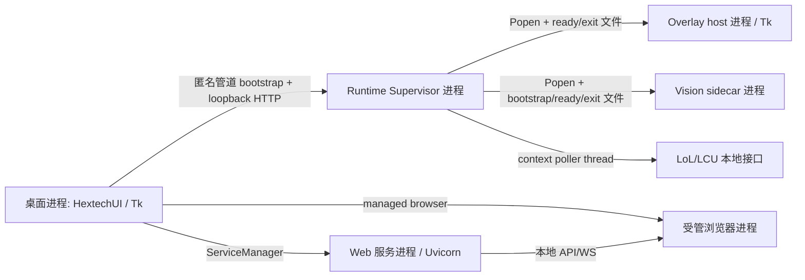
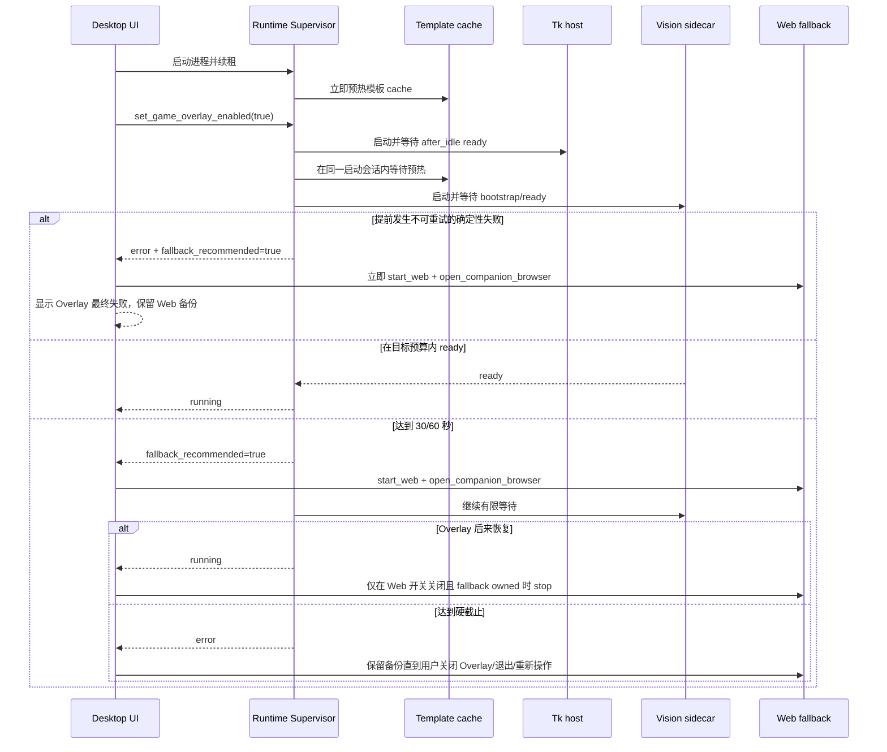

# Hextech 伴生系统设计

## 1. 文档目的

本文是 `run/` 当前架构、进程边界、启动预算、数据链路、运行态文件和维护验收的事实源，供人工维护者与 AI 在改动前查阅。

当前正式游戏内显示路线是 **Python 3.11 + Tk host + Vision sidecar**。Web 是用户可主动开启的展示面，也是在 Overlay 超时或提前失败时由桌面临时接管的备份。本文不定义 Overwolf 的实施计划；未来路线见 `overwolf-route.md`。

## 2. 目标与非目标

### 2.1 目标

- 桌面首屏、本地数据和 Overlay 在 cache 命中时力求 30 秒内 ready。
- cache miss、cache 未知或空运行态时力求 60 秒内 ready。
- 达到目标仍未 ready 时立即启动并打开 Web 备份，同时让 Overlay 最多继续 120 秒。
- Overlay 恢复后按照用户 Web 开关和 fallback 所有权决定是否关闭临时 Web。
- 启动、取消、失败和退出均有有限边界，不允许无限重试或遗留受管进程。

### 2.2 非目标

- 不在启动关键路径等待网络抓取完成。
- 不让 Runtime Supervisor 持有 Web 生命周期或用户 Web 开关。
- 不用 Web fallback 修改或持久化用户偏好。
- 不在当前发行链路引入 Overwolf、Electron、GEP 或第二套 Overlay renderer。

## 3. 代码架构与具体路径

| 层 | 主要路径 | 职责 |
| :--- | :--- | :--- |
| 启动薄壳 | `hextech_ui.py`、`web_server.py`、`build.py` | 转交桌面、Web 与打包真实入口 |
| 桌面 UI | `hextech/display/desktop/app.py` | Tk 窗口、用户开关、fallback 所有权、二级状态与关闭协调 |
| 桌面运行时 | `hextech/display/desktop/runtime.py` | Supervisor/Web 子进程、受管浏览器、LCU 与窗口同步 |
| 服务管理 | `hextech/display/desktop/service_manager.py` | Web 服务与低频监听；Supervisor 启用后不直接管理 Overlay |
| 执行面 | `hextech/runtime_supervisor.py` | lease、action、refresh、Overlay 启动会话、预算和结构化事件 |
| Overlay 生命周期 | `hextech/overlay/lifecycle.py` | host/sidecar 进程 readiness、退出信号、取消与清理 |
| Overlay host | `hextech/overlay/host.py` | Tk 透明置顶窗口、前台门控和渲染轮询 |
| Vision sidecar | `hextech/overlay/vision/sidecar.py`、`runner.py`、`template_runtime.py` | 截图、模板 cache、识别、三槽事件和 trace |
| 上下文/事件 | `hextech/overlay/context.py`、`events.py`、`data_source.py` | 游戏上下文、三槽事件和 host 读取适配 |
| 提示 cache | `hextech/overlay/hints.py` | 从本地稳定/运行态数据生成轻量提示 |
| 本地 Web/API | `hextech/display/web/app.py`、`api.py`、`runtime.py` | FastAPI/Uvicorn、本地页面、API 与 WS |
| 数据/刷新 | `hextech/catalog/`、`hextech/core/refresh.py`、`hextech/scraping/` | 本地读取、后台刷新、抓取与自愈 |
| 验收/构建 | `tools/dev_checks.py`、`tools/acceptance/`、`tools/build_package.py` | 自动化门禁、真机探针和便携包 |

## 4. 进程与线程模型



桌面主线程只负责 Tk。`hextech-post-visible-bootstrap` 在首屏 after-idle 后启动 Supervisor、ServiceManager 和本地数据加载。Overlay action、refresh、lease 与 fallback 都使用受管后台线程，UI 更新经 `root.after(0, ...)` 回到 Tk 主线程。

## 5. 启动数据链路



本地数据链路为：稳定数据/seed 与最新 runtime raw -> `catalog.runtime_store`/预计算 cache -> 桌面与 Web；Overlay hint cache 由 `overlay.hints` 生成，Vision 识别写三槽事件，host 经 `overlay.data_source` 读取事件、hint 与 context 后渲染。

稳定数据、运行态数据、打包资源和禁止入包路径的详细分类以 `../data/DATA_USAGE.md` 与 `../data/data_manifest.v1.json` 为准；本文只描述进程间的数据流，不复制数据清单事实源。

## 6. Overlay 启动会话与状态机

每次从非 running 状态启用 Overlay 创建一个会话。重复 enable 是幂等操作，不得重置已完成会话。

会话字段由 `OverlayRuntimeManager.snapshot()` 输出：

| 字段 | 含义 |
| :--- | :--- |
| `startup_mode` | `warm` 表示 cache hit；`cold` 包含 miss/unknown/空运行态 |
| `startup_elapsed_seconds` | 从本次会话开始到当前或终态的端到端耗时 |
| `target_budget_seconds` | 当前采用的 30 或 60 秒目标 |
| `fallback_recommended` | 目标超时或启动提前失败，桌面应接管 Web |
| `hard_timeout_reached` | 目标预算加 120 秒已耗尽 |
| `startup_attempts` | sidecar attempt、分配 timeout、结果和错误类型的精简记录 |

状态路径：

```text
stopped
  -> starting/prepare_data
  -> starting/context_start
  -> starting/host_start
  -> starting/cache_wait 或 vision_prewarming
  -> starting/sidecar_start
  -> running/running

任一确定性错误 -> error/failed
用户关闭或应用退出 -> stopping -> stopped
硬截止 -> 清理 host/sidecar/context -> error/failed (hard_timeout)
```

sidecar 最多首次尝试加一次瞬态重试。模板缺失、schema、配置、token 不匹配、清理失败和硬截止不重试。readiness 每 100ms 观察 ready/bootstrap/进程退出，并响应取消信号；每次 factory 返回后再次检查 generation 与硬截止，迟到进程必须先清理再报错。

Supervisor 退出时必须先登记并启动 Overlay 清理线程，再发布 shutdown Event；主循环等待有界清理完成后才退出，避免 host/sidecar 成为孤儿进程。便携包真实复验必须确认 snapshot 中的两个 PID 在退出后均不存在。

## 7. 预算与 40/70 放宽门槛

默认目标固定为 warm 30 秒、cold 60 秒，硬截止分别为 150 秒与 180 秒。

只有同一模式的 3 次正常进程测试中至少 2 次仅因稳定本机开销略超目标，且确认没有重复长等待、异常重试、无进展 phase、残留进程或 refresh 竞争，才允许把该模式整体加 10 秒。放宽后目标为 40/70 秒，继续窗口仍为 120 秒。任何超过 10 秒的偏差都必须按缺陷处理。

本轮修改前日志基线（2026-07-11）为：首次 Overlay action 到最终失败约 317 秒；预热后另起 action，随后约 280 秒符合 3 次 90 秒 sidecar 等待加退避；refresh 在首次 action 第 9 秒启动并与关键路径重叠。该基线用于证明修复方向，不代表修复后的真机样本。最终目标仍保持 30/60，是否放宽必须等待同版本真机 3 次样本。

2026-07-14 对同一便携包执行真实 Supervisor/host/sidecar 进程测量，隔离空运行态三次为 `30.437s`、`31.569s`、`30.988s`，cache 命中三次为 `9.429s`、`9.591s`、`9.311s`；六次均一次 sidecar attempt、未触发 fallback。结果满足 30/60 目标，因此不启用 40/70 放宽。该探针不替代 LoL 选择画面下的真机 Vision/窗口验收。

## 8. Web fallback 所有权

fallback 由 `HextechUI` 编排，状态是内存态，不写入 `ui_feature_flags.json`：

- 用户 Web 开关原本开启：复用现有 Web，不取得所有权。
- 用户 Web 开关关闭：桌面启动 Web、打开受管浏览器并设置 `fallback_web_owned`。
- fallback 期间用户开启 Web：所有权立即转给用户。
- Overlay 恢复且用户 Web 关闭：只关闭 fallback owned 的浏览器和 Web。
- Overlay 最终失败：保留 fallback Web。
- 用户关闭 Overlay或应用退出：取消 Overlay 启动并清理 fallback owned Web。
- Web 启动/浏览器打开/关闭失败只更新二级状态，不反向停止 Overlay。

二级状态至少区分：`Overlay 启动中`、`Web 备份启动中 / Overlay 继续启动`、`Web 备份已接管 / Overlay 继续启动`、`Overlay 已恢复`、`Overlay 最终失败 / Web 备份保留`。只有 Web 服务实际启动完成后才能显示“已接管”；确定性错误耗尽有限重试后立即进入“最终失败”，不再显示“继续启动”。

## 9. refresh 竞争控制

Supervisor 启动 10 秒后首次尝试 refresh。Overlay 为 `starting` 或非终态 cache prewarm 时，`tick()` 将 refresh 延后；Overlay 到达 `running`、`error` 或 `stopped` 后允许 refresh。这样避免网络抓取、线程池和模板/sidecar bootstrap 同时争用 CPU、磁盘与进程启动资源。

## 10. 运行态路径

源码态根为 `run/data/runtime/`；冻结态根为 `%LOCALAPPDATA%/HextechNexus/data/runtime/`，不可写入便携包目录。

| 相对路径 | 生产者 | 用途 |
| :--- | :--- | :--- |
| `state/ui_feature_flags.json` | `core.settings` | 用户开关；fallback 不得修改 |
| `state/startup_timing.v1.json` | desktop startup probe | Tk shell、首屏与后台数据时点 |
| `state/startup_status.json` | refresh/heal | 本地数据与自愈状态 |
| `state/supervisor_events.v1.jsonl` | Runtime Supervisor | action/lease/refresh 结构化事件 |
| `state/runtime_events.v1.jsonl` | refresh | 数据刷新结构化事件 |
| `state/web_server_port.txt` | Web | 本地端口；认证 token 内容不得进入文档/日志 |
| `state/game_overlay_slots.v1.json` | Vision | 当前三槽识别事件 |
| `state/game_overlay_context.v1.json` | context poller | 当前英雄/对局上下文 |
| `state/game_overlay_visibility.v1.json` | host | 前台门控和可见原因 |
| `state/game_overlay_sidecar_status.json` | Vision runner | sidecar phase/status |
| `state/overlay_vision_trace*.json` | Vision | 当前与历史诊断摘要 |
| `cache/overlay_hint_cache.v1.json` | overlay hints | 轻量提示与名称索引 |
| `logs/` | log_utils | 摘要、错误和开发态 JSONL |

`ready/bootstrap/exit` 文件带随机 generation/token，只用于同机进程握手，结束后应清理；token 不写入 Supervisor 事件或设计文档。

## 11. 诊断顺序

1. 先看 `startup_timing.v1.json`，确认 Tk 首屏与后台服务是否及时。
2. 再按 correlation id 查看 `supervisor_events.v1.jsonl`，定位 Overlay/refresh action 时序。
3. 查看 Supervisor snapshot 的 budget、phase、attempt 与 failure kind。
4. sidecar 问题再看 bootstrap/status/vision trace；不要先读取或导出 ROI 图像。
5. Web fallback 问题核对用户 Web 开关、ServiceManager 状态和受管浏览器所有权。
6. 使用桌面诊断导出时只采集白名单 state/log tail；不得读取 auth、token、cookie、raw、profile 或 debug 图像。

## 12. 维护与验收

最小目标验证：

```powershell
.\.venv\Scripts\python.exe -m pytest -q tests/test_runtime_supervisor.py tests/test_overlay_sidecar_lifecycle.py tests/test_desktop_runtime_overlay.py tests/test_desktop_startup_status.py
.\.venv\Scripts\python.exe tools/dev_checks.py --overlay-only --deep
.\.venv\Scripts\python.exe -m pytest -q
.\.venv\Scripts\python.exe -m ruff check hextech/runtime_supervisor.py hextech/overlay/lifecycle.py hextech/display/desktop/app.py tests/test_runtime_supervisor.py tests/test_overlay_sidecar_lifecycle.py tests/test_desktop_runtime_overlay.py --ignore E741
.\.venv\Scripts\python.exe tools/dev_checks.py --bundle-manifest
git diff --check
```

全量 `ruff check .` 与 `pyright` 当前仍包含 `main` 已存在的 Vision/UI 类型和样式债务，只作为债务观察项，不是本轮通过门禁。改动必须保证 scoped Ruff 通过，并将全量 Ruff/Pyright 与同一 `main` 基线对比，禁止新增诊断；不得为清零既有债务扩大 Overlay 启动修复范围。

便携包还必须在非仓库空运行态目录执行 `tools/acceptance/smoke_packaged_startup.py`。真机验收覆盖 warm/cold、目标内成功、目标超时 Web 接管、Overlay 延迟恢复、最终失败、两个开关互换和退出清理。自动化不能替代真机 Vision/窗口/受管浏览器验收。

修改启动行为时必须同时回答：会话起点是否唯一、deadline 是否可重置、取消是否能穿透等待、失败进程是否确认清理、fallback 是否错误取得用户 Web 所有权、refresh 是否重新进入关键路径。
