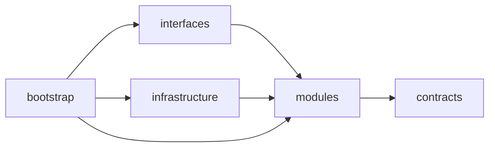

# Hextech 伴生系统设计

## 模块边界

源码根为 `src/hextech`。`contracts` 定义跨边界 ID、DTO 和失败分类；`modules` 持有业务用例；`interfaces` 与 `infrastructure` 实现入站和出站适配；`bootstrap` 是唯一 composition root，负责具体进程与实现组装。没有无消费者的预留 package 或旧路径转发入口。

反向导入由 architecture tests 阻断。模块不得依赖根脚本、旧路径 alias 或转发入口。

## 抓取与 generation 链路

```mermaid
flowchart LR
    Remote["CDN / Apex / Mayhem"] --> Fetch["Transport + Source"]
    Catalog["Catalog candidate"] --> Parse["Parser + Normalizer"]
    Fetch --> Parse
    Parse --> Run["var/sources/*/runs/run_id"]
    Run --> Gate["来源完整性门禁"]
    Gate --> Candidate["source candidate pointers"]
    Candidate --> Cohort["CohortPromotionStore + journal"]
    Cohort --> SourceCurrent["catalog/source current.v2.json"]
    SourceCurrent --> DataService["DataService generation builder"]
    Seed["resources/seeds"] --> DataService
    DataService --> GenerationGate["Schema / 数量 / SHA-256"]
    GenerationGate --> Generation["var/snapshots/generations/id"]
    Generation --> Current["snapshot current.v2.json（最后提交）"]
    Current --> View["固定 DataSnapshotView"]
    View --> UI["Desktop / Web / Overlay"]
    Current --> Pool["production_augment_pool"]
    Pool --> Vision["generation-bound Vision matrices"]
    Bundle["verified bundle cohort seed"] --> Install["冻结 EXE 启动前安装"]
    Install --> SourceCurrent
```

只有 DataService 可以提升来源 current 并发布 generation。来源 publisher 只写 immutable run
和 candidate pointer，显式请求 direct promotion 也会失败；Web、Desktop 和 Overlay 都没有发布权限。

## 来源门禁

Catalog 以 Data Dragon 的普通英雄条目为事实源；`id` 以 `Jade_` 开头的模式变体在构建阶段明确排除，不以任一统计来源的现有覆盖做反向交集，因此未来普通新英雄仍可进入 Catalog。`catalog.result.json` 的 `source_filter` v1 记录上游条目数、规范条目数、排除数、原因计数和最多 10 个数值 ID 样本，便于区分上游扩展与解析回退。

英雄总体统计继续使用 ARAMKit 的公开静态 JSON，固定请求 `dataset=all`。一次 run 先读取
`data/versions.json`，再读取排行和逐英雄详情；详情默认并发 6、硬上限 8，只有 timeout、TLS、network 与 5xx 进入一次并发 2 的尾部重试。单响应 UTF-8 内容上限 32 MiB、整轮累计上限 2 GiB，403/429 立即熔断；worker 总预算 10 分钟。解析后保留英雄概要与 `augments.all`、stage 1–4；generation 主 payload 不复制阶段行，Overlay 通过固定 provenance 的单英雄 scoped view 按需读取。

ARAMKit run 的开头和结尾必须得到完全相同的 `version + dataPath + buildTimeUnixMs + allMatches` marker。相同 marker 的 verified current 也只能在共享 5 小时时效预算内复用；超龄、缺失或非法时间必须重新抓取，失败时保留 last-good 而不能伪报 `not_stale`。排行英雄 ID 必须属于固定 Catalog，所有 `all/stages` 海克斯 ID 必须属于 Catalog 正数唯一 `cdragon_id`；重复 ID、非法 rate、空 stage、概要错位、marker 漂移或任何未知 ID 都拒绝整个候选。逐英雄投影由 `scoped_stats/manifest.json` 逐文件记录 path、size、SHA-256 与 record count，消费者同时校验索引和子文件。

Blitz 排名使用 `data.v2.iesdev.com` 的公开 ARAM Mayhem JSON，作为 ARAMKit 当前 Stage 与同英雄 `all` 都缺失时的第三层回退。该来源单请求、无需登录，只允许静态 `fetch_text`，单响应上限 2 MiB；403/429 立即失败。Scrapling 是主路径，只有最终 TLS/network 故障且 circuit 与剩余总预算允许时才执行一次 `requests` 静态 fallback；403/429、schema、identity、coverage、invalid payload 和大小门失败都不 fallback，实际 backend/fallback provenance 写入 manifest/report。artifact 只保存 `patch`、数据日期、海克斯全局 tier 与最多五个英雄的专属 tier，marker 为 `patch + data_date + record_count + canonical content SHA-256`。它不提供胜率、选择率或样本量，generation 和 UI 都不得从 tier 推断百分比。候选要求所有身份和英雄均能绑定同代 Catalog，production pool 覆盖至少 95%；2026-08-15 的 16.16 合同为 423 条、覆盖 232/237，未覆盖 `1343/2108/2109/2126/2148`，这些条目保留识别能力并明确显示公开来源暂无排名。

生产识别闭集与统计来源解耦：eligibility、中文名、稀有度 tier、图标和视觉 variant 继续由同一 Catalog generation 的 `augment_assets.v1.json` 冻结；Blitz 与 ARAMKit 都不能增删识别候选。generation builder 逐 ID 比较 production pool 与 Catalog asset 的路径和 SHA-256，任一多出、重复或未绑定都在 snapshot 发布前失败并由 promotion journal 回滚；Stage、`all` 和 Blitz 都缺失才形成 `SOURCE_STAT_MISSING`。

ARAMKit marker 变化会把 Catalog、ARAMKit、Blitz、Apex、Mayhem 全部纳入同一 refresh cycle；Blitz 自身每 2 小时按内容 marker 检查。轻量 marker probe 失败只取消加速，不把网络瞬断升级为来源失败；正式抓取和 generation 门禁仍独立 fail closed。

Apex 由稳定 slug map 直接构造英雄详情 URL。提取层分别返回结构化结果和有限错误诊断，合法空结果必须继续进入页面分类；结果只能是 `has_synergy`、有页面身份和明确空态证据的 `confirmed_empty`，或带 `FailureKind` 的失败。解析异常和未知空结果不能发布，Apex/Mayhem 只通过同一 cohort 原子晋升。

Mayhem 优先解析 manifest JSON，HTML 仅为结构化 fallback。reject 带稳定原因码和有限样本；空结果、规模回退或 reject 比例越界都保留 last-good。

公共 transport 统一记录 URL、backend、状态码、耗时、尝试次数、失败分类和可重试性。静态 `get` 路径只加载 `Fetcher`；只有显式 browser 模式才加载 `DynamicFetcher` 与 browserforge。timeout、TLS、network 和 5xx 有限退避；403/429 按 host 熔断。不使用 stealth、验证码绕过、登录态或真实浏览器 profile。

来源 worker 的新 candidate 成功与 last-good 可用是两个状态：刷新失败时即使 fallback 可读，也必须返回 `success=false`，并携带 `reason_code`、`failure_stage`、`fallback_used`、`last_good_available` 和有限诊断。协调器按 `reason_code` 写入 schedule 的 `failure_kind`，保留旧 current，不把 fallback 记成本轮成功或混入新 generation。

正式活动 Catalog 与待采用 Catalog 分为两条通道。`refresh_checkpoint.v1.json` 只推进活动 Catalog：ARAMKit fresh 后可发布新 generation；Blitz 失败时仅复用同 Catalog verified last-good，标记 `last_good/data_stale/production_coverage_insufficient` 并从公开 DTO、session report 和 Canvas 清空 tier/rank；Apex/Mayhem 成对复用同 Catalog last-good。ARAMKit 失败不发布 generation。不同 Catalog 的旧 `full_catalog_rebind` checkpoint 会原子复制到 `catalog_adoption_checkpoint.v1.json` 并 blocked，原证据只标记 migrated；新 Catalog 只有 Blitz 覆盖至少 95% 且四来源全部重绑后才能整体晋升，禁止跨 Catalog pointer。历史 `hextech/stats` generation 仍可只读和回滚；新 generation 必须包含 `aramkit/scoped_stats`，Blitz stale 时允许以明确降级 provenance 存在但不得向用户展示排名。

活动 Catalog 下的 ARAMKit 与 Blitz 兼容投影仍保持闭集：未知 ID 只有在 blocked adoption Catalog 的文件/hash 已验证且明确包含该 ID 时，才可从活动 artifact 中过滤，并写入 `compatibility_filtered_augment_ids`。Blitz 过滤后重算 artifact marker；两条来源都不因此切换 Catalog、恢复 adoption lane 或扩大 production pool。其他未知海克斯、未知英雄、schema 错误、覆盖不足和错绑继续拒绝整轮。验收器允许这种可证明的 `adoption_held` Catalog 与 optional stale，但不放宽 ARAMKit freshness、artifact hash、完整 provenance 或同 Catalog 绑定。

## 进程与消费

- Desktop：Tk 控制面和用户操作入口。
- Desktop窗口呈现：`DesktopWindowPresentation`持有显隐/关闭/停靠状态，25ms Tk tick消费后台容量一快照。`champ_select_only`为默认，`client_right`仅作候选验收回退；两者禁止向左钳制覆盖客户端。本地LCU单在途观察在前台约250ms、后台1.5s运行，先发布阶段再更新列表。窗口操作、销毁和跟随恢复只在GUI线程执行；隐藏启动不阻塞后台就绪。
- Runtime Supervisor：只管理 Overlay host、Vision sidecar、lease 与本机控制面，不拥有数据刷新职责。
- Bootstrap/Desktop service manager：组装并持有 DataService、Web 与 Runtime Supervisor 的具体进程。
- DataService：刷新来源、选择 last-good、构建并发布 generation。
- Web/Overlay：只通过固定 snapshot view 查询，不直接读取来源 run。

Desktop 同时是轻量托盘 owner。单实例协议 v2 用 Build ID、source fingerprint、PID、process create time 与真实 executable 验证 owner；只有同 Build 才发送 activation，不同 Build、旧 v1 或身份缺失明确冲突且双方都不被终止。冻结入口先分派角色，子角色禁止 cohort seed；Desktop 在 runtime logging 和首屏就绪后通过 bootstrap 注入回调执行唯一一次 seed，再启动 DataService/Supervisor。连续五分钟没有 League 客户端或游戏进程时，Desktop 依次停止 Web、DataService 和 Runtime Supervisor（后者负责回收 Overlay host 与 Vision Sidecar），自身与托盘仍常驻并以五秒进程探针等待恢复。

DataService 同时只运行一个 refresh cycle。`POST /v1/actions/refresh` 接受
`scope=due|core` 与 `force`；空 body 保持原有到期检查。Desktop 标题栏的“刷新”发送
`scope=core, force=true`，强制检查 ARAMKit/Blitz，同时继续处理正常到期的 Optional；
ARAMKit marker 变化或 Catalog 身份变化仍扩展为完整同代刷新。运行中重复触发合并为一次
`pending_recheck`，force 与覆盖范围按不丢失更强请求的规则合并；当前周期结束后立即重算。
shutdown 会拒绝新触发并清除 pending，不启动后续 worker。活动 `refresh_checkpoint.v1.json` 与 blocked `catalog_adoption_checkpoint.v1.json` 分离；两者的 `pending_sources` 都只能是 due 减 completed。活动 checkpoint 仅为 pending 来源保存有界的原因码、阶段、错误类型、fallback/last-good 状态和有限 diagnostics，剔除 traceback、命令行、环境、proxy 与凭据类字段；来源成功后对应失败证据消失。恢复时重新验证 Catalog ID/SHA、pointer、manifest 与 artifact SHA/size，只复用仍完整绑定的候选，半写或跨 Catalog 进度不进入活动发布通道。

存在可用 current generation 时，对局期间的自动刷新和手动核心刷新统一延后。DataService 的独立探针组合 Live Client 2999、LCU gameflow、游戏进程与窗口；接口 unknown 但进程/窗口存在时保守按在局中，Host visibility 只作补充诊断。活动 worker 每不超过 50 ms 检查 cancel signal，取消后给 2 秒协作退出，再关闭 Job Object 回收进程树；游戏取消、shutdown、hard timeout 分别归因，前两者不得写来源 backoff 或在 shutdown 后发布 generation。checkpoint 与延后门同时保留原始 `scope/force`，对局结束 30 秒后只恢复一次等价请求。`GET /v1/status.refresh_status` 统一暴露 state、scope、phase、reason、generation、pending 与起止时间，Desktop 将 running/deferred 持续显示，终态显示 6 秒；冷启动无 snapshot 时仍允许刷新。

Overlay 在有效 `session_id` 首次出现时固定整局 `stats_generation_id`；同局 current 更新只记录 `new_stats_generation_id`，下一局才采用。champion、Stage、ARAMKit run 和 immutable scoped view 仍按 `session_id + selection_epoch` 分轮固定。Stage 优先使用同一 Live Client 响应中的玩家等级（3–6/7–10/11–14/15+ 对应 Stage 1–4），等级缺失时才使用本局已确认选择数加一；每轮最多等待两秒后按现有信息冻结，短暂隐藏继续保留该轮范围，下一 epoch 只重算 Stage/scoped view，不更换整局 generation。

Context 的游戏 epoch 优先使用 League `PID + process_started_at`，只有身份不可用才回退窗口。Live Client 优先读取 `/allgamedata` 的 `gameData.gameTime`；新 epoch 会立即撤下旧英雄，只有 `gameTime <= process age + 30s` 或仍有效且属于本局选择期的 ticket 才能确认归属。LCU/Live 均有效但英雄冲突时 fail closed，Broker 重启、缺进程时间或旧 payload 都不得依赖英雄是否变化猜测；Context render gate 在 `game_instance_id` 变化时同步清除 hold。

Vision 从 snapshot provenance 打开绑定一致的 Catalog 和 `production_augment_pool`，以数字 `canonical_id` 构建模板；完整 Catalog 只供离线资源审计，不参与生产排名。模板缓存签名包含 pool ID、Catalog content hash 与资产索引 hash。Sidecar 的 `vision_pool_generation_id` 与 Host 的 `stats_generation_id` 是两个角色：stats-only generation 更新不预热、不重启 Sidecar，同一 game session 始终使用固定统计代；只有 production pool/Catalog/资产签名实际变化时，才在非对局状态预热并原子重启 Sidecar。pool 不可用时只允许使用绑定一致的 last-good，不能退回完整 Catalog。

Vision 使用 FP16 存储矩阵与进程内 FP32 计算镜像的双层结构；Sidecar 启动阶段预热镜像，单帧按四个模板通道批量投影三槽。独立约 10 ms 鼠标线程记录左键 down-edge，下一视觉帧只消费 750 ms 内同游戏实例/窗口/epoch 且唯一命中一个槽的事件；点击槽单独增加 slot generation，其他槽不变。普通候选/fingerprint 漂移不授权换卡；视觉 transition 仍要求两个独立 content-absent frame，OCR exact 仍要求 3/5。Timeline v2 以 Build/Sidecar instance 分文件并记录 mouse sequence、transition source/slot、逐槽 generation/change reason；旧 v1 与不确定 timeline 只读，不进入 retention 淘汰。OCR runtime 默认 `admit`，模板/OCR strong 冲突 fail closed，OCR 不可用不阻塞模板链。

Window probe 以实际 `League of Legends.exe` PID/EXE 为身份，配置路径严格取 `Path(executable).parent / "Config" / "game.cfg"`；WeGame 的 `...\Game\League of Legends.exe` 必须解析到 `...\Game\Config\game.cfg`，不能少掉 `Game` 层。探针按进程、文件大小和 `mtime_ns` 最多每秒刷新。`WindowMode=1/2` 才允许外部 layered-window Overlay 进入 DWM 桌面合成；`WindowMode=0`、未知或错误使 Host fail closed、Sidecar 在 capture 前非破坏性 pause。恢复 Borderless/Windowed 后沿用有效的 game instance、epoch 和稳定槽。Host 顶层 HWND 首次映射前必须设置并回读 `WDA_EXCLUDEFROMCAPTURE`，失败即隐藏；Host surface 与捕获排除是两条独立证明。Desktop DC/GetPixel 不能判断 affinity 是否泄漏，packaged smoke 用已知底色高对比探针和与 Sidecar 同类的 `ImageGrab` 捕获证明 Overlay 未重新进入识别输入。

Overlay使用绑定游戏HWND的有效物理客户区和固定版式`fixed_card_layout_v2`；首帧/恢复帧不使用Tk的1×1占位尺寸。逐帧Vision `layout_transform`只校准识别ROI，不移动显示布局。2560宽统计固定30px、1920宽固定23px，安全区宽376/282px，左右最少6/5px留白；只对超宽行收紧排版空格，不缩字、不压缩字形、不删字段。联动标题24px、正文/紧凑18px、阶段24px参考规格不变。viewport、DPI和布局版本进入语义键；报告记录安全区、实际Canvas bbox和空隙档位。说明样图只锁定视觉方向，各比例真实内框锚点保持`pending_real_device`，不能以参数回归或缩放离线图替代。

桌面备战席使用目标显示器有效DPI和逻辑客户区：S=clamp(客户区物理宽/D/1280,0.8,1.25)，期望宽320×S，受同屏右侧空间约束，最低200逻辑像素。必要文字最低12逻辑像素，300/230逻辑像素断点切换三列/两列/单列，恢复宽档增加8像素滞回；指标另行排布、列表滚动，控件身份和选择保持。高度由实际操作区、状态区及一行英雄确定，不足时区分宽/高受限，不换左侧或覆盖客户端。后台不操作Tk，头像尺寸版本栅栏拒绝迟到结果。自身GUI线程的短作用域创建保护避免Tk首次重建HWND时激活；不向游戏注入，不操作其他线程的窗口。

generation 构建先生成基础排名 hints，再用 Catalog 补全最终身份集，最后把当前 generation 的 Apex/Mayhem 联动按名称、规范化名称和 alias 投影到 hint。Catalog-only 海克斯可携带联动，但不会获得伪造统计。Overlay 按最终选中的 ARAMKit 或 Blitz 行读取对应 `source_status`；Apex/Mayhem freshness 仅影响联动区域，聚合 health 不再污染行级文案。

Snapshot manifest 保持 immutable。`DataSnapshotView.status(now=None)` 每次读取按共享来源周期的 `×1.25` 阈值实时投影 `data_status/data_reason/stale_age_seconds`，优先使用来源 `data_at`，旧代缺失时回退 `created_at`；自然变旧不改 `health`、`degraded_sources` 或 lineage `freshness`。`effective_degraded_sources` 合并发布时降级与消费者数据来源的读取时过期；Catalog 过期由独立 `adoption_held` 门处理，manifest 明确声明的 Catalog 降级仍会保留。Overlay 遇到 stale 必须清空胜率、出场率、ranking/tier 并显示数据年龄或“统计数据暂非最新”；严格 verifier 与 Desktop 优先消费 effective 字段。

会话报告、latest、最多 200 份历史报告和 diagnostic 截图由有界后台写入器异步处理，Tk/识别主线程只入队。显式诊断只保存 Overlay 矩形裁剪图，每个 active Hextech epoch 最多一张完整三槽 READY 图，不保存完整屏幕。ROI writer 容量为 8，满载或失败只写 Sidecar 诊断；默认不截图。`diagnostic_retention` 是唯一删除/轮转所有者，使用 `var/locks` 跨进程锁、共享 60 秒最短间隔并在 selection active 时跳过扫描；writer 只 append。所有持续诊断进入 128 MiB retention registry，并由后台 worker 按年龄、数量、分类/全局字节四重门淘汰；只有明确 schema v2 的 timeline 在自身集合内可清理，旧 v1/损坏/身份不明 timeline 永久 pin，且不占 v2 的 20-epoch 与 12 MiB 配额。generation、source run、Catalog、模型、模板和用户数据不在该 registry。Runtime Supervisor 的 lease 仍每两秒续约，但普通成功续约不写 journal；事件文件使用 1 MiB active 加 3 段轮转。事件、Sidecar、Host、Timeline v2 和报告都携带 manifest v3 的 `build_id`，Desktop 会显示构建身份并报告组件不一致。性能验收只统计目标 Build、同一 Sidecar instance 的 active Hextech epoch；candidate、body-shard、blocked 和纯 pause 均单独报告排除原因。完整运行与验收规则见 [overlay-runtime.md](overlay-runtime.md)。

源码态 supervisor 子进程显式继承 `src` import path；冻结态复用同一 GUI subsystem 可执行文件的模式参数。Supervisor 与 DataService 的 `Popen` 成功后立即绑定 Windows Job Object、登记 Desktop pending registry，随后才等待带随机 token 的 bootstrap；冻结态 Job 绑定失败即失败，Desktop 退出或 bootstrap 失败先关闭 Job 再清理状态。服务启动前只按受管 PID/create time/executable/Build state 阻止 foreign/orphan role，不扫描命令行或自动杀进程。所有 Windows 子进程使用 no-window 创建标志，因此主程序和受管服务都不依赖控制台。

verified bundle 是自包含 cohort：snapshot seed 与 Catalog、ARAMKit、Blitz、Apex、Mayhem 四来源 immutable run、production assets 一起进入包。冻结 composition root 在启动 Desktop 服务前先恢复 promotion journal，再对 current、previous、recovery point、本地 generations 与 bundle generation 重建完整 cohort，按 `created_at` 选择最新有效代；bundle 比运行态旧时不允许倒退，旧 current 被错误倒退时以 `runtime_restored` 恢复更新的本地代。选中 pointer、同代 schedule 与 recovery point 在同一 journal 中提交，snapshot pointer 始终最后提交；retention 保护 recovery point 引用。已有相同内容按 SHA-256 复用，旧 generation、报告和用户数据保留。部署窗口若完成到期刷新，部署验收只接受完整验证、单调更新且不改变 Catalog/production pool 的 generation，并分别核对 Sidecar Vision generation 与 Host stats generation；失败回滚覆盖 Catalog/四来源/snapshot current/previous、schedule、checkpoint、recovery point、selection、adoption checkpoint 与 promotion journal，避免只恢复 pointer 却留下跨代诊断状态。`--refresh-data` 构建路径以刷新后的运行态 snapshot 为唯一 seed 输入，packaged smoke 再用真实 Sidecar `--once` 验证生产池和矩阵绑定；packaged smoke 不是 League 真机验收。

冻结候选在 smoke 前对全部 DLL/PYD 的真实绝对路径执行 259 字符上限，长 artifacts 根直接拒绝；短路径候选进入每个 packaged fixture 后，先运行同一 EXE 的 acquisition-worker import self-check，导入 `curl_cffi._wrapper`、ARAMKit 与 Blitz service 并核对 Build ID，再允许启动 Desktop。该门只能证明冻结原生依赖可加载，不能替代真实 League 捕获、识别、展示和性能验收。

Augment/Arena 胜率与出场率 Overlay 仅保留为私人本机实验，按 Riot 当前 Developer Policy 是公开分发阻塞项；该架构不引入注入、游戏内存读取或 Vanguard 绕过。

## Host 显示准备与固定布局

Host 的 Tk 线程仅负责轻量事件/Context gate、窗口显隐与 Canvas 绘制；`OverlayDataPreparation` 单线程负责 verified snapshot、窄 display hint 索引、scoped stats 和 recommendation 投影，容量一请求队列按身份 coalesce。启动先后台预热 seed，不绑定未开始的游戏；本局 generation 在可信游戏实例出现后固定，统计和联动结果均携带请求版本，跨局、换英雄或碎片硬门使在途结果失效。原 DataSnapshotView 全量接口不变，Host 使用 `get_overlay_display_hints()` 避免复制全英雄统计。

显示布局使用指引关闭的真机卡框参考和物理客户区的 16:9/16:10 固定规格；逐帧 Vision transform 仅服务识别，不改变字号、统计条或联动外框。显示器/DPI 只读探测有界缓存，支持虚拟桌面负坐标；GUI 不读取游戏内存或修改游戏设置。

碎片在 Tracker、Host cache 与后台结果前都有硬门。碎片证据进入现有有界 timeline v2，性能报告明确排除。具体边界及四分辨率/五 DPI 验收矩阵见 [overlay-runtime.md](overlay-runtime.md)。
