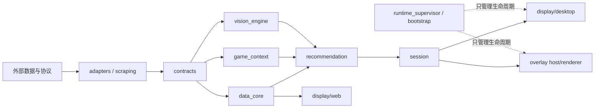
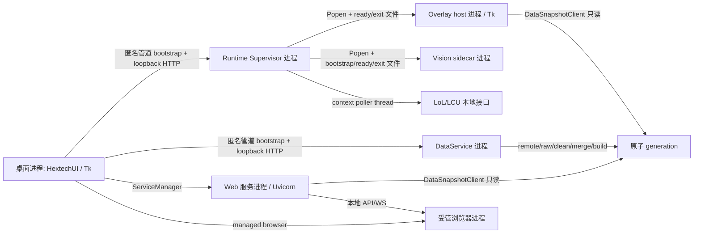
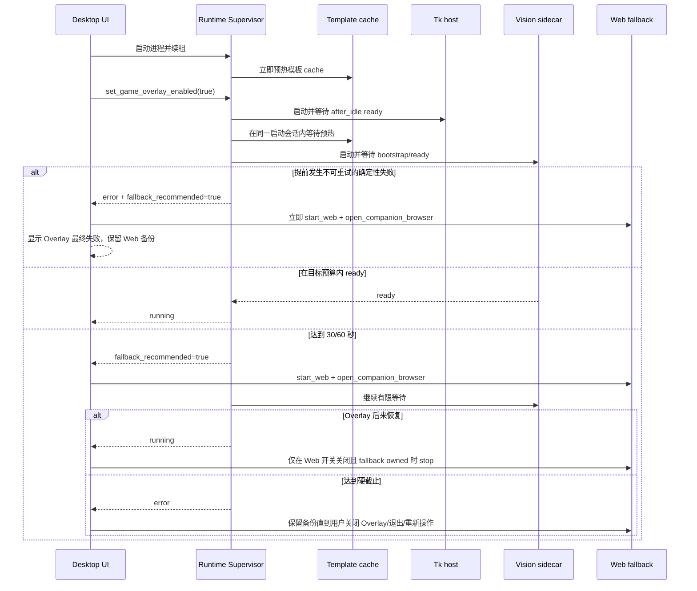
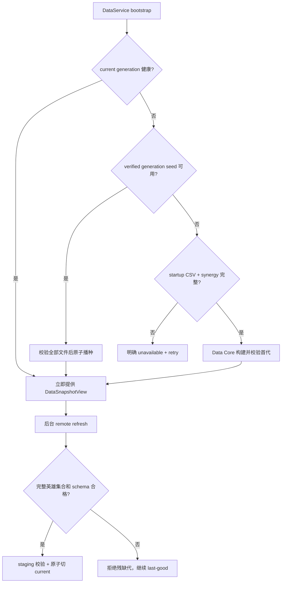
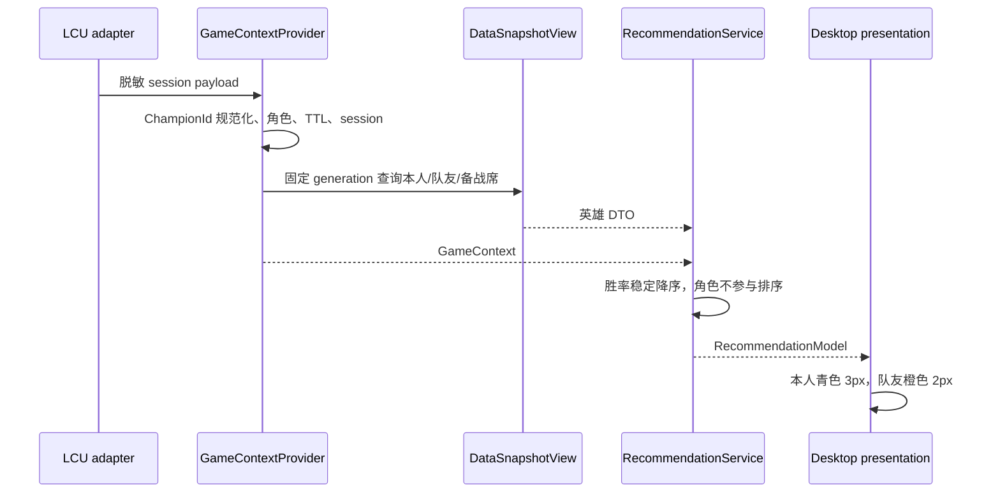
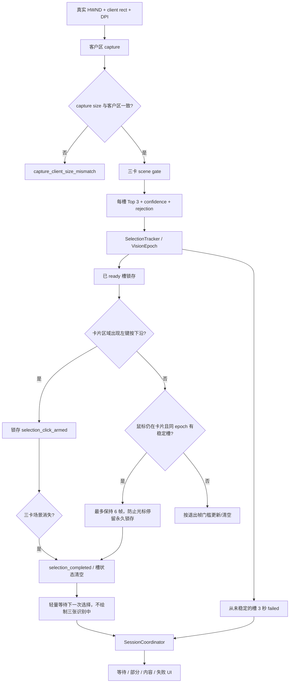
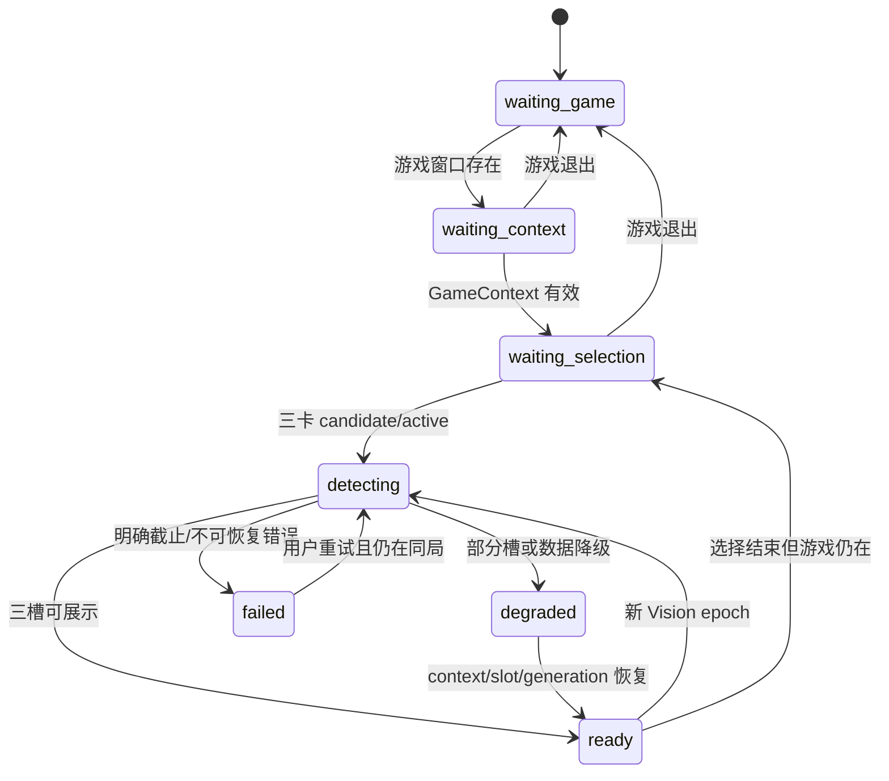
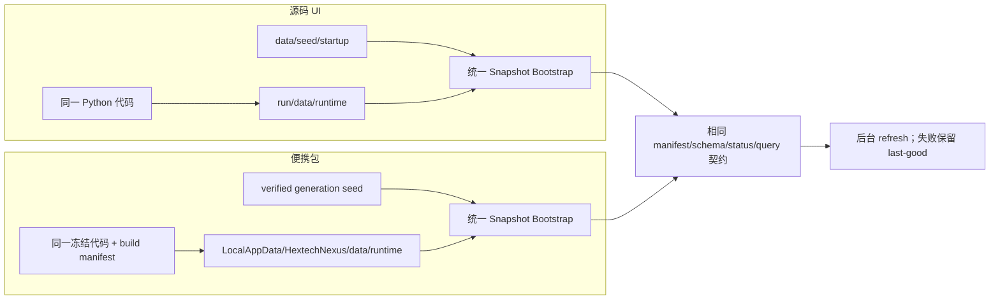
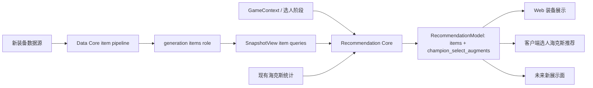

# Hextech 伴生系统设计

## 1. 文档目的

本文是 `run/` 当前架构、进程边界、启动预算、数据链路、运行态文件和维护验收的事实源，供人工维护者与 AI 在改动前查阅。

当前正式游戏内显示路线是 **Python 3.11 + Tk host + Vision sidecar**。Web 是用户可主动开启的展示面，也是在 Overlay 超时或提前失败时由桌面临时接管的备份。本文不定义 Overwolf 的实施计划；未来路线见 `overwolf-route.md`。

### 1.1 模块化目标与依赖方向

当前架构采用模块化单体与必要受管子进程。DataService、Runtime Supervisor 和
Vision sidecar 保持进程隔离，但业务规则不因进程边界复制。核心采用 ports/adapters
与同存储轻量 CQRS：Data Core 独占写入，其他模块只读取固定 generation 查询视图。



| 模块 | 唯一职责 | 禁止事项 |
| :--- | :--- | :--- |
| `contracts` | 强类型 ID、状态枚举和版本化 DTO | 导入 Tk/FastAPI/Pandas/requests/OpenCV |
| `data_core` | generation 写入边界和只读查询 port | 依赖具体展示面 |
| `game_context` | LCU 角色、阶段、TTL 和 session | 查询胜率或决定窗口显隐 |
| `vision_engine` | 原子窗口 observation 与识别 DTO | 查询统计或决定推荐 |
| `recommendation` | 排序、角色、海克斯/装备推荐语义 | 调用 UI 或进程管理 |
| `session` | 组合游戏、上下文、Vision、generation | 直接调用 Tk/FastAPI |
| `adapters` | LCU、文件、抓取、窗口等技术转换 | 包含业务排序和状态决策 |

`ChampionId` 在 adapter 边界把 `24`、`"024"`、`24.0` 统一为 `"24"`；非法或
模糊输入直接拒绝。CSV/DataFrame 只能停留在 Data Core。Desktop 直接消费 generation
英雄 DTO，不再建立第二份 Pandas 索引。

会话状态固定为 `waiting_game / waiting_context / waiting_selection / detecting / ready /
degraded / failed`。可见性与内容状态分离：游戏存在且用户开启时，context 或 event
暂缺进入轻量等待面，不再静默隐藏。

Vision sidecar 使用 Per-Monitor V2 DPI awareness，并把 HWND、client rect、capture
size、DPI scale 和 layout transform 视为原子 observation。客户区与捕获尺寸不一致时
输出 `capture_client_size_mismatch`，禁止使用混合坐标继续识别。

## 2. 目标与非目标

### 2.1 目标

- 桌面首屏、本地数据和 Overlay 在 cache 命中时力求 30 秒内 ready。
- cache miss、cache 未知或空运行态时力求 60 秒内 ready。
- 达到目标仍未 ready 时立即启动并打开 Web 备份，同时让 Overlay 最多继续 120 秒。
- Overlay 恢复后按照用户 Web 开关和 fallback 所有权决定是否关闭临时 Web。
- 启动、取消、失败和退出均有有限边界，不允许无限重试或遗留受管进程。

### 2.2 非目标

- 不在启动关键路径等待网络抓取完成。
- 不让 Runtime Supervisor 持有 Web 生命周期或用户 Web 开关。
- 不用 Web fallback 修改或持久化用户偏好。
- 不在当前发行链路引入 Overwolf、Electron、GEP 或第二套 Overlay renderer。

## 3. 代码架构与具体路径

| 层 | 主要路径 | 职责 |
| :--- | :--- | :--- |
| 启动薄壳 | `hextech_ui.py`、`web_server.py`、`build.py` | 转交桌面、Web 与打包真实入口 |
| 桌面 UI | `hextech/display/desktop/app.py` | Tk 窗口、用户开关、fallback 所有权、二级状态与关闭协调 |
| 桌面运行时 | `hextech/display/desktop/runtime.py` | Supervisor/Web 子进程、受管浏览器、LCU 与窗口同步 |
| 数据服务 | `hextech/data_service.py`、`hextech/data_snapshot.py` | 唯一远端刷新/构建/发布者；版本化 generation 与统一只读查询 |
| 客户端上下文 | `hextech/client_context.py` | 统一本人、队友、备战席、阶段、断连降级和过期清理语义 |
| 服务管理 | `hextech/display/desktop/service_manager.py` | DataService、Web 服务与低频监听的生命周期；Supervisor 启用后不直接管理 Overlay |
| 执行面 | `hextech/runtime_supervisor.py` | lease、action、Overlay 启动会话、预算和结构化事件；不再拥有数据刷新 |
| Overlay 生命周期 | `hextech/overlay/lifecycle.py` | host/sidecar 进程 readiness、退出信号、取消与清理 |
| Overlay host | `hextech/overlay/host.py` | Tk 透明置顶窗口、前台门控和渲染轮询 |
| Vision sidecar | `hextech/overlay/vision/sidecar.py`、`runner.py`、`template_runtime.py` | 截图、模板 cache、识别、三槽事件和 trace |
| 上下文/事件 | `hextech/overlay/context.py`、`events.py`、`data_source.py` | 游戏上下文、三槽事件和 host 读取适配 |
| 提示 cache | `hextech/overlay/hints.py` | 从本地稳定/运行态数据生成轻量提示 |
| 本地 Web/API | `hextech/display/web/app.py`、`api.py`、`runtime.py` | FastAPI/Uvicorn、本地页面、API 与 WS |
| 数据/刷新 | `hextech/catalog/`、`hextech/core/refresh.py`、`hextech/scraping/` | 本地读取、后台刷新、抓取与自愈 |
| 验收/构建 | `tools/dev_checks.py`、`tools/acceptance/`、`tools/build_package.py` | 自动化门禁、真机探针和便携包 |

### 3.1 模块状态、契约和维护入口

“已收敛”表示该边界已成为新代码的权威入口；“迁移中”表示已有类型化核心，但旧调用者仍通过兼容适配；“技术适配”可以包含框架或协议细节，但不得成为业务事实源。

| 物理路径 | 状态 | 唯一职责 | 输入 / 输出 | 允许依赖 / 禁止依赖 | 进程与主要测试 | 扩展点 |
| :--- | :--- | :--- | :--- | :--- | :--- | :--- |
| `hextech/contracts/` | 已收敛 | 强类型 ID、枚举、冻结 DTO、schema version | 已校验标量 / `GameContext`、`VisionSelection`、`RecommendationModel`、`GameSessionState` | 标准库 / Pandas、Tk、FastAPI、requests、OpenCV、runtime | 全进程；`test_modular_architecture.py` | `ItemId`、新 DTO 字段 |
| `hextech/data_core/` | 端口已收敛，pipeline 迁移中 | 固定 generation 查询 port 和读写分离边界 | contracts ID / `SnapshotViewPort` | contracts / UI、LCU、Vision、进程管理 | DataService 与消费者；`test_data_snapshot.py` | items 与新统计域 |
| `hextech/data_service.py`、`data_snapshot.py` | 已收敛 | 唯一写入、bootstrap、原子发布、last-good、固定代查询、海克斯身份解析 | 清洗数据、资源目录、action / manifest、generation、view | data_core、catalog、core、support / Tk、FastAPI、Vision 决策 | DataService 独立进程与只读消费者；`test_data_service.py`、`test_data_snapshot.py` | 新 snapshot role |
| `hextech/game_context/` | 核心已收敛 | LCU 角色、session、8 秒 TTL、跨局清空 | 脱敏 payload / `GameContext` | contracts / 胜率、Vision、UI、窗口显隐 | context poller；`test_client_context.py` | 新阶段与角色 |
| `hextech/client_context.py` | 迁移兼容 | 旧调用者到 `game_context` 的桥接和文件投影 | LCU payload / 兼容 JSON + DTO | game_context、adapters/lcu / 新业务规则 | Supervisor；`test_overlay_context_stability.py` | 调用者迁完后缩减 |
| `hextech/adapters/lcu/` | 技术适配 | LCU 字段脱敏、类型边界、错误码 | LCU HTTP JSON / provider 安全结构 | contracts / 排序、统计、UI | Desktop/Supervisor；`test_client_context.py` | 新 endpoint |
| `hextech/adapters/runtime_session.py` | 生产接线适配 | 将 context/event JSON 一次转换为 DTO，并调用 Recommendation/Session | 兼容 JSON、固定 view / `GameSessionState` | contracts、recommendation、session / Tk 绘制、抓取、重复状态判断 | Overlay host；`test_modular_architecture.py`、host tests | 删除旧字典入口后进一步缩减 |
| `hextech/vision_engine/` | 契约已收敛 | 原子窗口 observation 与 Vision DTO | HWND、客户区、capture、DPI / 类型化 observation | contracts / 统计、UI、进程生命周期 | sidecar/Session；`test_modular_architecture.py` | 新捕获 adapter |
| `hextech/overlay/vision/` | 技术适配，状态机已收敛 | 捕获、ROI、模板 cache、场景、逐槽稳定、hover 锁存、trace | 客户区帧、统一 hints / 三槽 event、history | vision_engine、data source、Pillow/Numpy / 胜率、排序、展示策略 | Vision sidecar；`test_overlay_vision_state.py`、`test_dev_gate_overlay.py` | 新分辨率和识别器 |
| `hextech/recommendation/` | 核心已收敛 | 唯一实现排序、角色标记、三槽统计状态 | context、vision、固定 view / `RecommendationModel` | contracts、data_core / UI 框架、LCU payload、CSV、进程管理 | 消费者进程；`test_modular_architecture.py` | 装备和选人推荐 |
| `hextech/session/` | 核心已收敛 | 组合 context/window/Vision/generation，生产状态、可见性和证据 | 类型化 DTO / `GameSessionState`、evidence | contracts、recommendation / UI、抓取、进程启停 | Desktop/Overlay；`test_real_session_acceptance.py` | 新 phase、脱敏回放 |
| `hextech/display/desktop/` | Presentation adapter，迁移中 | Tk、开关、英雄列表、Web fallback 所有权 | DTO/ViewModel、命令 / UI、受管 action | session、snapshot、runtime facade / CSV/DataFrame、原始 LCU、Vision trace 解释 | Desktop 主进程；desktop tests | 选人推荐面板 |
| `hextech/display/web/` | Presentation adapter，迁移中 | FastAPI、静态前端、WS，只展示同一代模型 | 固定代查询、请求 / API、HTML、WS | data_core、recommendation / 抓取、发布、重复规则 | Web 子进程；web tests | 装备页、新 API |
| `hextech/overlay/host.py`、`renderer.py`、`data_source.py`、`lifecycle.py` | Presentation/runtime adapter，迁移中 | 透明窗、等待/内容渲染、统一读取、readiness | session 投影、event、hints / Canvas、visibility | session、contracts、snapshot / CSV、抓取、身份猜测 | host 与 Supervisor；overlay lifecycle tests | 新 renderer |
| `hextech/runtime_supervisor.py` | 运行边界已收敛 | 启停、30/60 预算、120 秒继续、取消、重试、诊断 | action、lease / runtime snapshot、受管进程 | lifecycle、support / ChampionId、推荐、Vision 语义、Web 所有权 | Supervisor；runtime tests | 新受管进程 |
| `hextech/catalog/`、`core/`、`scraping/` | Data Core pipeline，迁移中 | 抓取、解析、清洗、Mayhem、资源目录、runtime store | 远端 HTML/JSON、静态资源 / 完整 CSV/JSON 候选代 | transport、support / UI、Overlay 生命周期、直接发布 | DataService worker；scraping/refresh tests | 装备数据源 |
| `hextech/support/` | 已收敛 | 原子 I/O、日志、Python runtime、诊断、图像校验 | 基础设施原语 / 小型工具 | 标准库和明确第三方库 / 业务规则 | 各进程；support tests | 通用基础设施 |
| `hextech_ui.py`、`web_server.py`、`build.py` | Composition root 薄壳 | 组合实现、选择 runtime 根并启动 | CLI、冻结环境 / 进程 | 对应 presentation/runtime / 业务计算、第二套 seed | 启动进程；package smoke | 新 CLI 参数 |
| `tools/acceptance/` | 验收工具 | 真实抓取、包 smoke、同局五联、性能样本 | 隔离 runtime、真实证据 / `ok` 报告 | 公开入口、contracts / mock 冒充真实验收 | 独立进程；acceptance tests | 新展示面验收 |

### 3.2 强制依赖规则

- 跨模块只传 DTO、port 或版本化 JSON；任意字典只允许停留在技术 adapter 和迁移兼容层。
- `ChampionId` 是无前导零十进制字符串。Vision stable ID 先由 `DataSnapshotView.resolve_augment()` 解析成 canonical 数字 ID，再查询组合统计。
- `SOURCE_STATS_MISSING` 表示身份已知但源站没有当前英雄组合；`IDENTITY_UNRESOLVED` 表示身份索引缺失。二者不得合并成“数据准备中”。
- `presentation`、`runtime`、`bootstrap` 当前是职责名称，不是物理空包；只有出现两个以上稳定实现时才移动文件，避免为了目录整齐制造转发层。

## 4. 进程与线程模型



桌面主线程只负责 Tk。`hextech-post-visible-bootstrap` 在首屏 after-idle 后通过 `ServiceManager` 启动 DataService，再启动 Supervisor 和本地展示加载。DataService 独立于 Web/Overlay 开关；其 bootstrap 管道只返回随机 loopback 端口和会话 nonce，stdout 首行交给 bootstrap queue 后仍持续 drain，stderr 从进程启动起持续 drain，防止抓取日志填满 Windows pipe。异常退出由 `ServiceManager` 检测并允许重启，桌面退出时关闭控制面、管道和 Windows Job Object。Overlay action、DataService refresh、lease 与 fallback 都使用受管后台线程，UI 更新经 `root.after(0, ...)` 回到 Tk 主线程。

## 5. 启动数据链路



正式数据链路为：DataService bootstrap -> 远端抓取 -> runtime raw/cleaned/Mayhem merge -> 最新 CSV 的结构化查询 DTO -> DataService staging generation -> schema/计数/大小/SHA-256 校验 -> 原子切换 `current.v1.json`。bootstrap 先读取健康 current；没有 current 时，冻结态使用 verified generation seed，源码态由只读 startup CSV/联动 seed 构建完整 generation。随后远端 refresh 才在后台更新下一代。两种入口只允许可写 runtime 根不同，不能再拥有不同的快照状态语义。DataService 可以复用已与最新 CSV 签名匹配的兼容查询缓存；缓存缺失或过期时直接从 CSV 构建 DTO，不等待数分钟的兼容缓存重建。桌面、Web 和 Overlay 都通过 `DataSnapshotClient` 整代读取同一 generation；当前代任一文件损坏时整体回退 previous，禁止按文件混代。Overlay 每轮绘制重新打开当前 view，首代发布后应从“数据准备中”原位更新，不要求重启。

generation 固定包含 `champions.json`、`champion_hextech.json`、`overlay_hints.json`、`identities.json` 与 `manifest.json`。manifest 记录 `schema_version`、`generation_id`、`created_at`、`private_stats_enabled`、来源摘要、三类记录计数以及每个文件的相对路径、大小和 SHA-256。只有 DataService 可以实例化发布器；Web、桌面、host、scraper 和 Mayhem 不得直接发布 generation 或 hint cache。



`DataSnapshotClient.open_view()` 会先解析并校验 current generation，再一次性载入四个角色文件形成固定 `DataSnapshotView`。一次 Web 请求、桌面刷新或 Overlay render model 必须复用同一 view，不能在查询中途重新读取 current 指针。桌面 generation watcher 只监测 generation id 变化并请求 UI 重载，不写快照；Web 每个请求固定一代；Overlay event、身份映射和统计查询也固定在同一代。

打包时 `tools/build_package.py --verified-snapshot-root <snapshots-root>` 只接受已经通过 manifest 校验的 snapshot 根，并将当前完整 generation 投影到 `data/seed/startup/snapshots/`。冻结态首启先校验并播种 generation 文件，最后原子发布 `current.v1.json`；`tools/runtime_bundle.py` 随后写入带 generation id、来源和计数的 `startup_status.json`。DataService status 使用 `runtime_current`、`verified_seed`、`startup_data_built`、`remote_refresh` 和 `last_good_fallback` 区分来源。检测到 verified seed 后 packaged smoke 禁止 DataService 自动联网刷新，并同时核对运行态 pointer、startup status、Web 详情和 Overlay 都属于同一 generation。这样源码 UI 与便携包都能在首次远端 refresh 前提供完整统计，后台下一代失败时仍保留当前代。

`ClientContextProvider` 从 LCU session 产生本人、队友、备战席与阶段。`myTeam`、`benchChampions` 必须是数组，`championId` 必须是正整数；畸形 payload 走有界 degraded/disconnected，不能抛异常后继续显示旧文件。Provider 的 8 秒 TTL 是生产 poller 唯一的旧上下文保留权威，遗留 30 秒文件窗口仅兼容没有 Provider 的一次性调用。列表仍按胜率稳定降序排列，`selection_role` 不参与排序：本人使用青色同尺寸标记，队友使用橙色同尺寸标记，备战席保持普通样式。同一 Vision epoch 内已 ready 槽持续显示；新候选达到现有稳定帧门槛后才原子替换。尚未产生稳定结果的槽满 3 秒转为 `failed` 并显示“识别失败/重试”，候选抖动不得重置该门槛，后续稳定后可自动恢复。

### 5.1 LCU 到客户端悬浮窗



### 5.2 游戏窗口、Vision 与 hover 锁存



runner 使用 Windows `GetAsyncKeyState(VK_LBUTTON)` 只记录按下沿，且仅在光标位于三卡区域时武装选择完成。若轮询恰好错过点击，hover 锁存也只能持续 6 帧，之后发出 `selection_completed`。完成事件的 `slot_states` 为空，Host 在 `render_full_overlay=false` 时走轻量等待 renderer，禁止再次把空槽解释成 `detecting`；下一次真实三卡场景进入时递增 epoch 并重新识别。

当同一局三槽均 ready、Recommendation 为内容态且窗口观测完整时，Host 自动在 `data/runtime/state/session_evidence/` 写入 `latest_real_session.v1.json` 与一次 Overlay 窗口截图。bundle 固定包含 `evidence_kind=real_game_session`、LCU 角色、HWND/客户区/capture/DPI、三槽、generation/session/epoch 和最终可见状态，格式与 `tools/acceptance/verify_data_pipeline.py::verify_real_session_evidence` 共用契约；任一身份不一致均拒绝验收。

稳定数据、运行态数据、打包资源和禁止入包路径的详细分类以 `../data/DATA_USAGE.md` 与 `../data/data_manifest.v1.json` 为准；本文只描述进程间的数据流，不复制数据清单事实源。

## 6. Overlay 启动会话与状态机

每次从非 running 状态启用 Overlay 创建一个会话。重复 enable 是幂等操作，不得重置已完成会话。

会话字段由 `OverlayRuntimeManager.snapshot()` 输出：

| 字段 | 含义 |
| :--- | :--- |
| `startup_mode` | `warm` 表示 cache hit；`cold` 包含 miss/unknown/空运行态 |
| `startup_elapsed_seconds` | 从本次会话开始到当前或终态的端到端耗时 |
| `target_budget_seconds` | 当前采用的 30 或 60 秒目标 |
| `fallback_recommended` | 目标超时或启动提前失败，桌面应接管 Web |
| `hard_timeout_reached` | 目标预算加 120 秒已耗尽 |
| `startup_attempts` | sidecar attempt、分配 timeout、结果和错误类型的精简记录 |

状态路径：

```text
stopped
  -> starting/prepare_data
  -> starting/context_start
  -> starting/host_start
  -> starting/cache_wait 或 vision_prewarming
  -> starting/sidecar_start
  -> running/running

任一确定性错误 -> error/failed
用户关闭或应用退出 -> stopping -> stopped
硬截止 -> 清理 host/sidecar/context -> error/failed (hard_timeout)
```

sidecar 最多首次尝试加一次瞬态重试。模板缺失、schema、配置、token 不匹配、清理失败和硬截止不重试。readiness 每 100ms 观察 ready/bootstrap/进程退出，并响应取消信号；每次 factory 返回后再次检查 generation 与硬截止，迟到进程必须先清理再报错。



Supervisor 退出时必须先登记并启动 Overlay 清理线程，再发布 shutdown Event；主循环等待有界清理完成后才退出，避免 host/sidecar 成为孤儿进程。便携包真实复验必须确认 snapshot 中的两个 PID 在退出后均不存在。

## 7. 预算与 40/70 放宽门槛

默认目标固定为 warm 30 秒、cold 60 秒，硬截止分别为 150 秒与 180 秒。

只有同一模式的 3 次正常进程测试中至少 2 次仅因稳定本机开销略超目标，且确认没有重复长等待、异常重试、无进展 phase、残留进程或 refresh 竞争，才允许把该模式整体加 10 秒。放宽后目标为 40/70 秒，继续窗口仍为 120 秒。任何超过 10 秒的偏差都必须按缺陷处理。

本轮修改前日志基线（2026-07-11）为：首次 Overlay action 到最终失败约 317 秒；预热后另起 action，随后约 280 秒符合 3 次 90 秒 sidecar 等待加退避；refresh 在首次 action 第 9 秒启动并与关键路径重叠。该基线用于证明修复方向，不代表修复后的真机样本。最终目标仍保持 30/60，是否放宽必须等待同版本真机 3 次样本。

2026-07-14 对同一便携包执行真实 Supervisor/host/sidecar 进程测量，隔离空运行态三次为 `30.437s`、`31.569s`、`30.988s`，cache 命中三次为 `9.429s`、`9.591s`、`9.311s`；六次均一次 sidecar attempt、未触发 fallback。结果满足 30/60 目标，因此不启用 40/70 放宽。该探针不替代 LoL 选择画面下的真机 Vision/窗口验收。

2026-07-16 使用 generation `20260716T043822-a762d00c4e` 的统一 hints，对正式 `SharedOverlayDataSource -> template_runtime` 路径执行三组隔离模板采样：cold 为 `42.462s`、`44.122s`、`45.763s`，对应 warm 为 `0.719s`、`0.640s`、`0.743s`；工作树默认 cache 再测为 `0.542s`。每次均为 517 个模板、`189,186,641` 字节 cache。结论是首次模板冷建稳定满足 60 秒空运行预算，但不能承诺 40 秒；已有 cache 的加载目标为亚秒级。模板签名只包含身份和资源字段，统计值、generation ID 和生成时间变化不得令 cache 失效；同机同资源并发 miss 通过线程锁和文件锁收敛为一次构建。只有身份或模板资源真实变化时才允许再次支付 cold 成本。

## 8. Web fallback 所有权

fallback 由 `HextechUI` 编排，状态是内存态，不写入 `ui_feature_flags.json`：

- 用户 Web 开关原本开启：复用现有 Web，不取得所有权。
- 用户 Web 开关关闭：桌面启动 Web、打开受管浏览器并设置 `fallback_web_owned`。
- fallback 期间用户开启 Web：所有权立即转给用户。
- Overlay 恢复且用户 Web 关闭：只关闭 fallback owned 的浏览器和 Web。
- Overlay 最终失败：保留 fallback Web。
- 用户关闭 Overlay或应用退出：取消 Overlay 启动并清理 fallback owned Web。
- Web 启动/浏览器打开/关闭失败只更新二级状态，不反向停止 Overlay。

二级状态至少区分：`Overlay 启动中`、`Web 备份启动中 / Overlay 继续启动`、`Web 备份已接管 / Overlay 继续启动`、`Overlay 已恢复`、`Overlay 最终失败 / Web 备份保留`。只有 Web 服务实际启动完成后才能显示“已接管”；确定性错误耗尽有限重试后立即进入“最终失败”，不再显示“继续启动”。

## 9. DataService action 与 refresh 竞争控制

refresh 所有权属于 DataService。进程先持有 `snapshots/data-service.lock`，防止多个桌面实例同时发布 generation；bootstrap 在控制面 ready 前完成 current 校验或 startup generation 构建，再由单 worker action queue 串行执行 `refresh` 与 `set_private_stats`。同类型 refresh 在运行中或已排队时返回 `already_queued`，不能并发抓取；两个 action 还共用核心锁，策略切换失败会回滚 desired policy，旧 refresh 不能覆盖新策略。桌面提交私用统计 action 后持续追踪同一 action 到终态，不使用会让 UI 先回滚、后台再反向发布的固定等待超时。详情抓取的单请求 timeout 先进入一次低并发 tail retry；403/429 仍立即熔断，retry 后不完整的数据不得发布。

refresh 失败不切 current，继续服务上一代并报告 degraded。远端刷新完成后，DataService 关闭旧兼容缓存重建阶段：已有同签名缓存时可直接复用，否则从新 CSV 一次性生成查询 DTO 并发布 generation。这样新代不会被数分钟的 Web 兼容缓存计算阻塞。Supervisor 不再直接调用 `refresh_backend_data`，因此 Overlay host/sidecar 启动不会与第二个刷新调度器竞争。

## 10. 运行态路径

源码态根为 `run/data/runtime/`；冻结态根为 `%LOCALAPPDATA%/HextechNexus/data/runtime/`，不可写入便携包目录。

| 相对路径 | 生产者 | 用途 |
| :--- | :--- | :--- |
| `state/ui_feature_flags.json` | `core.settings` | 用户开关；fallback 不得修改 |
| `state/startup_timing.v1.json` | desktop startup probe | Tk shell、首屏与后台数据时点 |
| `state/startup_status.json` | runtime bundle / refresh-heal | verified seed 或刷新后的数据 generation、自愈状态和计数 |
| `state/supervisor_events.v1.jsonl` | Runtime Supervisor | action/lease/refresh 结构化事件 |
| `state/runtime_events.v1.jsonl` | refresh | 数据刷新结构化事件 |
| `state/web_server_port.txt` | Web | 本地端口；认证 token 内容不得进入文档/日志 |
| `state/game_overlay_slots.v1.json` | Vision | 当前三槽识别事件 |
| `state/game_overlay_context.v1.json` | context poller | 当前英雄/对局上下文 |
| `state/game_overlay_visibility.v1.json` | host | 前台门控和可见原因 |
| `state/game_overlay_sidecar_status.json` | Vision runner | sidecar phase/status |
| `state/overlay_vision_trace*.json` | Vision | 当前与历史诊断摘要 |
| `snapshots/current.v1.json` | DataService | 当前/上一 generation 原子指针 |
| `snapshots/generations/<id>/` | DataService | 完整不可变数据代与 manifest |
| `snapshots/data-service.lock` | DataService | 单实例发布锁；文件存在不代表锁仍被持有 |
| `cache/Champion_List_Cache.json` | 迁移期兼容路径 | 与最新 CSV 签名绑定；DataService 只在已经匹配时复用，不负责等待重建 |
| `cache/Champion_Hextech_Cache.json` | 迁移期兼容路径 | 与最新 CSV 签名绑定；过期时 DataService 直接从 CSV 构建 generation |
| `logs/` | log_utils | 摘要、错误和开发态 JSONL |

`ready/bootstrap/exit` 文件带随机 generation/token，只用于同机进程握手，结束后应清理；token 不写入 Supervisor 事件或设计文档。

### 10.1 源码 UI 与便携包对照



### 10.2 后续装备与选人推荐扩展



## 11. 诊断顺序

1. 先看 `startup_timing.v1.json`，确认 Tk 首屏与后台服务是否及时。
2. 再按 correlation id 查看 `supervisor_events.v1.jsonl`，定位 Overlay/refresh action 时序。
3. 查看 DataService status 与 `snapshots/current.v1.json`，核对 active/previous generation、策略和降级原因。
4. 查看 Supervisor snapshot 的 budget、phase、attempt 与 failure kind。
5. sidecar 问题再看 bootstrap/status/vision trace；trace 应包含候选、置信度、拒绝原因和耗时，不要先读取或导出 ROI 图像。
6. Web fallback 问题核对用户 Web 开关、ServiceManager 状态和受管浏览器所有权。
7. 使用桌面诊断导出时只采集白名单 state/log tail；不得读取 auth、token、cookie、raw、profile 或 debug 图像。

## 12. 维护与验收

最小目标验证：

```powershell
.\.venv\Scripts\python.exe -m pytest -q tests/test_runtime_supervisor.py tests/test_overlay_sidecar_lifecycle.py tests/test_desktop_runtime_overlay.py tests/test_desktop_startup_status.py
.\.venv\Scripts\python.exe tools/dev_checks.py --overlay-only --deep
.\.venv\Scripts\python.exe -m pytest -q
.\.venv\Scripts\python.exe -m ruff check hextech/runtime_supervisor.py hextech/overlay/lifecycle.py hextech/display/desktop/app.py tests/test_runtime_supervisor.py tests/test_overlay_sidecar_lifecycle.py tests/test_desktop_runtime_overlay.py --ignore E741
.\.venv\Scripts\pyright.exe hextech/recommendation/service.py hextech/overlay/vision/runner.py hextech/overlay/vision/template_runtime.py
.\.venv\Scripts\python.exe tools/dev_checks.py --bundle-manifest
git diff --check
```

全量 `ruff check .` 与 `pyright` 当前仍包含 `main` 已存在的 Vision/UI 类型和样式债务，只作为债务观察项，不是本轮通过门禁。改动必须保证 scoped Ruff 通过，并将全量 Ruff/Pyright 与同一 `main` 基线对比，禁止新增诊断；不得为清零既有债务扩大 Overlay 启动修复范围。

便携包还必须在非仓库空运行态目录执行 `tools/acceptance/smoke_packaged_startup.py`。2026-07-15 的真实总验收 generation `20260715T132919-958e2dd635` 经 BAT 在 13.03 秒进入同代 Web 可用态，未启用 40/70 秒宽限。真机验收覆盖 warm/cold、目标内成功、目标超时 Web 接管、Overlay 延迟恢复、最终失败、两个开关互换和退出清理。自动化不能替代真机 Vision/窗口/受管浏览器验收。

交付前必须执行真实总验收，不允许 mock、旧 seed 或静默 fallback 冒充成功：

```powershell
.\.venv\Scripts\python.exe tools/acceptance/verify_data_pipeline.py --remote-timeout 900 --build-timeout 1800 --package-timeout 70 --real-session-evidence <session.json>
```

使用 `--component-only` 时保存真实抓取、Web、合成 Tk 和打包 smoke 证据，但只设置
`component_chain_ok=true`，最终 `ok` 保持 `false`。交付必须额外传入
`--real-session-evidence <session.json>`，证明真实 LCU ChampionId、真实 HWND/客户区/
DPI、真实 Vision epoch 与三槽、同代 RecommendationModel、最终 content 状态和非空
截图属于同一 `session_id + generation_id + vision_epoch`。Vision history 必须保留 session、HWND、客户区、capture size、DPI、epoch 和三槽摘要；最终 render state 也必须携带同代 generation 与同一 epoch。缺少任一项、跨局/跨代/跨 epoch 或混入合成事件时验收失败。

依赖事实源位于 `tools/requirements/{runtime,build,dev,compat}.txt`。便携 BAT 必须是 ASCII/CRLF，通过唯一根 EXE 启动；packaged smoke 实际经 BAT 启动。PyInstaller 必须收集 `scrapling`、`browserforge` 与 `apify_fingerprint_datapoints` package data，并在启动 smoke 前验证关键 JSON/ZIP 存在。

修改启动行为时必须同时回答：会话起点是否唯一、deadline 是否可重置、取消是否能穿透等待、失败进程是否确认清理、fallback 是否错误取得用户 Web 所有权、refresh 是否重新进入关键路径。
