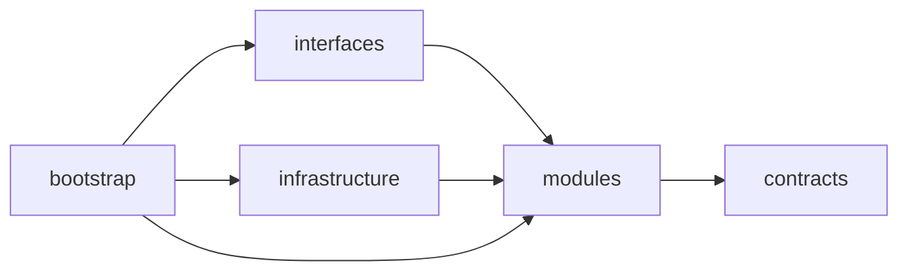

# Hextech 伴生系统设计

增量发布采用“排行与当前英雄立即、其余已验证 unit 合并收尾”的节奏；优先英雄改变时可提前发布其已完成结果。不得每完成一个后台英雄就重写完整兼容快照并重验全部闭包。原文与单英雄 candidate 已独立持久化，合并发布不丢下载进度。

当前为2026-09-14隔离源码候选，不表示正式安装或真机完成。生产刷新已切换 `IncrementalRefreshService`；旧六文件只在 `tests/support/legacy_refresh/` 冻结测试。旧流程材料见 [overlay-refresh-v2-history.md](overlay-refresh-v2-history.md)，案例证据与未完成项见 [overlay-case-baseline.md](overlay-case-baseline.md)。

## 模块边界

源码根为 `src/hextech`。`contracts` 定义跨边界 ID、DTO 和失败分类；`modules` 持有业务用例；`interfaces` 与 `infrastructure` 实现入站和出站适配；`bootstrap` 是唯一 composition root，负责具体进程与实现组装。旧刷新引擎不再属于生产 src；少量既有兼容导出不能成为第二套生产协调器。

反向导入由 architecture tests 阻断。模块不得依赖根脚本、旧路径 alias 或转发入口。

## 抓取与 generation 链路

```mermaid
flowchart LR
    Remote["CDN / Apex / Mayhem"] --> Fetch["Transport + Source"]
    Catalog["Catalog candidate"] --> Parse["Parser + Normalizer"]
    Fetch --> Raw["RawResponseCache：source/revision/URL"]
    Raw --> Parse
    Parse --> Run["var/sources/*/runs/run_id"]
    Run --> Gate["排行/单英雄/Optional unit 完整性门禁"]
    Gate --> Candidate["source candidate pointers"]
    Candidate --> Cohort["CohortPromotionStore + journal"]
    Cohort --> SourceCurrent["catalog/source current.v2.json"]
    SourceCurrent --> DataService["IncrementalRefreshService + IncrementalProjection"]
    Seed["resources/seeds"] --> DataService
    DataService --> GenerationGate["Schema / 数量 / SHA-256"]
    GenerationGate --> Generation["var/snapshots/generations/id"]
    Generation --> Current["snapshot current.v2.json（最后提交）"]
    Current --> View["固定 DataSnapshotView"]
    View --> UI["Desktop / Web / Overlay"]
    Current --> Pool["production_augment_pool"]
    Pool --> Vision["generation-bound Vision matrices"]
    Bundle["verified bundle cohort seed"] --> Install["冻结 EXE 启动前安装"]
    Install --> SourceCurrent
```

只有 DataService 可以提升来源 current 并发布 generation。来源 publisher 只写 immutable run
和 candidate pointer，显式请求 direct promotion 也会失败；Web、Desktop 和 Overlay 都没有发布权限。

## 来源、单元与 snapshot v3

Catalog 仍以普通英雄和经验证视觉资产为事实源；模式变体过滤、ID/名称/路径/hash 校验不由统计覆盖反推。production pool eligibility 只由绑定一致的 Catalog/augment_assets 决定，统计或 Optional 来源不能扩大识别池。

ARAMKit 排行 `hero_rankings` 先发布，单英雄 `all` 和 Stage 1–4 完整后各自形成 `scoped_stats` immutable unit。`IncrementalRefreshService` 通过 `IncrementalProjection` 组合实际有效 units，使用现有 CohortPromotionStore/journal 发布。排行就绪不等待所有英雄或 Optional；pending 英雄有明确空 augments 和 data_status，不得冒充完整。不同 unit 可持有各自 source_version，但必须同 Catalog，manifest/path/size/SHA-256、索引及每个 child 都要验证。

`RawResponseCache` 按 source/revision/URL 隔离，支持重试与重启后的同版本响应复用；新 revision 不借用旧 raw。缓存命中仍检查身份/hash/size，再按当前 Catalog 做解析与规范化。每 revision 2 GiB、每来源 6 GiB 硬预算含未完成/孤立 body，超限明确 budget stop。当前没有自动 prune，不保证只保留两个版本，不触发临时目录搬运或自动清理用户数据。

Optional lane 与 Core 分开执行；Apex/Mayhem/Blitz 的缺失或失败不阻塞已验证核心 unit 发布，但仍须各自通过身份和内容门。Apex 明确空态才可 confirmed_empty，未知空结果不能假成功。Blitz 只有 tier，不推断百分比或样本量。ARAMKit Stage 缺行仍回退同英雄 all，再缺才显示 Blitz tier；Catalog-only 身份仍可识别。

snapshot reader 接受 schema 2/3，新 writer 默认 3；V2 DTO 与 baseline contribution 默认2保留。v3 components 包含 ranking 与每 hero 的 source_version/catalog_id/complete，可选 run_id；生产完整单元须有精确 run provenance。未知字段/错误类型拒绝，身份统计投影保持一致。SourceStatus 支持明确 pending/confirmed_empty/unavailable；旧v2完整非空统计门不降低。

## 进程与消费

- Desktop：Tk 控制面和用户操作入口。
- Desktop窗口呈现：`DesktopWindowPresentation` 持有显隐/关闭/停靠状态；当前独立窗口与 `client_foreground` 合同以 [desktop-stable28.md](desktop-stable28.md) 为准。窗口操作、销毁与跟随恢复只在GUI线程执行，后台阶段/列表观察不阻塞显隐。
- Runtime Supervisor：只管理 Overlay host、Vision sidecar、lease 与本机控制面，不拥有数据刷新职责。
- Bootstrap/Desktop service manager：组装并持有 DataService、Web 与 Runtime Supervisor 的具体进程。
- DataService：刷新来源、选择 last-good、构建并发布 generation。
- Web/Overlay：只通过固定 snapshot view 查询，不直接读取来源 run。

Desktop 同时是轻量托盘 owner。单实例协议 v2 用 Build ID、source fingerprint、PID、process create time 与真实 executable 验证 owner；只有同 Build 才发送 activation，不同 Build、旧 v1 或身份缺失明确冲突且双方都不被终止。冻结入口先分派角色，子角色禁止 cohort seed；Desktop 在 runtime logging 和首屏就绪后通过 bootstrap 注入回调执行唯一一次 seed，再启动 DataService/Supervisor。连续五分钟没有 League 客户端或游戏进程时，Desktop 依次停止 Web、DataService 和 Runtime Supervisor（后者负责回收 Overlay host 与 Vision Sidecar），自身与托盘仍常驻并以五秒进程探针等待恢复。

DataService 的 actions 仍接受 scope=due|core 与 force，重复触发合并；新生产执行器不是旧 RefreshCycleMixin。Core 与 Optional lane 分开运行，发布事务有锁，停止后不接新 worker，不发布新 generation；内部 progress 不等于用户已见正确结果。

对局期间不再统一取消下载。短寿命 download_context.v1.json 调整当前英雄优先级；未知 Context 可暂停领取背景任务，已开始任务继续。Catalog 更新仍在非对局状态执行，冷启动对局中缺 Catalog 明确失败。shutdown/hard timeout 的取消、协作退出与 Job 回收继续保留；旧游戏结束延时恢复/checkpoint adoption 引擎仅留冻结测试。

`BackgroundLoadGuard` 只控制后台任务领取：对同一游戏实例的新 captured recognition 观察，保留最近 10 个有效捕获加识别耗时；其中至少 5 个大于 180ms 时暂停背景领取，最近 10 个全部不超过 150ms 时恢复。重复/乱序捕获与无效时间不入样本，换游戏实例清状态。它消费采样事件，不是完整时间线，样本不能充当验收 P95 或识别正确性证据；已开始的任务不因此取消，当前英雄仍优先。

Host 在首次选择开始前可以从已验证旧 view 升级到当前英雄完整的新 snapshot；首次 candidate/active/blocked 或 selection_window_active 观察确定截止，不等待READY。截止后本局 generation 冻结，迟到后台结果不能跨截止采用；下一局重新开放。champion/Stage/scoped run 按 selection epoch 有界冻结，Stage 优先等级3–6/7–10/11–14/15+，缺等级才由本局已确认选择数推导，不能跨局回流。

Context 的游戏 epoch 优先使用 League `PID + process_started_at`，只有身份不可用才回退窗口。Live Client 优先读取 `/allgamedata` 的 `gameData.gameTime`；新 epoch 会立即撤下旧英雄，只有 `gameTime <= process age + 30s` 或仍有效且属于本局选择期的 ticket 才能确认归属。LCU/Live 均有效但英雄冲突时 fail closed，Broker 重启、缺进程时间或旧 payload 都不得依赖英雄是否变化猜测；Context render gate 在 `game_instance_id` 变化时同步清除 hold。

Vision 从 snapshot provenance 打开绑定一致的 Catalog 和 `production_augment_pool`，以数字 `canonical_id` 构建模板；完整 Catalog 只供离线资源审计，不参与生产排名。模板缓存签名包含 pool ID、Catalog content hash 与资产索引 hash。Sidecar 的 `vision_pool_generation_id` 与 Host 的 `stats_generation_id` 是两个角色：stats-only generation 更新不预热、不重启 Sidecar，首次选择截止后同一 game session 使用固定统计代，截止前仍按当前英雄完整性门采用；只有 production pool/Catalog/资产签名实际变化时，才在非对局状态预热并原子重启 Sidecar。pool 不可用时只允许使用绑定一致的 last-good，不能退回完整 Catalog。

Vision 使用 FP16 存储矩阵与进程内 FP32 计算镜像的双层结构；Sidecar 启动阶段预热镜像，单帧按四个模板通道批量投影三槽。独立约 10 ms 鼠标线程记录左键 down-edge，下一视觉帧只消费 750 ms 内同游戏实例/窗口/epoch 且唯一命中一个槽的事件；点击槽单独增加 slot generation，其他槽不变。普通候选/fingerprint 漂移不授权换卡；视觉 transition 仍要求两个独立 content-absent frame，OCR exact 仍要求 3/5。Timeline v2 以 Build/Sidecar instance 分文件并记录 mouse sequence、transition source/slot、逐槽 generation/change reason；旧 v1 与不确定 timeline 只读，不进入 retention 淘汰。OCR runtime 默认 `admit`，模板/OCR strong 冲突 fail closed，OCR 不可用不阻塞模板链。

Window probe 以实际 `League of Legends.exe` PID/EXE 为身份，配置路径严格取 `Path(executable).parent / "Config" / "game.cfg"`；WeGame 的 `...\Game\League of Legends.exe` 必须解析到 `...\Game\Config\game.cfg`，不能少掉 `Game` 层。探针按进程、文件大小和 `mtime_ns` 最多每秒刷新。`WindowMode=1/2` 才允许外部 layered-window Overlay 进入 DWM 桌面合成；`WindowMode=0`、未知或错误使 Host fail closed、Sidecar 在 capture 前非破坏性 pause。恢复 Borderless/Windowed 后沿用有效的 game instance、epoch 和稳定槽。Host 顶层 HWND 首次映射前必须设置并回读 `WDA_EXCLUDEFROMCAPTURE`，失败即隐藏；Host surface 与捕获排除是两条独立证明。Desktop DC/GetPixel 不能判断 affinity 是否泄漏，packaged smoke 用已知底色高对比探针和与 Sidecar 同类的 `ImageGrab` 捕获证明 Overlay 未重新进入识别输入。

Overlay使用绑定游戏HWND的有效物理客户区和固定版式`fixed_card_layout_v2`；首帧/恢复帧不使用Tk的1×1占位尺寸。逐帧Vision `layout_transform`只校准识别ROI，不移动显示布局。2560宽统计固定30px、1920宽固定23px，安全区宽376/282px，左右最少6/5px留白；只对超宽行收紧排版空格，不缩字、不压缩字形、不删字段。联动标题24px、正文/紧凑18px、阶段24px参考规格不变。viewport、DPI和布局版本进入语义键；报告记录安全区、实际Canvas bbox和空隙档位。说明样图只锁定视觉方向，各比例真实内框锚点保持`pending_real_device`，不能以参数回归或缩放离线图替代。

桌面备战席使用目标显示器有效DPI和逻辑客户区：S=clamp(客户区物理宽/D/1280,0.8,1.25)，期望宽320×S，受同屏右侧空间约束，最低200逻辑像素。必要文字最低12逻辑像素，300/230逻辑像素断点切换三列/两列/单列，恢复宽档增加8像素滞回；指标另行排布、列表滚动，控件身份和选择保持。高度由实际操作区、状态区及一行英雄确定，不足时区分宽/高受限，不换左侧或覆盖客户端。后台不操作Tk，头像尺寸版本栅栏拒绝迟到结果。自身GUI线程的短作用域创建保护避免Tk首次重建HWND时激活；不向游戏注入，不操作其他线程的窗口。

generation 构建先生成基础排名 hints，再用 Catalog 补全最终身份集，最后把当前 generation 的 Apex/Mayhem 联动按名称、规范化名称和 alias 投影到 hint。Catalog-only 海克斯可携带联动，但不会获得伪造统计。Overlay 按最终选中的 ARAMKit 或 Blitz 行读取对应 `source_status`；Apex/Mayhem freshness 仅影响联动区域，聚合 health 不再污染行级文案。

Snapshot manifest 保持 immutable。status(now) 按 SOURCE_INTERVALS ×1.25 投影诊断时效，优先 data_at、旧代回退created_at，不改 health/degraded_sources/freshness；pending/confirmed_empty/unavailable 不被年龄覆盖。Overlay 不因年龄清空已经验证的百分比或tier，年龄和待切代信息只写诊断，不在卡片/阶段旁制造过期提示。真实缺失、损坏、不可用或错绑仍fail closed。

会话报告、latest、最多 200 份历史报告和 diagnostic 截图由有界后台写入器异步处理，Tk/识别主线程只入队。显式诊断只保存 Overlay 矩形裁剪图，每个 active Hextech epoch 最多一张完整三槽 READY 图，不保存完整屏幕。ROI writer 容量为 8，满载或失败只写 Sidecar 诊断；默认不截图。`diagnostic_retention` 是唯一删除/轮转所有者，使用 `var/locks` 跨进程锁、共享 60 秒最短间隔并在 selection active 时跳过扫描；writer 只 append。所有持续诊断进入 128 MiB retention registry，并由后台 worker 按年龄、数量、分类/全局字节四重门淘汰；只有明确 schema v2 的 timeline 在自身集合内可清理，旧 v1/损坏/身份不明 timeline 永久 pin，且不占 v2 的 20-epoch 与 12 MiB 配额。generation、source run、Catalog、模型、模板和用户数据不在该 registry。Runtime Supervisor 的 lease 仍每两秒续约，但普通成功续约不写 journal；事件文件使用 1 MiB active 加 3 段轮转。事件、Sidecar、Host、Timeline v2 和报告都携带 manifest v3 的 `build_id`，Desktop 会显示构建身份并报告组件不一致。工作负载性能分类仍记录自身场景与排除原因，但独立人工真值以标注span为分母；candidate/body_shard/inactive分类不能排除错READY、漏图或未确认失败。完整运行与验收规则见 [overlay-runtime.md](overlay-runtime.md)。

源码态 supervisor 子进程显式继承 `src` import path；冻结态复用同一 GUI subsystem 可执行文件的模式参数。Supervisor 与 DataService 的 `Popen` 成功后立即绑定 Windows Job Object、登记 Desktop pending registry，随后才等待带随机 token 的 bootstrap；冻结态 Job 绑定失败即失败，Desktop 退出或 bootstrap 失败先关闭 Job 再清理状态。服务启动前只按受管 PID/create time/executable/Build state 阻止 foreign/orphan role，不扫描命令行或自动杀进程。所有 Windows 子进程使用 no-window 创建标志，因此主程序和受管服务都不依赖控制台。

verified bundle 是自包含 cohort：v2 保留全来源闭包，v3 seed metadata schema2 携带实际 primary source_run_ids 和所有独立 units、Catalog、production assets及scoped child文件。启动恢复journal后重建候选闭包，按created_at单调选择；runtime_restored不能只凭pointer自报。恢复点schema2明确绑定snapshot3及units，retention保护current/previous/recovery/journal的全部unit根。旧v1 recovery仍绑定v2全量代。v3使用receipt schema2：写证时重新验证当前完整closure，读取时核对全部unit/child/Catalog资产metadata、小型header及current/previous/recovery/schedule身份，并检查generation一级目录inventory漂移；命中不重哈希全部历史，任一漂移回到完整验证。真实冷启动性能仍未验证。部署只允许经验证且Catalog/pool不变的新代，失败回滚既有安装/状态合同不变；本次没有实施安装、部署或全量fresh网络构建。

冻结候选在 smoke 前对全部 DLL/PYD 的真实绝对路径执行 259 字符上限，长 artifacts 根直接拒绝；短路径候选进入每个 packaged fixture 后，先运行同一 EXE 的 acquisition-worker import self-check，导入 `curl_cffi._wrapper`、ARAMKit 与 Blitz service 并核对 Build ID，再允许启动 Desktop。该门只能证明冻结原生依赖可加载，不能替代真实 League 捕获、识别、展示和性能验收。

Augment/Arena 胜率与出场率 Overlay 仅保留为私人本机实验，按 Riot 当前 Developer Policy 是公开分发阻塞项；该架构不引入注入、游戏内存读取或 Vanguard 绕过。

## Host 显示准备与固定布局

Host 的 Tk 线程只读 `HostInputObserver` 容量一输入邮箱，负责轻量gate、显隐与Canvas；event/context磁盘读取、输入复制由该后台观察器承担，旧邮箱超TTL失效。观察器先记录首次选择截止再读context。`OverlayDataPreparation` 单后台线程负责snapshot、窄hint、scoped统计和recommendation，容量一请求coalesce；读取后复核版本、游戏身份与截止，跨局/换英雄/碎片结果失效。首选前仅采用当前英雄完整的新view，截止后本局不换代；原全量接口保留，Host用窄display hints。

显示布局使用指引关闭的真机卡框参考和物理客户区的 16:9/16:10 固定规格；逐帧 Vision transform 仅服务识别，不改变字号、统计条或联动外框。显示器/DPI 只读探测有界缓存，支持虚拟桌面负坐标；GUI 不读取游戏内存或修改游戏设置。

碎片在 Tracker、Host cache 与后台结果前都有硬门。碎片证据进入现有有界 timeline v2，工作负载报告可以单列；人工真值中的碎片误显仍必须计错。具体边界及四分辨率/五 DPI 验收矩阵见 [overlay-runtime.md](overlay-runtime.md)。

## 验证边界

离线 unit/故障注入/结构测试仅证明其覆盖范围。30秒性能目标、全量fresh网络数据链、原生窗口与真实五局尚未验证；Windows模式/捕获排除、物理30/23px和安全区、异步报告及诊断留存合同未改变。没有自动raw prune，也不把旧历史Build或内部READY当当前最终像素验收。
