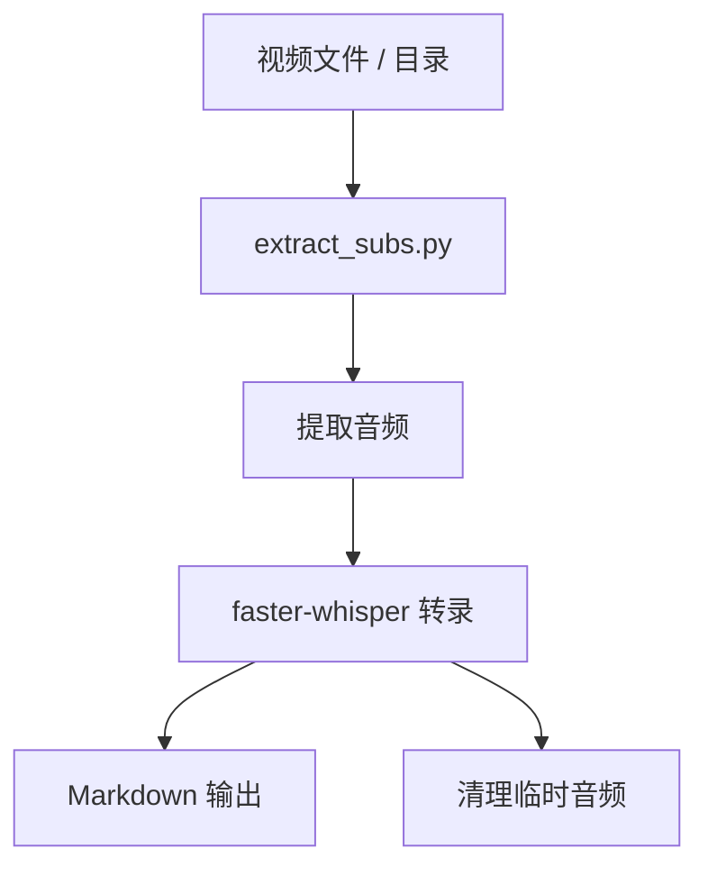
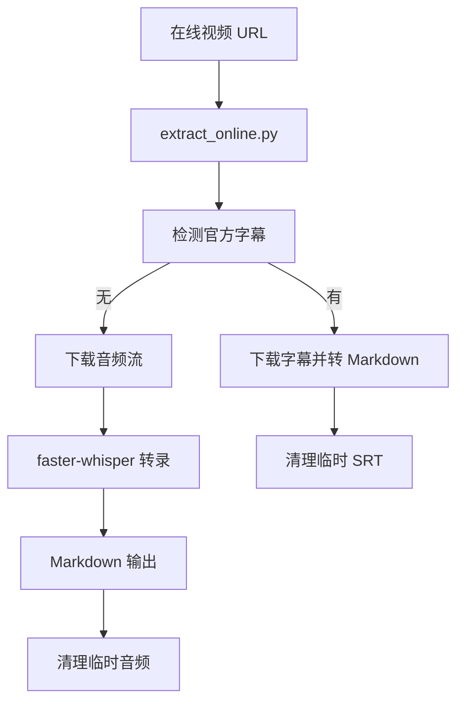

# 项目文档 — subtitle_extractor

<!-- PROJECT:SECTION:OVERVIEW -->
## 一、项目总览

`subtitle_extractor/` 是一个本地字幕提取工具目录，面向本地视频文件和在线视频 URL。项目目标是优先拿到现成字幕，拿不到就把音频转成 Markdown 字幕。

---

<!-- PROJECT:SECTION:FILES -->
## 二、文件职责清单

| 文件 | 类型 | 职责 |
| :--- | :--- | :--- |
| `extract_subs.py` | 主入口 | 本地视频 / 目录批量字幕提取 |
| `extract_online.py` | 主入口 | 在线视频字幕提取与下载回退 |
| `requirements.txt` | 依赖 | Python 运行依赖 |
| `PROJECT.md` | 项目文档 | 项目总览、职责、风险与变更记录 |
| `test_output/` | 输出目录 | 测试或示例输出 |

---

<!-- PROJECT:SECTION:DATAFLOW -->
## 三、数据生产、存储与流转

### 本地文件链路

### 在线视频链路

---

<!-- PROJECT:SECTION:DEPENDENCIES -->
## 四、关键依赖与影响范围

| 改动文件 | 直接影响 | 潜在级联影响 | 审计关注点 |
| :--- | :--- | :--- | :--- |
| `extract_subs.py` | 本地字幕提取主流程 | 输出格式、临时音频清理 | 本地文件是否按时清理 |
| `extract_online.py` | 在线字幕下载与回退 | 字幕优先级、音频转录路径 | 官方字幕 / 音频回退是否清晰 |
| `requirements.txt` | 环境可安装性 | 运行失败、版本冲突 | 依赖是否完整 |

---

<!-- PROJECT:SECTION:ISSUES -->
## 五、已知问题、风险与技术债务

| 编号 | 类型 | 问题描述 | 影响文件 | 优先级 | 状态 | 建议方案 |
| :--- | :--- | :--- | :--- | :--- | :--- | :--- |
| ST-001 | 依赖可用性 | `moviepy`、`faster-whisper`、`yt-dlp` 都依赖本地环境是否安装完整 | 全项目 | 中 | 已知 | 在 README 或安装说明中保持依赖列表同步 |
| ST-002 | 临时文件清理 | 音频 / SRT 临时文件需要在失败与成功路径都清理 | `extract_subs.py`、`extract_online.py` | 中 | 已知 | 保持失败分支的清理逻辑 |
| ST-003 | 平台兼容 | 不同平台视频格式和编码差异较大 | `extract_subs.py`、`extract_online.py` | 低 | 已知 | 新增平台支持时先补测试样例 |

---

<!-- PROJECT:SECTION:CHANGELOG -->
## 六、变更记录

| 日期 | task_id | 执行端 | 最终改动 | 最终有效范围 | 范围变动/新增需求 | 遗留债务 | 审计结果 | 备注 |
| :--- | :--- | :--- | :--- | :--- | :--- | :--- | :--- | :--- |
| 2026-04-12 | cx-task-subtitle-extractor-project-doc-refresh-20260412 | cx | 按新模板重写字幕提取项目文档，补齐职责、数据流与风险说明 | `subtitle_extractor/PROJECT.md` | 无 | ST-001, ST-002, ST-003 | pending | 本轮只更新文档，不修改脚本逻辑 |
| 2026-03-25 | docs-template-refresh | cx | 按最新模板重写项目文档结构 | `PROJECT.md` | 无 | ST-001, ST-002, ST-003 | pending | 保留原有功能说明并补齐流程、依赖和维护说明 |

---

<!-- PROJECT:SECTION:MAINTENANCE -->
## 七、维护规则

- 修改输出格式时，要同时检查 `extract_subs.py` 和 `extract_online.py`
- 新增视频平台支持时，优先放到 `extract_online.py`
- 临时音频和临时 SRT 文件必须在成功与失败路径都清理
- 若要扩展字幕格式，先确认 Markdown 输出仍能被后续流程接受
