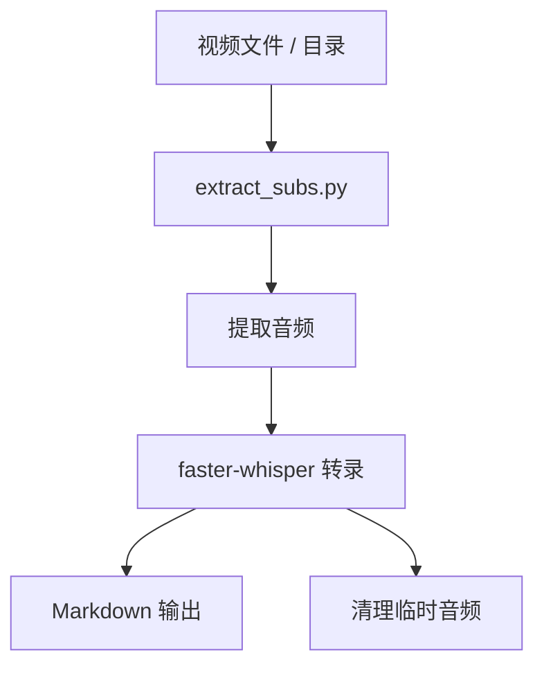
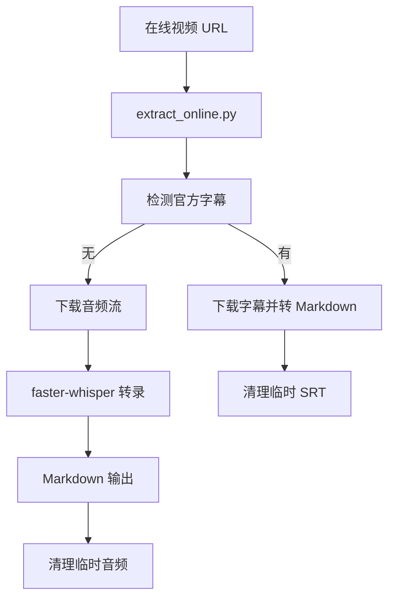

# 视频字幕提取项目文档

`subtitle_extractor/` 是一个面向本地视频和在线视频的字幕提取工具目录。它的目标很明确：优先拿到现成字幕，拿不到就把音频转成 Markdown 字幕。

## 项目目标

- 支持本地视频文件和目录批量处理。
- 支持在线视频 URL 解析。
- 优先下载官方字幕，减少转录成本。
- 没有官方字幕时，自动回退到音频转录。
- 输出统一的 Markdown 时间轴字幕文件。

## 目录职责

| 路径 | 作用 |
| --- | --- |
| `subtitle_extractor/extract_subs.py` | 本地视频字幕提取主入口。 |
| `subtitle_extractor/extract_online.py` | 在线视频字幕提取主入口。 |
| `subtitle_extractor/PROJECT.md` | 项目文档。 |
| `subtitle_extractor/requirements.txt` | Python 依赖。 |
| `subtitle_extractor/test_output/` | 测试输出目录。 |

## 处理流程

### 本地文件



### 在线视频



## 核心模块

### `extract_subs.py`

- 支持单文件和目录递归处理。
- 支持 `.mp4`、`.avi`、`.mov`、`.mkv`、`.wmv`、`.flv`、`.webm`。
- 先提取音频，再用 `faster-whisper` 转录。
- 转录结果会写成 `# 视频字幕` 风格的 Markdown。
- 临时音频文件会在成功后删除。

### `extract_online.py`

- 先用 `yt-dlp` 检测和下载字幕。
- 字幕优先语言默认为 `zh`、`en`。
- 如果没有字幕，自动下载最佳音频流。
- 下载后调用 `extract_subs.py` 中的转录逻辑生成 Markdown。
- 处理完成后会清理临时 SRT 或 WAV 文件。

## 输出格式

输出文件统一采用 Markdown 时间轴结构：

```markdown
# 视频字幕

## [00:00:00.000 - 00:00:05.123]

第一段字幕内容。

## [00:00:05.124 - 00:00:10.456]

第二段字幕内容。
```

时间戳使用 `HH:MM:SS.mmm` 格式，便于后续人工整理和二次加工。

## 使用方式

### 安装依赖

```bash
pip install -r requirements.txt
```

### 本地视频

```bash
python extract_subs.py input_video.mp4 -o output_dir
python extract_subs.py /path/to/videos -o output_dir
python extract_subs.py input_video.mp4 -d cuda
python extract_subs.py input_video.mp4 -m large
```

### 在线视频

```bash
python extract_online.py "https://youtube.com/watch?v=..." -o output_dir
python extract_online.py "URL" -l zh en ja
python extract_online.py "URL" -d cuda -m medium
```

## 依赖与环境

- Python 3.8+。
- `faster-whisper` 用于音频转录。
- `yt-dlp` 用于在线视频解析和字幕下载。
- `moviepy` 用于本地视频音频提取。
- 可选 CUDA 环境用于加速转录。

## 维护要点

- 不要把临时音频和临时 SRT 文件留在输出目录里。
- 修改输出格式时，要同时检查 `extract_subs.py` 和 `extract_online.py`。
- 新增视频平台支持时，优先放到 `extract_online.py`，避免污染本地文件处理逻辑。
- 如果要扩展字幕格式，先确认 Markdown 输出是否仍然能被后续流程接受。

## 最近变更

| 日期 | 变更 |
| --- | --- |
| 2026-03-14 | 整理本地与在线字幕提取流程，统一输出为 Markdown。 |
| 2026-03-25 | 按最新模板重写项目文档结构，补齐流程、依赖和维护说明。 |
